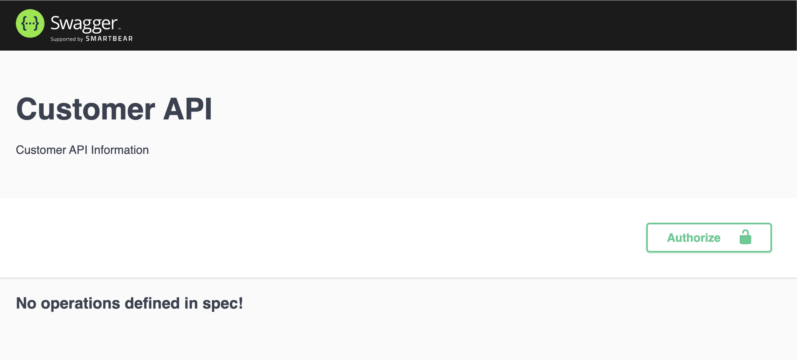
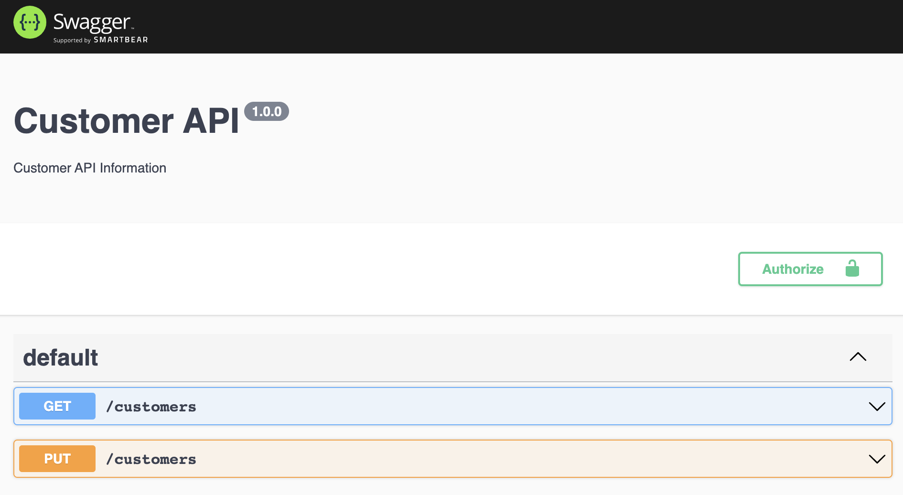
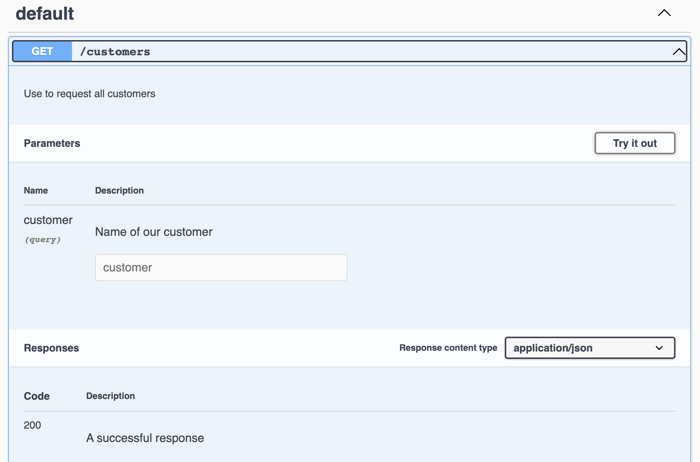

# Add Swagger to Express

## Default express app

> npm i express

```javascript
const express = require("express");
const app = express();

const port = process.env.PORT || 5000;

// Routes
app.get("/customers", (req, res) => {
  res.status(200).send("Customer results");
});

app.put("/customer", (req, res) => {
  res.status(200).send("Successfully updated customer");
});

app.listen(port, () => {
  console.log(`Server is running on port ${port}`);
});
```

## Setup basic Swagger options

> npm i swagger-ui-express swagger-jsdoc

```javascript
const express = require("express");
const app = express();
const swaggerJsDoc = require("swagger-jsdoc");
const swaggerUi = require("swagger-ui-express");

const port = process.env.PORT || 5000;

// for more info: https://swagger.io/specification/#infoObject
const swaggerOptions = {
  swaggerDefinition: {
    info: {
      title: "Customer API",
      description: "Customer API Information",
      contact: {
        name: "Amazing Developer",
      },
      servers: ["http://localhost:5000"],
    },
  },
  // ['.routes/*.js']
  apis: ["app.js"],
};

const swaggerDocs = swaggerJsDoc(swaggerOptions);

app.use("/api-docs", swaggerUi.serve, swaggerUi.setup(swaggerDocs));

// Routes
app.get("/customers", (req, res) => {
  res.status(200).send("Customer results");
});

app.put("/customer", (req, res) => {
  res.status(200).send("Successfully updated customer");
});

app.listen(port, () => {
  console.log(`Server is running on port ${port}`);
});
```

- verify at `http://localhost:5000/api-docs/`
- result
  

### Add route infos into Swagger

```javascript
const express = require("express");
const app = express();
const swaggerJsDoc = require("swagger-jsdoc");
const swaggerUi = require("swagger-ui-express");

const port = process.env.PORT || 5000;

// for more info: https://swagger.io/specification/#infoObject
const swaggerOptions = {
  swaggerDefinition: {
    info: {
      version: "1.0.0",
      title: "Customer API",
      description: "Customer API Information",
      contact: {
        name: "Amazing Developer",
      },
      servers: ["http://localhost:5000"],
    },
  },
  // ['.routes/*.js']
  apis: ["app.js"],
};

const swaggerDocs = swaggerJsDoc(swaggerOptions);
app.use("/api-docs", swaggerUi.serve, swaggerUi.setup(swaggerDocs));

// Routes
// indentatin in the swagger declaration is important
/**
 * @swagger
 * /customers:
 *  get:
 *    description: Use to request all customers
 *    responses:
 *      '200':
 *        description: A successful response
 */
app.get("/customers", (req, res) => {
  res.status(200).send("Customer results");
});

/**
 * @swagger
 * /customers:
 *    put:
 *      description: Use to return all customers
 *    parameters:
 *      - name: customer
 *        in: query
 *        description: Name of our customer
 *        required: false
 *        schema:
 *          type: string
 *          format: string
 *    responses:
 *      '201':
 *        description: Successfully created user
 */
app.put("/customer", (req, res) => {
  res.status(200).send("Successfully updated customer");
});

app.listen(port, () => {
  console.log(`Server listening on port ${port}`);
});
```



