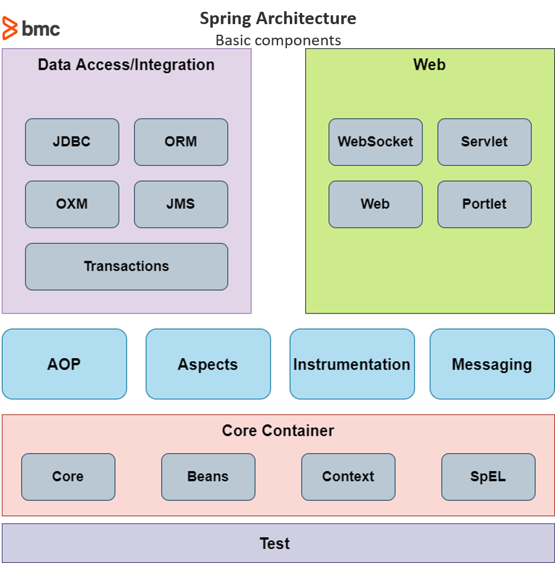

# Spring

- it is an open source framework for building enterprise Java apps
- it aims to simplify the complex and cumbersome enterprise Java app development process by offering a framework that includes technologies such as
  - **Aspect-oriented programming** (AOP)
  - **Dependency Injection** (DI)
  - **Plain Old Java Object** (POJO)
- it is a lightweight framework that can be used to create scalable, secure, and robust enterprise web apps
- it can be considered as a collection of sub frameworks such as
  - **Spring Web Flow**
  - **Spring MVC**
  - **Spring ORM**
- `Spring` also supports `Kotlin` and `Groovy`
- it is also the base that powers all other spring based projects such as
  - **Spring Boot**
  - **Spring Cloud**
  - **Spring GraphQL**

## Core Features

### Inversion of Control (IoC) Container

- it is one of the core features of Spring that provides a streamlined way to configure and manage Java objects
- it is responsible for managing the lifecycle of a defined Java object, significantly increasing the configurability of a Spring-based application
- it uses the dependency injection or dependency lookup patterns to provide the object reference during runtime
- it consists of assembler code that is required for configuration management
- Spring provides `org.springframework.beans` and `org.springframework.context` packages that can be used to facilitate these functions

### Support for aspect oriented programming

- AOP aims to provide more modularity to the cross-cutting concerns, which are functions that span across the application, such as
  - Logging
  - Caching
  - Transaction management
  - Authentication
- AOP complements object-oriented programming by providing a different way to structure the program, where OOP modularity is based on classes
- In AOP, the main unit of modularity is an aspect (cross-cutting concern)
  - This enables users to use AOP to create custom aspects and declarative enterprise services
  - The IoC container does not depend on AOP, offering further freedom for developers to select their preferred programming method
- However, Aspect-Oriented Programming combined with the Spring IoC provides a robust middleware solution

### Data access framework

- Database communication issues are one of the common issues developers face when developing applications
- Spring simplifies the database communication process by providing direct support for popular data access frameworks in Java, such as
  - JDBC, Hibernate, Java Persistence API (JPA)
- it offers features such as resource management, exception handling, and resource wrapping for all the supported data access frameworks, further simplifying the development process

### Transaction management framework

- Unlike the Java Transaction API (JTA), the Spring Transaction Management Framework is not limited to global and nested transactions
- Spring offers an abstraction mechanism for Java that enables users to:
  - Work with local, global, and nested transactions
  - Save points
  - Simplify transaction management across the application
- The Spring Data Access Framework directly integrates with the Transaction Management Framework with support for messaging and caching
  - This enables developers to create feature-rich transactional systems that span across the applications without depending on EJB or JTA

### Spring MVC framework

- The Spring MVC enables developers to create applications using the popular MVC pattern
- It is a request-based framework that allows developers to easily create customized MVC implementations that exactly suit their needs
- The core component of Spring MVC is the `DispatcherServlet` class which handles user requests and then forwards them to the correct controller
  - This allows the controller to process the request, create the model and then provide the information to the end-user via a specified view

### Spring web service

- This Spring Web Service component provides a streamlined way to create and manage web service endpoints in the application
- It offers a layered approach that can be managed using XML and can be used to provide mapping for web requests to a specific object

### Spring test frameworks

- Spring simplifies testing within the framework with components like
  - Mock objects
  - TestContext framework
  - Spring MVC Test

## Spring Framework Architecture

- Spring is built using different modules that enable different functionality

### Core container

- This contains the fundamental modules that are the cornerstone of the Spring framework
  - **Core (spring-core)** is the core of the framework that power features such as Inversion of Control and dependency injection
  - **Beans (spring-beans)** provides `Beanfactory`, which is a sophisticated implementation of the factory pattern
  - **Context (spring-context)** builds on Core and Beans and provides a medium to access defined objects
    - `ApplicationContext` interface is the core part of the Context module, and the spring-context-support provides support for third-party interactions such as caching, mailing, and template engines
  - **SpEL (spring-expression)** enables users to use the Spring Expression Language to query and manipulate the object graph at runtime

### Data access/integration

- This includes the modules that are used to handle data access and transaction processing in an application
  - **JDBC (spring-jdbc)** provides a `JDBC` abstraction layer that eliminates the need to separate `JDBC` coding when dealing with databases
  - **ORM (spring-orm)** are integration layers for popular object-relational mapping API such as `JPA`, `JDO Hibernate`
  - **OXM (spring-oxm)** is the abstraction layer that supports `Object/XML` mapping implementations like `JAXB`, `XStream`
  - **JMS (spring-jms)** is the Java Messaging Service module that creates and consumes messages that directly integrate with the Spring messaging module
  - **Transaction (spring-tx)** offers programmatic and declarative transaction management for classes that include special interfaces and POJOs

### Web

- The Web layer relates to modules that power web-based functions in Spring
  - **WebSocket (spring-websocket)** powers the web socket-based communication for clients and servers
  - **Servlet (spring-webmvc)** is the Spring WebMVC module that contains the MVC and REST implementations
  - **Web (spring-web)** provides all the basic web-oriented features and contains an HTTP client and web-related parts of the Spring remoting
  - **Portlet (spring-webmvc-portlet)** provides the MVC implementation to be used in a portlet environment

### Other Modules

- **AOP (spring-aop)** provides an aspect-oriented programming implementation that can be used when creating applications
- **Aspects (spring-aspects)** enables direct integration with the AspectJ programming extension by the eclipse foundation
- **Instrumentation (spring-instrument)** is the class instrumentation support and class loader implementations for application servers
- **Messaging (spring-messaging)** provides a robust platform to manage messaging in applications
- **Test (spring-test)** is the Spring test module that supports unit and integration testing with `JUnit` and `TestNG`
