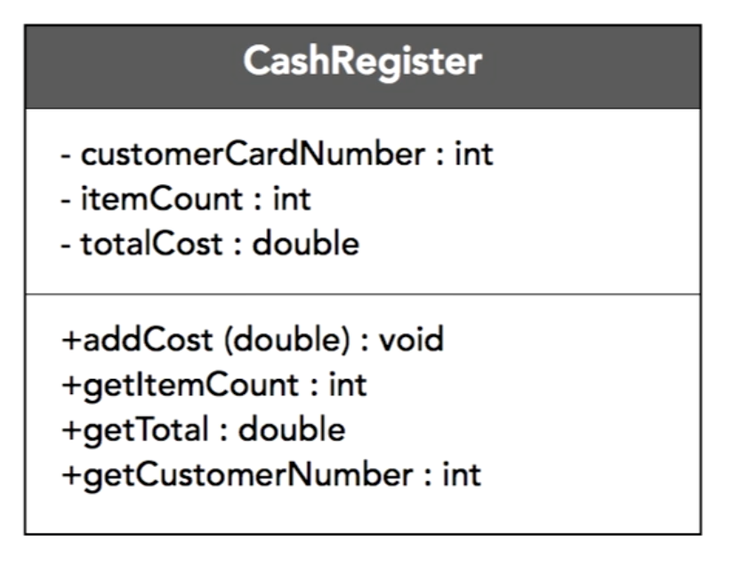

# UML (Unified Modeling Language)

- it is a general-purpose, developmental, modeling language in the field of software engineering that is intended to provide a standard way to visualize the design of a system
- before writing code, we need to design our computer system
  - when working with a team, information needs to be shared
    - need to have some plan or representation of the system
- UML is for describing system components and their interrelationships
- it gives us a list of terms, abstractions, concepts and tools for high level modeling of the system
- it is to some extent a design patterns in the programming world
- the rules of UML is not limited to programming

  - it is also used for modeling business processes, system design, drawing up organization, etc.

- for visualizing your classes
- example: class diagrams

  

  - top is the class name
  - middle is the list of properties
  - bottom is the methods the class has

## Access modifiers

- `+` public
- `-` private
- `#` protected

## Formats

- `underlined text` static fields or methods
- `ALL_CAPS` constant fields or final
- `italic` abstract methods

- example: UML relations

  

- example: UML relationship

  

## Association

- Once classes and attributes have been identified and placed into a diagram, the next stage is to add `Associations`
  - Usually, the system is not limited to just one class, there are tens, hundreds of classes, or even more
  - Naturally, all these classes somehow interact with each other, somehow communicate, send messages to each other, call each other's methods, send events, and so on
  - So the next step after creating those classes should be the visual representation of the relationship between these classes
- There are different types of relationship between two classes / objects
- The most basic type of relationship is `association`
  - which means that the two classes are somehow related to each other
  - we do not yet know exactly how this relationship is expressed and are going to clarify it in the future
- This usually happens in the early stages of system design, when we know that there is a relationship
  - but what specific relationship - inheritance, composition, or something else is not yet clear
- When designing the system more globally
  - The association helps when we indicate that 1 class in some way interact with another class
  - At the initial stage, this is enough
- An association is a relationship in which objects of one type are somehow related to objects of another type
  - i.e. an object of 1 type contains or somehow uses an object of another type
  - The player plays in a team
    - We do not yet know what kind of relationship they have, or we are not interested in it at this stage of the design
    - But we know that there is a relationship
- `directional association`

  - the arrow shows us that we have a component that uses another component
  - In this case the CustomService uses the CustomRepository component, and not vice versa
  - example: Directed association

    

## Inheritance


- A more precise type of relationship is the public inheritance relationship (`IS A Relationship`)
  - which says that everything that is true for the base class is true for its successor
- With its help we can

  - get polymorphic behavior
  - abstract from the concrete implementation of classes
  - deal only with abstractions (interfaces or base classes)
  - do not pay attention to implementation details

- Although inheritance is a great tool in the hands of any OOP programmer
  - it is clearly not enough for solving all types of problems
  - Firstly, not all relationships between classes are defined by the "is a" relationship
  - secondly, inheritance is the strongest relationship between 2 classes that cannot be broken at runtime
    - this relationship is static and, in strongly typed languages, is determined at compile time
- in JavaScript, it has prototypal inheritance and can be changed for inherited classes
  - properties can be changed by just changing prototypes
  - But this is more an exception rather than a rule
    - Because you cannot do this in classical inheritance
      - once inherited in the source code, at run time you will not break this connection and you will not change the base class
      - That is why inheritance is the strongest relationship between objects
        - That is why architects and system designers recommend using inheritance only when it is necessary
- there is the concept of `preferring composition over inheritance`
  - this suggests that composition can be broken at run time
  - and you can replace one object in the composition at runtime with another, change the behavior dynamically
  - You cannot do this with the inheritance

## Composition and Aggregation

- When relationships between components go beyond inheritance

  - relationships such as composition and aggregation come to our rescue
  - They both model a `HAS-A Relationship` and are usually expressed in that the class of a whole contains the fields (or properties) of its constituent parts


- the diamond is always on the side of the whole, and the simple line is on the side of the component
- a filled rhombus indicates a stronger bond - composition
- an open rhombus indicates a weaker bond - aggregation
- The difference between composition and aggregation
  - composition: the whole explicitly controls the lifetime of its component part
    - the part does not exist without the whole
  - aggregation: although the whole contains its component part, their lifetimes are not related
    - e.g.: the component part is passed via constructor parameters
- `CompositeCustomService` uses composition to manage its constituent parts
- `AggregatedCustomService` uses aggregation
- explicit control of the lifetime usually leads to a higher coupling between the whole and the part
  - since a specific type is used that closely connects the participants with each other

```ts
class CompositeCustomService {
  // Composition
  private readonly repository: CustomRepository = new CustomRepository();

  public doSomething() {
    // Usage of repository
  }
}

class AggregatedCustomService {
  // Aggregation
  private readonly repository: AbstractRepository;
  constructor(repository: AbstractRepository) {
    this.repository = repository;
  }

  public doSomething() {
    // Usage of repository
  }
}
```

- Another example of composition
  - Let us say a bicycle is a whole part and its components (shock absorbers, wheels, handlebars) are parts
  - a single shock absorber without a bike makes no sense
- An example of aggregation
  - Suppose there is a university or a school as a whole and teachers, professors as parts, for a certain period they may be part of this university, in some period they may not be included
  - They can exist without this university after the university is destroyed, that is, its lifetime is over
