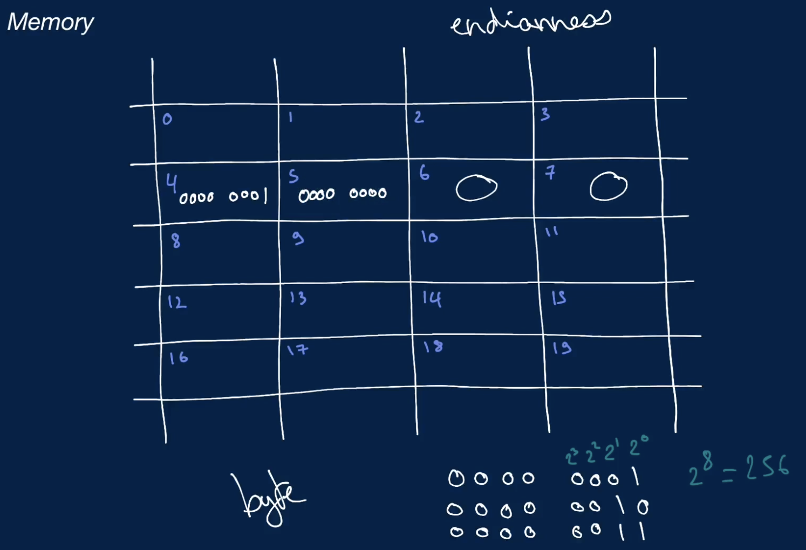
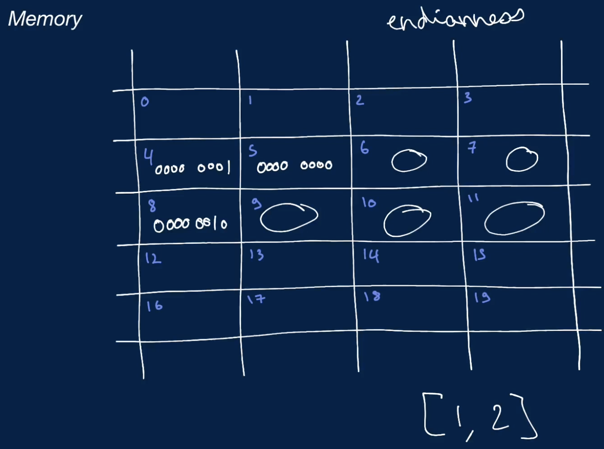
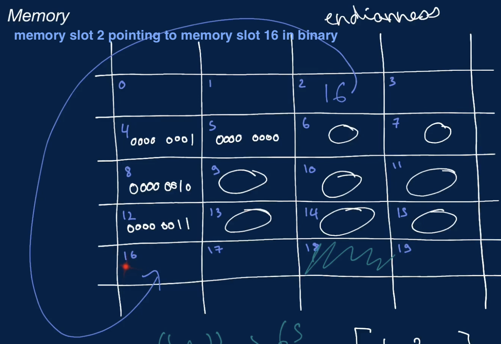

# Memory
- it is the foundational layer of computing where all data is stored
  - data stored in memory is stored in bytes and by extension bits
  - bytes in memory can point to other bytes in memory
    - so as to store references to other data
  - the amount of memory that a machine has is bounded, making it valuable to limit how much memory an algorithm takes up
  - accessing a byte or a fixed number of bytes (like 4 bytes or 8 bytes in the case of 32 bit and 64 bit integers) is an elementary operation which can be loosely treated as a single unit of operational work
- in other words
  - memory is a bounded canvas of memory slots that can store data
    - bounded means that you have a limited amount of data that you can store in it
    - it is possible to run out of memory
    - information that's stored in these memory slots are stored in base 2 format (binary number format) as bits
      - 1 memory slot can hold 8 bits which is 1 byte
    - when storing an integer in memory, that integer is a fixed-width integer
      - meaning its either 32 bits or 64 bits
        - if the Operating System (OS) using 32 bit architecture, it would always need 4 memory slot to hold 32 bits which is 4 bytes
          - order is dependent of OS endianess
            - Little endian ```00000001 00000000 00000000 00000000```
              - least significant bytes comes first
            - Big endian ```00000000 00000000 00000000 00000001```
              - most significant bytes comes first
          - when accessing a 32 bit integer, you will be accessing 4 memory slots
            - this is a very inexpensive operation from a time point of view
## Example of memory usage
- e.g.: storing a fixed-width 32 bit integer value to a variable
  - ```foobar = 1```
  - what happens under the hood is where the program is going to store this variable, the number 1 in a memory slot or series of memory slots that is free in the memory canvas
  - if the value requires more than 1 memory slots to be stored, it will store them back to back

- e.g.: storing a list of fixed-width 32 bit integer value to a variable
  - ```foobar = [1, 2]```

- the computer can access any of the memory slots very quickly with the memory address
## Binary Digit (Bit)
- it is a fundamental unit of information in Computer Science that represents a state with 1 of 2 values
  - usually 0 and 1
- any data stored in a computer is at the most basic level, represented in bits
## Byte
- a group of 8 bits
  - e.g.: 01101000 is a byte
- a single byte can represent up to 256 data values 2^8
- since a binary number is a number expressed with only 2 symbols, like 0 and 1
  - a byte can represent all the numbers between 0 and 255 in binary format
      ```
      1: 0000 0001
      2: 0000 0010
      3: 0000 0011
      4: 0000 0100
      ```
## Fixed-Width Integer
- an integer represented by a fixed amount of bits
- e.g.: a 32 bit integer is a type int integer represented by 32 bits (4 bytes)
    ```00000000 00000000 00000000 00000001```
  - a 64 bit integer is a type long integer represented by 64 bits (8 bytes)
    ```00000000 00000000 00000000 00000000 00000000 00000000 00000000 00000001```
- regardless of how large an integer is, its fixed-width-integer representation is by definition made up of a constant number of bits
  - an operation performed on its fixed-width-integer representation consists of a constant number of bit manipulations
    - since the integer is made up of a fixed number of bits
## American Standard Code for Information Interchange (ASCII)
- map a character to a number
- e.g.: ASCII code for character "A" is 65 which would be turned into bits
- thus a string of characters will be stored as a list of numbers in memory
## Pointers
- at any memory slot, a memory address of another memory slot can be stored in base 2 format (binary number format)
  - allows you to not have to store specific data at a memory slot
  - but instead point to another memory slot that stores that data
- e.g.: store memory slot 16 at memory slot 2

