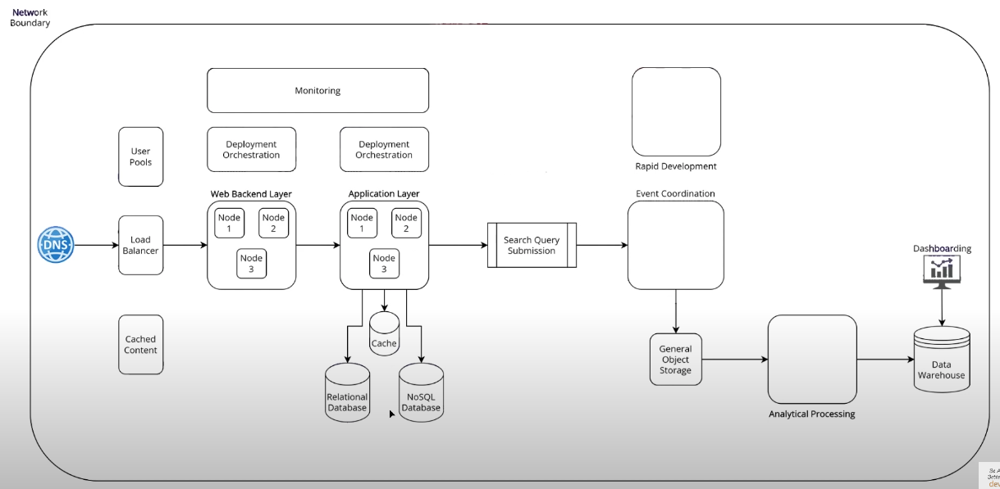
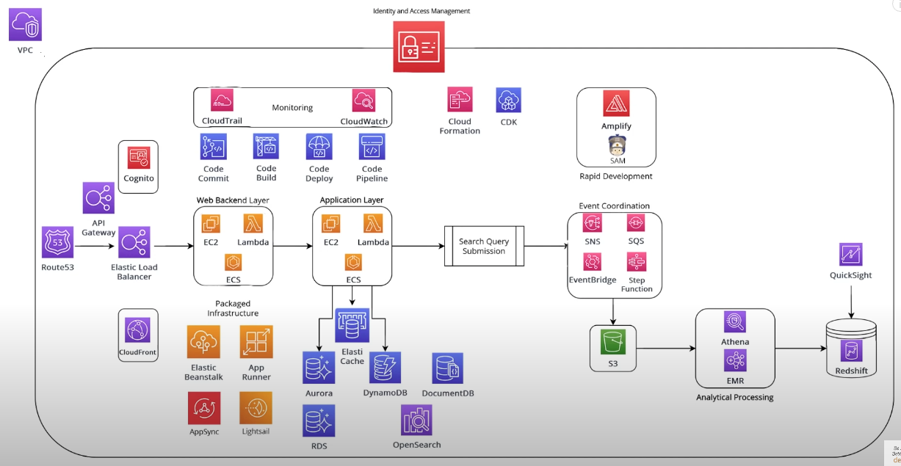

# Introduction to AWS services

## DNS (Route 53 service)

- it is where you define all the DNS configuration
  - where you are going to route traffic to from the internet
  - supports health checks on endpoints and any traffic shaping that you want to do
- will be used frequently when defining externally facing APIs or endpoints
- the DNS will point to a load balancer
- DNS can also be point to the API Gateway which then points to the load balancer

## Load Balancer (Elastic Load Balancer service)

- 2 variations
  1. application load balancer
     - it operates at the L7 layer
     - for those that want to use content from http headers to route the traffic
  2. network load balancer
     - it operates at the L4 layer
     - it is a bit more cost effective and supports higher throughput limits

## Web Backend Layer

- this is where the request from the frontend touches the backend
- services available
  - `EC2`: Elastic Compute Cloud service
    - you rent virtual machines that you pay for by the hour
    - it is convenient because with EC2 machines, you can set them up to do whatever you please
      - can be used to hold backend databases, wordpress blog, rest api, etc.
    - cons is that you have to do a lot of setup and configuration by yourself to use it
  - `Lambda` service
    - it is a serverless compute infrastructure
      - you define, write and deploy functions
        - the functions are snippets of code that can be small or large pieces of code
      - you do not need to worry about the infrastructure compared to EC2
      - AWS will handle the deployment of the application onto a container and scaling the application whenever the number of requests to the lambda function increase
    - it is a paper invocation
      - so its cost effective for application workloads that have bursty traffic patterns
      - it also good for applications that have traffic during the day and almost nothing during the evening
  - `ECS`: Elastic Container Service service
    - there is a variation of it called `EKS`: Elastic Kubernetes Service
    - it helps you manage containers, setup servers with integrated load balancing and auto scaling, facilitate your deployments to those containers

## Application Layer (similar to Web Backend Layer)

- it doesn't really change in terms of the compute options
- you have the same kind of fundamental building blocks that are available to you regardless whether its your web backend layer or your kind of business logic heavy application layer

## (API Gateway service)

- helps to facilitate the creation of the rest apis, and hosting those apis
- it offers additional functionality on top of just using a load balancer to distribute the traffic to different nodes
- features it offers
  - api throttling
  - authorization on an api
    - useful if you want to build a private api that can only be accessible from users in a user pool
    - the api gateway can be setup to validate a token by integrating with the user pool service or can be defined on your own
  - model validations
    - you can define what types of models your api supports, then have that validation performed before the request actually gets to the Web Backend Layer

## User Pools (Cognito service)

- it allows you to create user pools with features like login and registration
- users will sign up for accounts directly within cognito using the hosted UI, or you can integrate with other 3rd party identity providers such as (google, facebook, amazon, etc.)

## Cache (Elastic Cache service)

- it has 2 flavors
  - Memcache
  - Radis
    - most popular
- it is based on key value lookups
- you have to worry about hosting that infrastructure
  - you would need to own a cluster of memory optimized nodes
  - you have to worry about the maintenance, and alarming of that cluster
    - such as node replacement, hardware failures

## Databases

### Relational Database

#### Aurora

- most popular because it is more hands-off
- it is an in-house built amazon database
  - it compatible with both MySQL and PostgreSQL
- makes it easier for administration monitoring, auto scaling, storage auto scaling, compute auto scaling
- it offers the data rest api that you can use call your database
- it also offers a serverless compute model
  - you don't need to worry about provisioning any type of hardware behind the scenes
  - by using this, it offers auto scaling type of database

#### RDS (Relational Database Service)

- it allows you to select which database configuration you would like
  - you can pick from common database such as MySQL, PostgreSQL, Microsoft SQL Server, Oracle, Cassandra, etc.
- this is where most customers would be comfortable in
- you would need to worry about provisioning any type of hardware behind the scenes

### NoSQL Database

#### DynamoDB

- most popular
- it is optimized for key value lookups
- it is a fully managed database service
  - this means you do not need to worry about anything with regards to infrastructure or hardware
  - only need to worry about the scaling configuration, while DynamoDB will handle the auto scaling for you behind the scenes

#### DocumentDB

- it is a fully managed service
- it is compatible with MongoDB

#### OpenSearch

- it is a new name for `ElasticSearch`
- it is good if you are looking for something that supports more flexible querying at scale
  - also allows powerful grouping features, and dynamic grouping
- it also comes with `Kibana` which is an open source dashboarding technology to take a look at your data inside your open search database
- it has been used quite effectively as a replacement to `RDS` in some cases

## Packaged Infrastructure

- it makes your life easier as a developer
- it offers a combination of the different services
- it helps to abstract some of the complexity away from you at the sacrifice of configuration and control

### Elastic Beanstalk service

- it allows you to setup any kind of web application
  - can be containerized
  - makes it easier for you to set up your apps with different components
    - backend layer, load balancer, auto scaling and monitoring
- everything is managed at one spot
- you control the infrastructure with Elastic Beanstalk but its similar to an orchestrator service
  - where it would go to the services and provision what it needs for the type of application that you are trying to deploy onto it
- it is orchestrating the deployment of your `EC2` machines, load balancers, and any other stuff that you may need
  - however, you still have visibility or insight into that infrastructure
  - you still need to worry about maintaining it

### App Runner service (new)

- all of the lower level components are abstracted away from you
  - you just worry about your application configuration and deployment
  - app runner will worry about deploying that onto your infrastructure and scaling it if it requires it
- behind the scenes, it uses
  - `ECS service`
  - `fargate service`
    - it is a serverless mode for running containers where it uses provision containers that you can specify
    - but you don't need to worry about the infrastructure

### Lightsail service

- it is another pre-packaged services that makes your life easier
- similar to GoDaddy, DigitalOcean
  - where you select the type of stack that you want to set up for your application
    - you select the different pre-packaged pricing models
    - you don't have to worry about the details of which node type, where if you use `EC2` directly you have to
  - you pick the different pre-packaged options for compute and the costs are reasonable
- can deploy wordpress blog, or other kinds of applications, or containers
- you can add other components
  - such as load balancing, auto scaling
- it is basically a more simplified version and safer, since it is very beginner friendly

### AppSync service

- a fully managed graphql as a service
- provides you with the graphql functionality where you can use it to integrate with other backend aws services such as `DynamoDB`
- you can also use it to integrate with `Lambda` functions if you want to have some custom resolvers
- it can also scale very well based on the level of traffic and is transparent to you as an administrator

## Cached Content

- anything that you want to cache
  - image files, javascript, html, css, etc.

### CloudFront service

- it allows you to deploy a `CloudFront` distribution which replicates some of your content from the General Object Storage to regional nodes that are located all across the world close to your end users
  - this helps to get better performance for the static content
- great for applications that want to optimize the experience for the user

## Deployment Orchestration

### Code Commit service

- it is for storing your source code
- you can either store your source code directly inside `Code Commit` as a service
  - or you can integrate code commit with 3rd party providers such as github
- by itself it is not impressive or powerful
  - its merits comes from being able to integrate with 3rd party providers

### Code Build service

- it allows you to take your source that's located in `Code Commit` or any other 3rd party connected repository and then build that up into artifacts
- it also allows you to create and run tests in a test environment for your source code
- when you combine that with some other components, you can build sophisticated CICD pipelines that have multiple different steps in terms of running your unit tests and integration tests
- it is basically for building and testing your source code

### Code Deploy service

- it takes the artifacts that are built in the `Code Build` and then it would deploy it to the other services in the Web Backend Layer or Application Layer

### Code Pipeline service

- it is the deployment orchestration service
- it allows you to define a workflow of the different stages that your application will run through
  - e.g.: source code -> build -> test -> deploy to test env -> run another tests -> deploy to prod

## Monitoring

- need to know where to look to determine when things are going wrong and you need to step in
  - or when things are fine

### CloudWatch service

- kinda like an Umbrella service because it has a lot of different features that are inside
  - most important feature is the ability to evaluate your metrics on the AWS services
  - i.e.: you can use `CloudWatch` to view different metrics on your `EC2` machines to see over time in chart format
    - such as cpu utilization, memory utilization
  - i.e.: for `Lambda`
    - what are the concurrent number of invocations or all the invocations in 1 day
- another useful feature is logging
  - many of the applications would be emitting application logs
    - in terms of what your application is doing
  - for other services are a kind of managed services that sit on their own
    - often these services will integrate with `CloudWatch` to give you an Administration level events whenever things are happening on the services if you're using that piece of infrastructure
- new feature is Insights
  - lets you search over very large volumes of `CloudWatch` data using similar to a SQL style language
- basically it helps you monitor the state of your applications in your AWS

### CloudTrail service

- it is the audit trail of the operations that are being performed on your infrastructure
  - the operations that are being performed and who is performing those operations
  - i.e.: a Lambda function calling a database, a user deleting all your infrastructure
- it will offer you different types of events that allow you to gain insight into who is accessing different services and what they are doing on those services
  - the types of events can either be at the control or administration level
    - its is for when your infrastructure gets provisioned or deleted or modified
  - there is also data level events
    - the collections of events is called Trails
      - data level events give you a little more granular data
        - when configured on the DyanamoDB, it will give you log information on every single request that comes to your table
          - it is not recommended because it would be chewing through a lot of bandwidth for log storage, but can be enable or disabled
  - insights event
    - it is a proactive one where you can configure it to automatically monitor your account
      - AWS uses machine learning to monitor the `CloudTrail` events for any anomalies
    - useful for being proactive about security threats

## Identity and Access Management (IAM) service

- it is a security management service for AWS
- you create high-level entities such as users or roles
  - and associated with these users are policies
    - policies are important because by default a user will not have any kind of permissions to do anything on AWS
      - unless you define a IAM policy that gives that user to perform that action
- basically AWS security management uses an implicit deny operation
  - you deny access to everything unless someone says otherwise
- you create IAM policies and attached these policies to users
  - you can assign users to different groups that has policy permission set predefined and apply to anyone in the group
- you can also use it to create accounts that users can log in directly
  - a developer can have their own account

## Infrastructure as code

- it is the preferred way to create and manage your infrastructure
- no one really goes into the console anymore to create things and manage your infrastructure
  - unless it's your first time doing it and you're just experimenting
- its more preferred to write your infrastructure in a code format or configuration format that can be easily picked up and deployed to a new environment

### Cloud Formation service

- it is one of the options that allows you to write your infrastructure in a code format or configuration format that can be easily picked up and deployed to a new environment
- it is a service that allows you to write json or yaml configuration files
  - then you upload these files to `Cloud Formation` and it will be responsible for calling other AWS services to provision your infrastructure
  - i.e.: you can write a template file that has a DynamoDB in it, and a Lambda function
    - once you upload the file into `Cloud Formation`, it will go and create your Lambda function and DynamoDB table
  - it is convenient and quick, however, it has some downfalls
    - downfalls are writing your infrastructure as yaml or json is not really good
      - `CDK` solves these problem

### Cloud Development Kit (CDK) service

- it is a method of writing your infrastructure as code that is a little more fluent for developers
- it involves you writing actual code
  - allowing you to be more expressive with your infrastructure definition files so that you can be a little more dynamic and structure your code in a much simpler way using functions
- it is easy to use Higher Level Constructs
  - these constructs can contain an entire application specifications
  - you can have a construct that's an entire serverless architecture
    - ie.g.: that contains `Lambda` function, `DynamoDB` table, etc.
- behind the scenes, `CDK` does generate the code you write into `Cloud Formation`, then `Cloud Formation` is the one that deploys that out into AWS
- there are outside AWS options you can use for Infrastructure as codes such as
  - i.e.: Terraform, Pulumi
  - which can be used to integrate with AWS

## Rapid Development

### Amplify service

- it is a tool kit style service that allows you to rapidly build and deploy entire applications
- it is different because it is primarily a Cli tool, and it focuses on the functionality and not on the infrastructure of what you are trying to provision
- i.e.: you can run a simple command to add an api
  - behind the scenes, `Amplify` will deploy maybe a `Lambda` function with an `Api Gateway`
- it allows you to add things such as user authentication and authorization
  - behind the scenes it will give you a `Cognito` user pool
- you can add things such as a relational database
  - it will give you an `Aurora` serverless database that you can use
- it is good because of its abstraction, which is also a con because of that abstraction
  - the debugging of any problems that arises is a nightmare, because you need to dive into the different independent services, which is problem if you do not understand about the AWS services you are trying to debug
- if you want to stay within a well-defined box then `Amplify` is great
  - if you want to venture out of that box, writing your own `CDK` would be recommended, and understand the AWS services

### Serverless Application Model (SAM) service

- it is great in terms of providing shorthands of common infrastructure setups that would typically be written in `Cloud Formation`
- there is `SAM` templates that you can use that is similar to what those Higher Order Constructs do in `CDK`
- it can handles much of the complexity of the setup for you
- it is also great for local testing of `Lambda` functions
  - can use `SAM` to build and run your `Lambda` functions locally before you deploy them into AWS

## Event Coordination

### Simple Notification Service (SNS) service

- it is a pub sub service
- it is the pub in the sub
- it is responsible for publishing notifications to a topic
  - a topic can have many different subscribers
- the idea is that a domain model owner such as search query service puts an entry into its database, it wants to notify other services
  - those services will use an `SNS` topic that they publish to to notify other micro-services that something changed
  - the subscribers can be many different types of infrastructure
    - you can have other AWS services that are your subscribers such as a `Lambda` function, you can have a http endpoint that exists on an `EC2` instance
- basically if you want to tell other people about data or data changes, then use `SNS`

### Simple Queue Service (SQS) Queue service

- it is responsible for holding messages so that you can process them at a later time
- you define queues which can be connected to from many different types of compute infrastructure
  - you can connect queue to a `Lambda` function or an `EC2` machine or an `ECS` task
  - these infrastructure will pull your queue for new messages and then perform some type of action when it finds new messages in the queue
- typically people set up an `SNS` to an `SQS`
  - so the `SNS` topic being the publisher
  - the `SQS` being the subscriber
- basically if you want to be notified of when something changes in someone else's data, use `SQS`

### EventBridge service

- it is similar to what `SNS` offers with some distinct benefits
- instead of `SNS` topics, `EventBridge` uses this concept of Event Buses
  - you can integrate your `EventBridge` Event Bus with many different kind of application actions all across AWS
  - i.e.: you want to integrate your `EventBridge` with whenever an `EC2` machine gets terminated
    - or whenever a `Lambda` function gets updated
    - or whenever the configuration on your `DynamoDB` table gets changed
  - then you can define rules that specify who to deliver these events to
    - similar to how `SNS` has subscribers, `EventBridge` also has subscribers, and you define these rules and target groups of who to deliver these messages to depending on the type of event
- the benefits of `EventBridge` over `SNS` is that it has 2 important features
  1. Schema Discovery
     - if you are using `SNS` and you are publishing to your topic and someone is getting a message in your `SQS` queue
       - what does the schema of that message look like
       - what does the format of the message look like
       - is it have a JSON, is it an XML file, does it have foo as a key and bar as a value, etc.
     - `EventBridge` allows you to define these schema definitions to help subscribers get access to the models that are going to be delivered from the `EventBridge` Event Bus
     - it also allows you to search through different schemas
  2. 3rd party integrations
     - an example of 3rd party integrations that you can work with is Shopify
       - Shopify has native integration with `EventBridge`
         - what that means is that any time someone places an order on your Shopify e-commerce website, that can be directly integrated into `EventBridge`
         - then you can have specify rules setup to deliver that notification to a micro-service or backend service that cares about those updates, or to General Object Storage

### Step Function service

- it allows you to define workflows and different steps
  - i.e.: a starting step, x step, y step, etc.
  - you can have conditional logic in the step function workflow
  - it allows you to build things like customer ordering workflow
- you can have a fail safe and conditional logic in that workflow
  - so if anything fails, then a different path or a different choice is taken
- it offers direct integration with many other AWS services
  - you can use a service like `Lambda` to glue different parts of the workflow together and is serverless
- basically it is a kind of orchestration service that allows you to define sophisticated and large workflows that may run through many steps

## General Object Storage

### Simple Storage (S3) service

- it is just your kitchen sink of data storage
- very cheap and scalable
- you can store exabytes (1k PB) or petabytes (1k TB) of data
- you can move data over time into cold storage to get better price points
- typically you will store your assets in the `S3` and then connect it to your `CloudFront` distribution so that it can be replicated and serve to all your customers around the world
- it can be used to store any type of files
  - images, css, videos, etc.
- there are file sizes limits, refer to AWS website for more details

## Analytical Processing

### Elastic MapReduce (EMR) service

- it is a large-scale distributed data processing system
- it allows you to run many different frameworks including
  - Spark clusters, Hive, Presto
  - you can also run it in a serverless mode
- it is a service where you are going to do just massive number crunching to perform some kind of analytics

### Athena service

- it is a completely serverless big data processing or analytics service
- how it works is that you can keep your data stored in `S3`
  - you don't need to load the data anywhere which is the case for `EMR`
  - `Athena` will directly connect to your `S3` data, crawl your data, automatically detect the schema of the data, and then create tables that you can query using SQL
  - so whenever you dispatch a job to `Athena` it uses AWS infrastructure behind the scenes to prioritize the request
- you can run massive queries on data that is already stored in `S3`

## Data Warehouse

- place to store data like business intelligence, or any types of analytics that we may want to perform on it
- we don't want to store those data in places like `DocumentDB` or `DynamoDB` etc. because its not meant for it

### Redshift service

- it is a Columnar style database that allows you to perform some very large queries concurrently
- it can support many users at the same time
- it is a little expensive
- it offers
  - serverless mode
    - pay per use type model
  - provision mode
    - where you can provision the nodes in a distributed way
- this where you will run your workloads for the kind of OLAP (Online Analytical Processing) style queries
- there is a connection you can do with `Redshift` and `S3`
  - you can just deliver data to `S3` and then set up an automatic load job to load that to `Redshit` so that it can be available for this OLAP style querying
- good for data engineers, business intelligence users, anyone that wants to interact with data at scale using SQL

## Dashboarding

### QuickSight service

- it is a tool that is great for end users
- you give users their independent logins they can access whether it be in `Redshit` or `S3` or anything else
- it can create business facing dashboards

## Network Boundary

- offers a service that allows you to isolate all of your resources into specific isolated network

### Virtual Private Cloud (VPC) service

- allows you to create your own `VPC`s that are basically private networking spaces for your infrastructure to exist in
- it is completely separate from all other AWS accounts, and it is just your networking space
- you can connect your `VPC` to other `VPC`
  - so as to be able to talk to other services or different account
- you can open up your `VPC` so that your infrastructure is callable from the public internet
- you can have very large `VPC` that host many different micro-services or service oriented architectures
- basically you can use `VPC` to isolate your resources from any other systems, and also allows you to find some security rules to make sure that your infrastructure is protected from any outside actor
