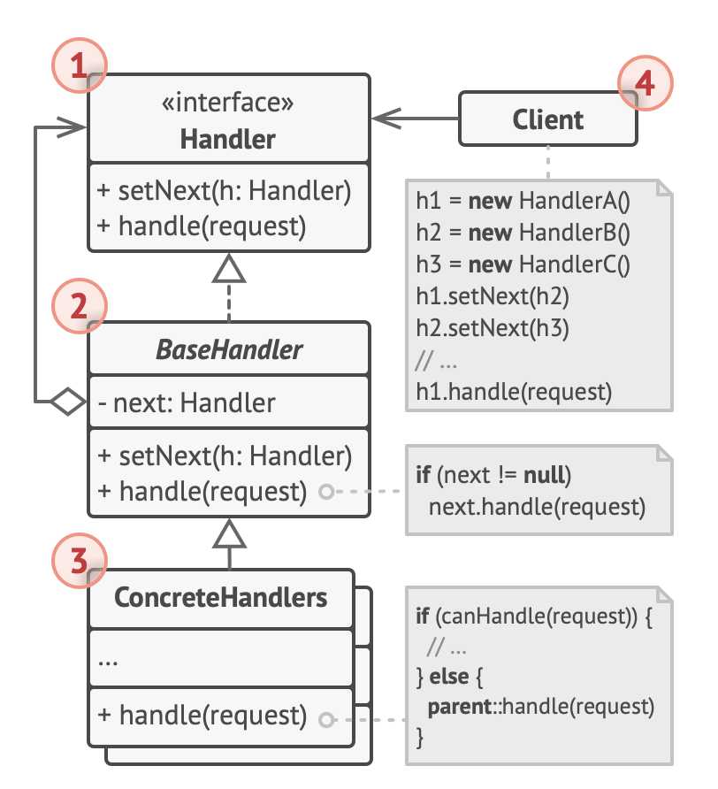

# Chain of Responsibility design pattern

- It allows passing of request along the chain of potential handlers until 1 of them handles the request
- it allows multiple objects to handle the request without coupling the sender class to the concrete classes of the receivers
- the chain can be composed dynamically at runtime with any handler that follows a standard handler interface

## When to use

- when your program is expected to process different kinds of requests in various ways, but the exact types of requests and their sequences are unknown beforehand
- when it’s essential to execute several handlers in a particular order
- when the set of handlers and their order are supposed to change at runtime

## Structure

1. The Handler declares the interface, common for all concrete handlers.

   - It usually contains just a single method for handling requests, but sometimes it may also have another method for setting the next handler on the chain.

2. The Base Handler is an optional class where you can put the boilerplate code that’s common to all handler classes.

   - Usually, this class defines a field for storing a reference to the next handler.
   - The clients can build a chain by passing a handler to the constructor or setter of the previous handler.
   - The class may also implement the default handling behavior: it can pass execution to the next handler after checking for its existence.

3. Concrete Handlers contain the actual code for processing requests.

   - Upon receiving a request, each handler must decide whether to process it and, additionally, whether to pass it along the chain.
   - Handlers are usually self-contained and immutable, accepting all necessary data just once via the constructor.

4. The Client may compose chains just once or compose them dynamically, depending on the application’s logic.
   - Note that a request can be sent to any handler in the chain—it doesn’t have to be the first one.
