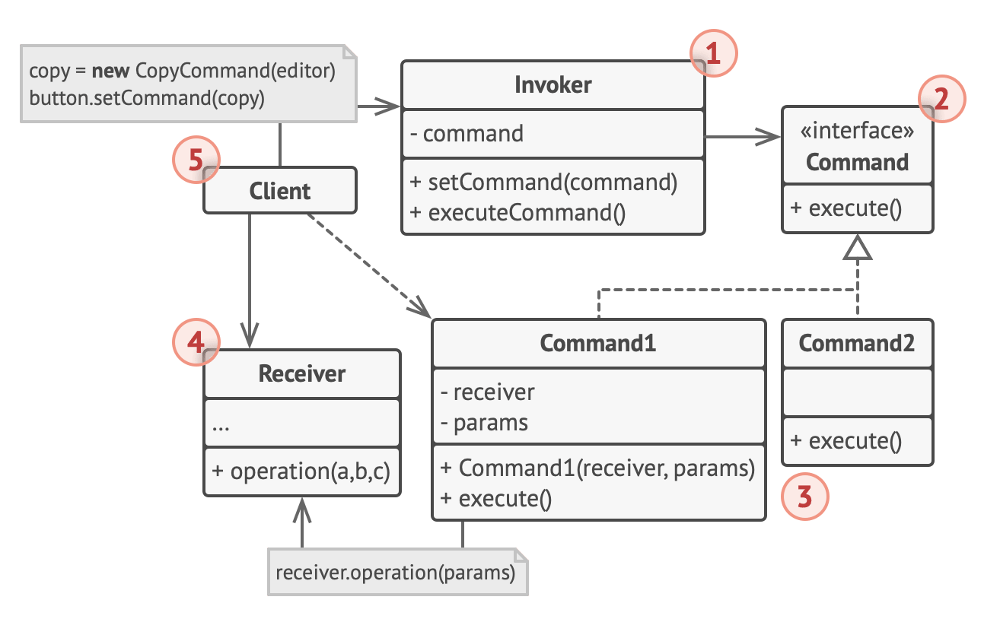

# Command pattern

- The Command pattern aims to encapsulate method invocation, requests, or operations into a single object
- It gives us the ability to both parameterize and pass method calls around that can be executed at our discretion
- It enables us to decouple objects invoking the action from the objects that implement them, giving us a greater degree of overall flexibility in swapping out concrete classes (objects)
- idea behind the Command pattern is that it provides us a means to separate the responsibilities of issuing commands from anything executing commands, delegating this responsibility to different objects instead

## Why use the Command pattern

- By using the command pattern in our programs and applications, we are able to incorporate functionalities (such as queueing, request logging, and undo/redo operations) with a lot of ease
- This is because each request is an independent entity from other classes and objects
- therefore, we can modify or update a request without worrying about affecting other requests or objects

## Analogy

### in a restaurant

- the Client is the customer
- the Invoker is the waiter that writes the paper order that is given from the client
- the waiter then gives the paper orders as a form of command to the chefs in the kitchen
- the reciever is the chefs in the kitchen that takes the command and then prepares the meal

## Structure

1. The Sender class (aka invoker) is responsible for initiating requests.
   - This class must have a field for storing a reference to a command object.
   - The sender triggers that command instead of sending the request directly to the receiver.
   - Note that the sender isn’t responsible for creating the command object.
   - Usually, it gets a pre-created command from the client via the constructor.
2. The Command interface usually declares just a single method for executing the command.
3. Concrete Commands implement various kinds of requests.
   - A concrete command isn’t supposed to perform the work on its own, but rather to pass the call to one of the business logic objects.
   - However, for the sake of simplifying the code, these classes can be merged.
4. Parameters required to execute a method on a receiving object can be declared as fields in the concrete command.
   - You can make command objects immutable by only allowing the initialization of these fields via the constructor.
5. The Receiver class contains some business logic.
   - Almost any object may act as a receiver.
   - Most commands only handle the details of how a request is passed to the receiver, while the receiver itself does the actual work.
6. The Client creates and configures concrete command objects.
   - The client must pass all of the request parameters, including a receiver instance, into the command’s constructor.
   - After that, the resulting command may be associated with one or multiple senders.
