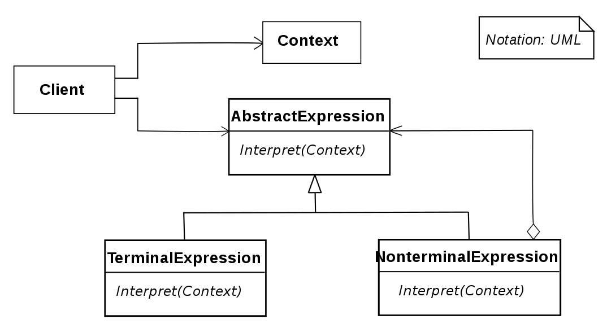

# Interpreter design pattern

- Given a language, define a representation for its grammer along with an interpreter that uses the representation to interpret sentences in the language

## When to use

- Use when you need to create a scripting language to allow end user to customize their solution due to the complexity and advanced configuration requirements of the app
  - however, it is easier & faster to use an existing command interpreter or expression evaluator tool of the box
- Use when a problem can be encoded and implemented by a simple grammar
  - when a problem is characterized by a language, it describes the problem domain which should be well-understood and well-defined
  - the language needs to be mapped to a grammer
  - grammars are usually hierarchical tree-like structures that step through multiple levels
    - but end up with terminal nodes (also called literals)

## Structure

1. AbstractExpression / Expression
   - declares an interface for executing an operation
2. TerminalExpression / ThousandExpression, HundredExpression / TenExpression / OneExpression / LeafExpression
   - implements an interpret operation associated with terminal symbols in the grammar
   - an instance is required for every terminal symbol in the sentence
3. NonterminalExpression / ComposedExpression
   - 1 such class is required for every rule `R ::= R1R2...Rn` in the grammar
   - maintains instance variables of type AbstractExpression for each of the symbols R1 through Rn
   - implements an Interpret operation for nonterminal symbols in the grammar
     - Interpret typical calls itself recursively on the variables representing R1 through Rn
4. Context
   - contains information that is global to the interpreter
5. Client / InterpreterApp
   - builds (or is given) an abstract syntax tree representing a particular sentence in the language that the grammar defines
   - the abstract syntax tree is assembled from instances of the NonterminalExpression and TerminalExpression classes
   - invokes the Interpret operation
