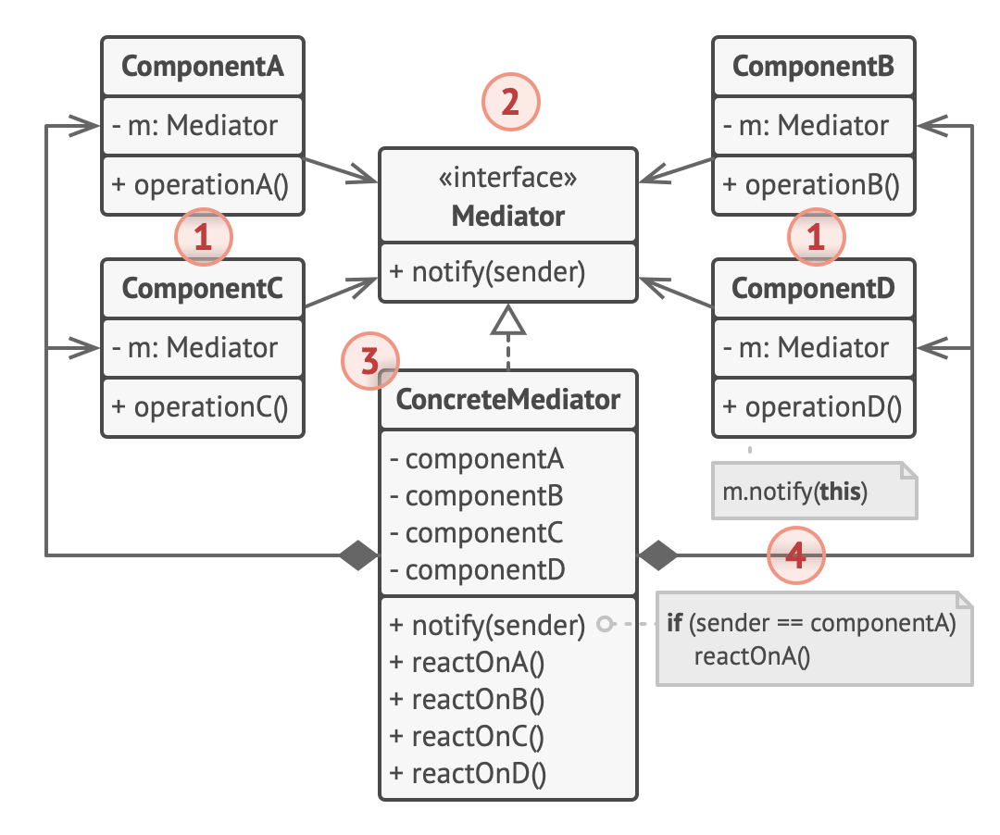

# Mediator design pattern

- lets you reduce chaotic dependencies between objects
- the pattern restricts direct communications between the objects
  - forces them to collaborate only via a mdeiator object

## Problem

- e.g.: let's say there is a dialog for creating & editing customer profile
  - it consists of various form controls such as text fields, checkboxes, buttons, etc.
  - some of the form elements may interact with others
    - e.g: selecting "i have a dog" checkbox may reveal a hidden text field for entering the dog's name
    - another e.g.: the submit button that has to validate values of all fields before saving the data
  - by having this logic implemented directly inside the code of the form elements
    - it make these element's classes much hard to reuse in other forms of the app
      - e.g.: can't use the checkbox inside another form as it's coupled to the dog's text field
    - this results in you can only use either all the classes involved in rendering the profile form, or none at all

## Solution

- all direct communication between the components which you want to make independent of each other should be ceased
  - these components must collaborate indirectly
    - by calling a special mediator object that redirects the calls to appropriate components
    - thus, the components depend only on a single mediator class instead of being coupled to dozens of their colleagues
- in the profile editing form, the dialog class itself may act as the mediator
  - dialog class should already be aware of all of its sub-elements
    - thus introducing of new dependencies into the class is not needed
- the most significant change happens to the actual form elements (e.g.: submit button)
  - previously, each time a user clicked the button, it had to validate the values of all individual form elements
  - its single job is to notify the dialog about the click
  - upon receiving this notification, the dialog itself performs the validations or passes the task to the individual elements
    - therefore, instead of being tied to a dozen form elements, the button is only dependent on the dialog class

## Analogy

- pilots of aircraft that approach or depart the airport control area don't communicate directly with each other
  - they speak to an air traffic controller, who sits in a tall tower somewhere near the airstrip
- without the air traffic controller, pilots would need to be aware of evey plane in the cicinity of the airport
  - discussing landing priorities with a committee of dozens of other pilots
- therefore, the tower doesn't need to control the whole flight
  - it exists only to enforce constraints in the terminal area because the number of involved actors there might be overwhelming to a pilot

## Structure

1. Components are various classes that contain some business logic.

   - Each component has a reference to a mediator, declared with the type of the mediator interface.
   - The component isn’t aware of the actual class of the mediator, so you can reuse the component in other programs by linking it to a different mediator.

2. The Mediator interface declares methods of communication with components, which usually include just a single notification method.

   - Components may pass any context as arguments of this method, including their own objects, but only in such a way that no coupling occurs between a receiving component and the sender’s class.

3. Concrete Mediators encapsulate relations between various components.

   - Concrete mediators often keep references to all components they manage and sometimes even manage their lifecycle.

4. Components must not be aware of other components.
   - If something important happens within or to a component, it must only notify the mediator.
   - When the mediator receives the notification, it can easily identify the sender, which might be just enough to decide what component should be triggered in return.
   - From a component’s perspective, it all looks like a total black box.
   - The sender doesn’t know who’ll end up handling its request, and the receiver doesn’t know who sent the request in the first place.

## When to use

- use the pattern when it's hard to change some of the classes because they are tightly coupled to a bunch of other classes
  - the pattern lets you extract all the relationships between classes into a separate class, isolating any changes to a specific component from the rest of the components
- use the pattern when you can't reuse a component in a different program because it's too dependent on other components
  - after you apply the mediator, individual components become unaware of the other components
  - they could still communicate with each other, albeit indirectly, through a mediator object
  - to reuse a component in a different app, you need to provide it a with a new mediator class
- use the mediator when you find yourself creating tons of component subclasses just to reuse some basic behavior in various contexts
  - since all relations between components are contained within the mediator, it's easy to define entirely new ways for these components to collaborate by introducing new mediator classes, without having to change the components themselves

## How to implement

1. identify a group of tightly coupled classes which would benefit from being more independent(e.g., for easier maintenance or simpler reuse of these classes)
2. Declare the mediator interface and describe the desired communication protocol between mediators and various components.
   - In most cases, a single method for receiving notifications from components is sufficient.
   - This interface is crucial when you want to reuse component classes in different contexts.
     - As long as the component works with its mediator via the generic interface, you can link the component with a different implementation of the mediator.
3. Implement the concrete mediator class.
   - This class would benefit from storing references to all of the components it manages.
4. You can go even further and make the mediator responsible for the creation and destruction of component objects.
   - After this, the mediator may resemble a factory or a facade.
5. Components should store a reference to the mediator object.
   - The connection is usually established in the component’s constructor, where a mediator object is passed as an argument.
6. Change the components’ code so that they call the mediator’s notification method instead of methods on other components.
   - Extract the code that involves calling other components into the mediator class.
   - Execute this code whenever the mediator receives notifications from that component.

## Pros & Cons

### Pros

- Single Responsibility Principle. You can extract the communications between various components into a single place, making it easier to comprehend and maintain.
- Open/Closed Principle. You can introduce new mediators without having to change the actual components.
- You can reduce coupling between various components of a program.
- You can reuse individual components more easily.

### Cons

- Over time a mediator can evolve into a God Object.
