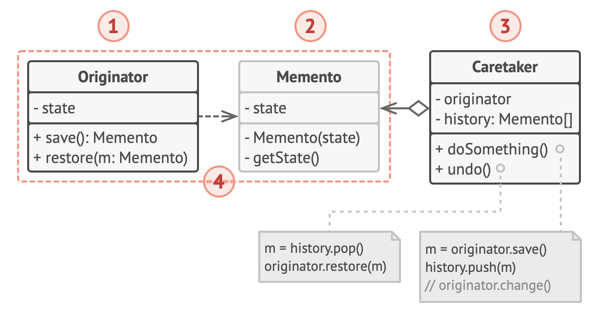
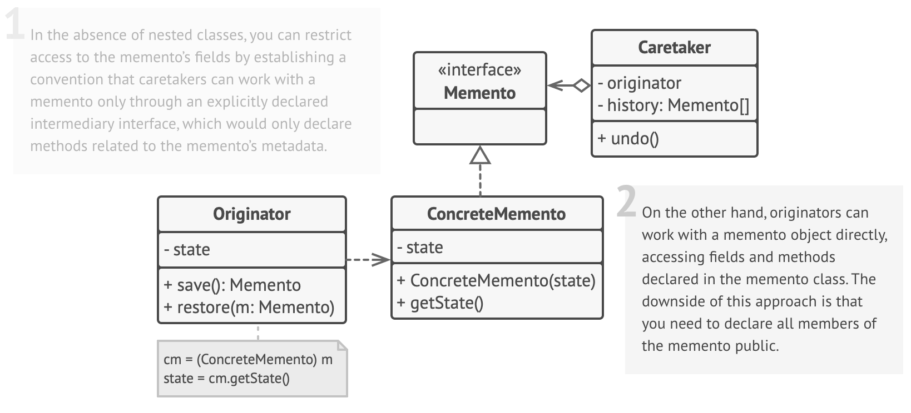
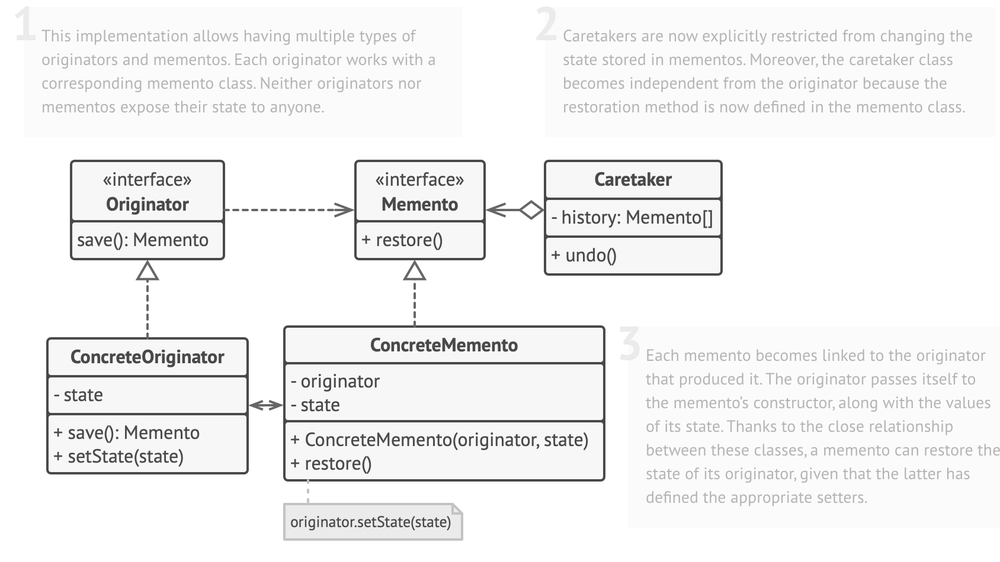

# Memento design pattern

- it lets you save and restore the previous state of an object without revealing the details of its implementation

## Problem

- imagine developing a text editor app, it can do text editing, format text, and insert inline images
- you decided to let users undo any operations carried out on the text
  - you decided to take the direct approach for implementation
  - before performing any operation, the app records the state of all objects and saves it in some storage
  - later when a user decides to revert an action, the app fetches the latest snapshot from the history and uses it to restore the state of all objects
    - regarding the state snapshot, how would you produce one?
    - you would need to go over all the fields in an object and copy their values into storage
      - however, this would only work if the object had quite relaxed access restrictions to its contents
      - unfortunately, most real objects won't let others peek inside them that easily, which hides all significant data in private fields
    - assuming that our objects behave like hippies
      - prefer open relations and keeping their state public
      - this approach would solve the immediate problem and let you produce snapshots of objects' states at will
      - it still has some serious issues
        - in the future, you might decide to refactor some of the editor classes or add or remove some of the fields
        - this would also require changing the classes responsible for copying the state of the affected objects
  - Considering the actual snapshots of the editor's state
    - what data does it contain
      - at a bare minimum, it must contain the actual text, cursor coordinates, current scroll position, etc
    - to make a snapshot, you would need to collect these values and put them into some kind of container
    - most likely you would store lots of these container objects inside some list that would represent the history
      - containers would end up being objects of 1 class
      - class would have almost no methods, but lots of fields that mirror the editor's state
    - to allow other objects to write and read data to and from a snapshot, the fields need to be public
      - that would expose all the editor's state, private or not
      - other classes would become dependent on every little change to the snapshot class
- this reaches a dead end
  - you either expose all internal details of classes, making them too fragile
  - or restrict access to their state, making it impossible to produce snapshots

## Solution

- the problems are caused by broken encapsulation
  - some objects try to do more than they are supposed to
  - they try to invade the private space of other objects instead of letting these objects perform the actual action, so as to collect the data required to perform the action
- Memento pattern delegates creating the state snapshots to the actual owner of that state (the originator object)
  - hence, instead of other objects trying to copy the editor's state from the outside
    - the editor class itself can make the snapshot since it has full access to its own state
- the pattern suggests storing the copy of the object's state in a sepcial object called memento
  - the contents of the memento aren't accessible to any other object except the one that produced it
  - other objects must communicate with mementos using a limited interface which may allow fetching the snapshot's metadata
    - but not the original object's state contained in the snapshot
- such a restrictive policy lets you store mementos inside other objects
  - usually called caretakes
  - since the caretaker works with the memento only via the limited interface
    - it's not able to tamper with the state stored inside the memento
    - at the same time, the originator has access to all fields inside the memento
      - allowing it to restore its previous state at will
- in the text editor example, we can create a separate history class to act as the caretaker
  - a stack of mementos stored inside the caretaker will grow each time the editor is about to execute an operation
  - you could render this stack within the UI, displaying the history of previously performed operations to a user
- when a user triggers the undo, the history grabs the most recent memento from the stack and passes it back to the ditor, requesting a roll-back
  - since the editor has full access to the memento, it changes its own state with the values taken from the memento

## Structure

1. The Originator class can produce snapshots of its own state, as well as restore its state from snapshots when needed.

2. The Memento is a value object that acts as a snapshot of the originator’s state.

   - It’s a common practice to make the memento immutable and pass it the data only once, via the constructor.

3. The Caretaker knows not only “when” and “why” to capture the originator’s state, but also when the state should be restored.

   - A caretaker can keep track of the originator’s history by storing a stack of mementos. When the originator has to travel back in history, the caretaker fetches the topmost memento from the stack and passes it to the originator’s restoration method.

4. In this implementation, the memento class is nested inside the originator.
   - This lets the originator access the fields and methods of the memento, even though they’re declared private.
   - On the other hand, the caretaker has very limited access to the memento’s fields and methods, which lets it store mementos in a stack but not tamper with their state.

## When to use

- Use the Memento pattern when you want to produce snapshots of the object’s state to be able to restore a previous state of the object
  - it lets you make full copies of an object’s state, including private fields, and store them separately from the object
  - While most people remember this pattern thanks to the “undo” use case, it’s also indispensable when dealing with transactions
- Use the pattern when direct access to the object’s fields/getters/setters violates its encapsulation
  - it makes the object itself responsible for creating a snapshot of its state
  - No other object can read the snapshot, making the original object’s state data safe and secure

## How to implement

1. Determine what class will play the role of the originator

   - It’s important to know whether the program uses one central object of this type or multiple smaller ones

2. Create the memento class

   - One by one, declare a set of fields that mirror the fields declared inside the originator class

3. Make the memento class immutable

   - A memento should accept the data just once, via the constructor
   - The class should have no setters

4. If your programming language supports nested classes, nest the memento inside the originator

   - If not, extract a blank interface from the memento class and make all other objects use it to refer to the memento
   - You may add some metadata operations to the interface, but nothing that exposes the originator’s state

5. Add a method for producing mementos to the originator class

   - The originator should pass its state to the memento via one or multiple arguments of the memento’s constructor
   - The return type of the method should be of the interface you extracted in the previous step (assuming that you extracted it at all)
   - Under the hood, the memento-producing method should work directly with the memento class

6. Add a method for restoring the originator’s state to its class

   - It should accept a memento object as an argument
   - If you extracted an interface in the previous step, make it the type of the parameter
   - In this case, you need to typecast the incoming object to the memento class, since the originator needs full access to that object

7. The caretaker, whether it represents a command object, a history, or something entirely different, should know when to request new mementos from the originator, how to store them and when to restore the originator with a particular memento

8. The link between caretakers and originators may be moved into the memento class
   - In this case, each memento must be connected to the originator that had created it
   - The restoration method would also move to the memento class
   - However, this would all make sense only if the memento class is nested into originator or the originator class provides sufficient setters for overriding its state

## Pros & Cons

### Pros

- You can produce snapshots of the object’s state without violating its encapsulation
- You can simplify the originator’s code by letting the caretaker maintain the history of the originator’s state

### Cons

- The app might consume lots of RAM if clients create mementos too often
- Caretakers should track the originator’s lifecycle to be able to destroy obsolete mementos
- Most dynamic programming languages, such as PHP, Python and JavaScript, can’t guarantee that the state within the memento stays untouched
