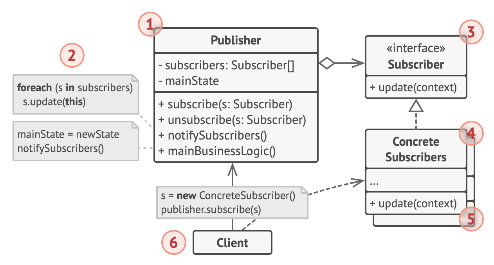

# Observer design pattern

- it lets you define a subscription mechanism to notify multiple objects about any events that happen to the object they're observing

## Problem

- if there are 2 types of objects: `Customer` and `Store`
  - the customer is interested in a particular brand of product (e.g. a new iphone model), which would become available soon
- the customer could visit the store every day and check the product availability
  - but while the product is still en route, most of these trips would be pointless
- the store could send emails (might be considered spam) to all customers each time a new product becomes available
  - this would save some customers from endless trips to the store
  - at the same time, it's upset other customers who aren't interested in new products
- this arises in a conflict
  - either the customer wastes time checking the product availability
  - or the store wastes resources notifying the wrong customers

## Solution

- the object that has a state is called subject
  - since it's also going to notify other objects about the state change, it can be called publisher
  - all other objects that went to track changes to the publisher's state are called subscribers
- the observer pattern suggests that adding a subscription mechanism to the publisher class
  - allowing individual objects to subscribe or unsubscribe from a stream of events coming from that publisher
  - this mechanism consists of
    1. an array field for storing a list of references to subscriber objects
    2. several public methods which allows adding subscribers to and removing them from that list
- whenever an important event happens to the publisher
  - it goes over to its subscribers and calls the specific notification method on their objects
- real apps migh have dozens of different subscriber classes that are interested in tracking events of the same publisher class
  - should not couple the publisher to all of those subscriber classes
  - also might not know about some of the subscriber classes beforehand if the publisher class is supposed to be used by other people
- this is important that all subscribers implement the same interface and that the publisher communicates with them only via that interface
  - this interface should declare the notification method along with a set of parameters that the publisher can use to pass some contextual data along with the notification
- if the app has several different types of publishers and you want to make the subscribers compatible with all of them
  - can make all publishers follow the same interface
  - this interface would only need to describe a few subscription methods
  - the interface would allow subscribers to observer publishers' status without coupling to their concrete classes

## Analogy

- if you subscribe to a newspaper or magazine
  - you no longer need to go to the store to check for the next available issue
  - instead the publisher sends the new issues directly to your mailbox right after publication or even in advance
- the publisher maintains a list of subscribers and knows which magazines they're interested in
  - subscribers can leave the list at any time when they wish to stop the publisher sending new magazine issues to them

## Structure

1. The Publisher issues events of interest to other objects.

   - These events occur when the publisher changes its state or executes some behaviors. Publishers contain a subscription infrastructure that lets new subscribers join and current subscribers leave the list.

2. When a new event happens, the publisher goes over the subscription list and calls the notification method declared in the subscriber interface on each subscriber object.

3. The Subscriber interface declares the notification interface.

   - In most cases, it consists of a single update method.
   - The method may have several parameters that let the publisher pass some event details along with the update.

4. Concrete Subscribers perform some actions in response to notifications issued by the publisher.

   - All of these classes must implement the same interface so the publisher isn’t coupled to concrete classes.

5. Usually, subscribers need some contextual information to handle the update correctly.

   - For this reason, publishers often pass some context data as arguments of the notification method.
   - The publisher can pass itself as an argument, letting subscriber fetch any required data directly.

6. The Client creates publisher and subscriber objects separately and then registers subscribers for publisher updates.

## When to use

- Use the Observer pattern when changes to the state of one object may require changing other objects, and the actual set of objects is unknown beforehand or changes dynamically
  - You can often experience this problem when working with classes of the graphical user interface
    - e.g.: you created custom button classes, and you want to let the clients hook some custom code to your buttons so that it fires whenever a user presses a button
  - The Observer pattern lets any object that implements the subscriber interface subscribe for event notifications in publisher objects
    - You can add the subscription mechanism to your buttons, letting the clients hook up their custom code via custom subscriber classes
- Use the pattern when some objects in your app must observe others, but only for a limited time or in specific cases
  - The subscription list is dynamic, so subscribers can join or leave the list whenever they need to

## How to implement

1. Look over your business logic and try to break it down into two parts: the core functionality, independent from other code, will act as the publisher; the rest will turn into a set of subscriber classes
2. Declare the subscriber interface
   - At a bare minimum, it should declare a single update method
3. Declare the publisher interface and describe a pair of methods for adding a subscriber object to and removing it from the list
   - Remember that publishers must work with subscribers only via the subscriber interface
4. Decide where to put the actual subscription list and the implementation of subscription methods
   - Usually, this code looks the same for all types of publishers, so the obvious place to put it is in an abstract class derived directly from the publisher interface
   - Concrete publishers extend that class, inheriting the subscription behavior
   - However, if you’re applying the pattern to an existing class hierarchy, consider an approach based on composition: put the subscription logic into a separate object, and make all real publishers use it
5. Create concrete publisher classes
   - Each time something important happens inside a publisher, it must notify all its subscribers
6. Implement the update notification methods in concrete subscriber classes
   - Most subscribers would need some context data about the event
   - It can be passed as an argument of the notification method
   - But there’s another option. Upon receiving a notification, the subscriber can fetch any data directly from the notification
   - In this case, the publisher must pass itself via the update method
   - The less flexible option is to link a publisher to the subscriber permanently via the constructor
7. The client must create all necessary subscribers and register them with proper publishers

## Pros & Cons

### Pros

- Open/Closed Principle
  - can introduce new subscriber classes without having to change the publisher’s code (and vice versa if there’s a publisher interface)
- can establish relations between objects at runtime

### Cons

- Subscribers are notified in random order
