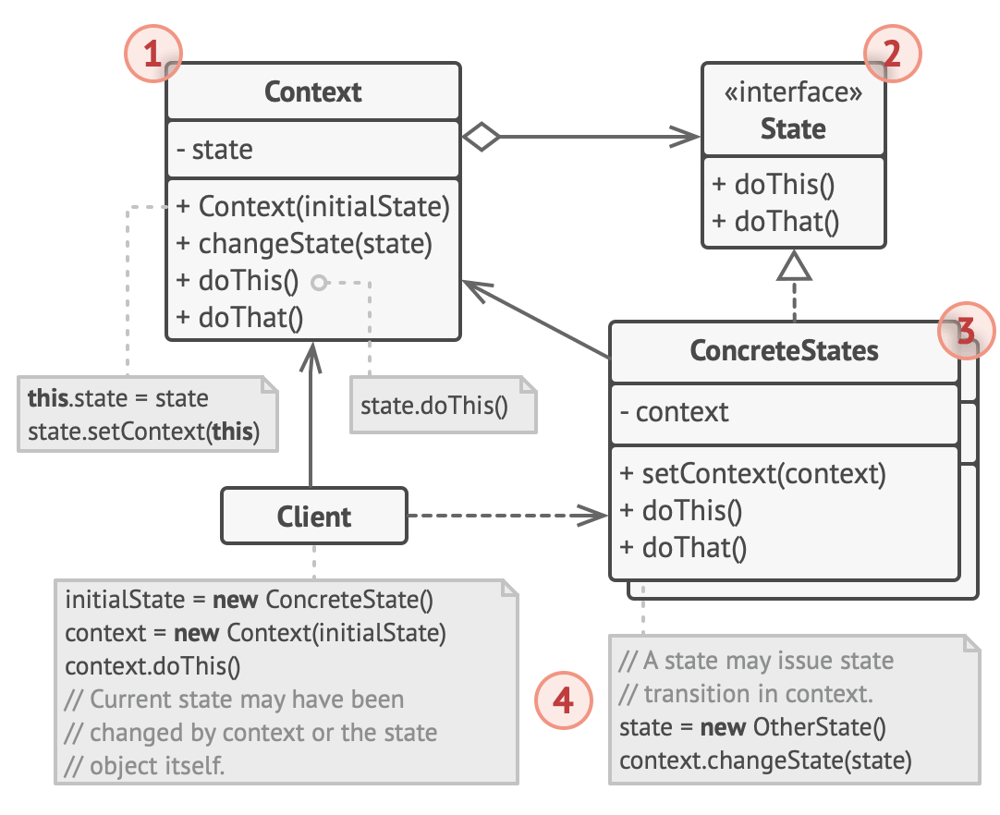

# State design pattern

- it lets an object alter its behavior when its internal state changes
- it appears as if the object changed its class

## Problem

- state pattern is closely related to the concept of Finite-state-machine
  - main idea is that, at any time, there's a finite number of states which a program can be in
    - within any unique state, the program behaves differently
    - the program can be switched from 1 state to another instanteously
    - however, depending on a current state, the program may or may not switch to a certain other states
    - these switching rules, called transitions are also finite and predetermined
- the same approach can be applied to objects
  - e.g.: for a Document class
    - it can be in 1 of 3 states
      - draft, moderation, published
        - draft: it moves the document to moderation
        - moderation: it makes the document public, but only if the current user is an administrator
        - published: it doesn't do anything at all
- state machines are usually implemented with lots of conditional operators that select appropriate behavior depending on the current state of the object
  - usually this state is just a set of values of the object's fields
- the biggest weakness of a state machine based on conditionals reveals itself once we start adding more states and state-dependent behaviors to the Document class
  - most methods will contain a lot of conditionals that pick the proper behavior of a method according to the current state
  - this makes it difficult to maintain because any change to the transition logic may require changing state conditionals in every method
  - the problem tends to get bigger as a project evolves
    - it is difficult to predict all possible states and transitions as the design stage
    - thus a lean state machine built with a limited set of conditionals can grow into a bloated mess over time

## Solution

- the state pattern suggest that new classes should be created for all possible states of an object
  - and extract all state-specific behaviors into these classes
- Instead of implementing all behaviors on its own, the original object, called context, stores a reference to 1 of the state objects that represents its current state, and delgates all state-related work to that object
- to transition the context into another state
  - replace the active state object with another object that represents that new state
- this is possible only if all state classes follow the same interface and the context itself works with these objects through that interface
- structure look similar to Strategy pattern
  - but is different in that the particular states may be aware of each other and inititate transitions from 1 state to antother
  - whereas strategies almost never know about each other

## Analogy

- the buttons and switches in the smartphone behave differently depending on the current state of the device
  - When the phone is unlocked, pressing buttons leads to executing various functions
  - When the phone is locked, pressing any button leads to the unlock screen
  - When the phone’s charge is low, pressing any button shows the charging screen

## Structure

1. Context stores a reference to one of the concrete state objects and delegates to it all state-specific work.

   - The context communicates with the state object via the state interface.
   - The context exposes a setter for passing it a new state object.

2. The State interface declares the state-specific methods.

   - These methods should make sense for all concrete states because you don’t want some of your states to have useless methods that will never be called.

3. Concrete States provide their own implementations for the state-specific methods.

   - To avoid duplication of similar code across multiple states, you may provide intermediate abstract classes that encapsulate some common behavior.
   - State objects may store a backreference to the context object.
   - Through this reference, the state can fetch any required info from the context object, as well as initiate state transitions.

4. Both context and concrete states can set the next state of the context and perform the actual state transition by replacing the state object linked to the context.

## When to use

- Use the State pattern when you have an object that behaves differently depending on its current state, the number of states is enormous, and the state-specific code changes frequently
  - The pattern suggests that you extract all state-specific code into a set of distinct classes
  - As a result, you can add new states or change existing ones independently of each other, reducing the maintenance cost
- Use the pattern when you have a class polluted with massive conditionals that alter how the class behaves according to the current values of the class’s fields
  - The State pattern lets you extract branches of these conditionals into methods of corresponding state classes
  - While doing so, you can also clean temporary fields and helper methods involved in state-specific code out of your main class
- Use State when you have a lot of duplicate code across similar states and transitions of a condition-based state machine
  - The State pattern lets you compose hierarchies of state classes and reduce duplication by extracting common code into abstract base classes

## How to implement

1. Decide what class will act as the context
   - It could be an existing class which already has the state-dependent code; or a new class, if the state-specific code is distributed across multiple classes
2. Declare the state interface
   - Although it may mirror all the methods declared in the context, aim only for those that may contain state-specific behavior
3. For every actual state, create a class that derives from the state interface
   - Then go over the methods of the context and extract all code related to that state into your newly created class
   - While moving the code to the state class, you might discover that it depends on private members of the context
     - There are several workarounds:
       - Make these fields or methods public
       - Turn the behavior you’re extracting into a public method in the context and call it from the state class
         - This way is ugly but quick, and you can always fix it later
       - Nest the state classes into the context class, but only if your programming language supports nesting classes
4. In the context class, add a reference field of the state interface type and a public setter that allows overriding the value of that field
5. Go over the method of the context again and replace empty state conditionals with calls to corresponding methods of the state object
6. To switch the state of the context, create an instance of one of the state classes and pass it to the context
   - You can do this within the context itself, or in various states, or in the client
   - Wherever this is done, the class becomes dependent on the concrete state class that it instantiates

## Pros & Cons

### Pros

- Single Responsibility Principle
  - Organize the code related to particular states into separate classes
- Open/Closed Principle
  - Introduce new states without changing existing state classes or the context
- Simplify the code of the context by eliminating bulky state machine conditionals

### Cons

- Applying the pattern can be overkill if a state machine has only a few states or rarely changes
