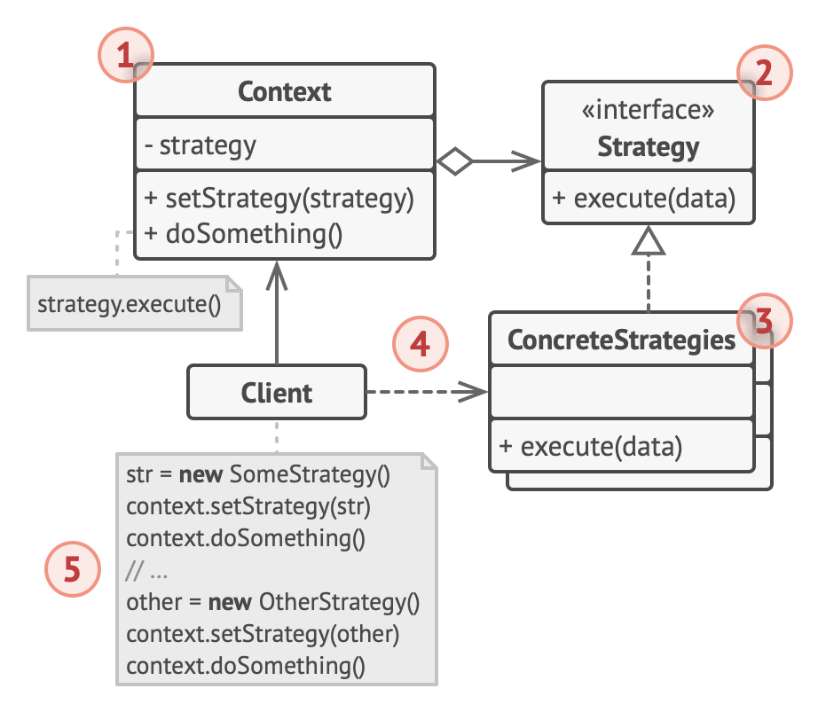

# Strategy design pattern

- it lets you define a family of algorithms, put each of them into a separate class and make their objects interchangeable

## Problem

- when creating a navigation app for travelers
  - the app is centered around a map which helped users quickly orient themselves in any city
  - 1 of the most requested features for the app is automatic route planning
    - a user should be able to enter an address and see the fastest route to that destination displayed on the map
  - the 1st version of the app could only build the routes over roads
    - however, not everyone likes to drive on their vacation
    - the next update, you added an option to build walking routes
    - then you add another option to let people use public transport in their routes
    - later you add route building for cyclists
    - later another option for building route for all tourist attractions
  - from a business perspective the app is a success
    - but the technical part caused many headaches
      - each time you add a new routing algorithm, the main class of the navigator doubled in size
      - becoming too hard to maintain
  - any change to 1 of the algorithms, whether it is a simple bug fix, or a slight adjustment of the street score
    - affected the whole class, increasing the chance of creating an error in already working code
  - in addition, teamwork became inefficient
    - teammates would complain that they spend too much time resolving merge conflicts
    - implementing a new features requires you to change the same huge class conflicting with the code produced by other people

## Solution

- the strategy pattern suggest that you take a class that does something sepcific in a lot of different ways
  - and extract all of these algorithms into separate classes called strategies
- the original class called context must have a field for storing a reference to 1 of the strategies
  - the context delegates the work to a linked strategy object instead of executing it on its own
- the context isn't responsible for selecting an appropriate algorithm for the job
  - instead, the client passes the desired strategy to the context
  - the context doesn't know much about the strategies
  - it works with all strategies through the same generic interface
    - which only exposes a single method for triggering the algorithm encapsulated within the selected strategy
- this way the context becomes independent of concrete strategies
  - so you can add new algorithms or modify existing 1s without changing the code of the context or other starategies
- in the navigation app, each routing algorithm can be extracted to its own class with a single buildRoute method
  - the method accepts an origin and destination and returns a collection of the route's checkpoints
- even though given the same arguments, each routing class might build a different route
  - the main navigator class doesn't really care which algorithm is selected since its primary job is to render a set of checkpoints on the map
  - the class has a method for switching the active routing strategy
    - so its clients such as the buttons in the user interface can replace the currently selected routing behavior with another one

## Analogy

- imagine that you have to get to the airport
  - you can catch a bus, order a cab, or get on the bicycle
- these are your transportation strategies
- you can pick one of the strategies depending on factors such as budget or time constraints

## Structure

1. The Context maintains a reference to one of the concrete strategies and communicates with this object only via the strategy interface.

2. The Strategy interface is common to all concrete strategies.

   - It declares a method the context uses to execute a strategy.

3. Concrete Strategies implement different variations of an algorithm the context uses.

4. The context calls the execution method on the linked strategy object each time it needs to run the algorithm.

   - The context doesn’t know what type of strategy it works with or how the algorithm is executed.

5. The Client creates a specific strategy object and passes it to the context.
   - The context exposes a setter which lets clients replace the strategy associated with the context at runtime.

## How to use

- Use the Strategy pattern when you want to use different variants of an algorithm within an object and be able to switch from one algorithm to another during runtime
  - The Strategy pattern lets you indirectly alter the object’s behavior at runtime by associating it with different sub-objects which can perform specific sub-tasks in different ways
- Use the Strategy when you have a lot of similar classes that only differ in the way they execute some behavior
  - The Strategy pattern lets you extract the varying behavior into a separate class hierarchy and combine the original classes into one, thereby reducing duplicate code
- Use the pattern to isolate the business logic of a class from the implementation details of algorithms that may not be as important in the context of that logic
  - The Strategy pattern lets you isolate the code, internal data, and dependencies of various algorithms from the rest of the code
  - Various clients get a simple interface to execute the algorithms and switch them at runtime
- Use the pattern when your class has a massive conditional operator that switches between different variants of the same algorithm
  - The Strategy pattern lets you do away with such a conditional by extracting all algorithms into separate classes, all of which implement the same interface
  - The original object delegates execution to one of these objects, instead of implementing all variants of the algorithm

## How to implement

1. In the context class, identify an algorithm that’s prone to frequent changes
   - It may also be a massive conditional that selects and executes a variant of the same algorithm at runtime
2. Declare the strategy interface common to all variants of the algorithm
3. One by one, extract all algorithms into their own classes
   - They should all implement the strategy interface
4. In the context class, add a field for storing a reference to a strategy object
   - Provide a setter for replacing values of that field
   - The context should work with the strategy object only via the strategy interface
   - The context may define an interface which lets the strategy access its data
5. Clients of the context must associate it with a suitable strategy that matches the way they expect the context to perform its primary job

## Pros && Cons

### Pros

- You can swap algorithms used inside an object at runtime
- You can isolate the implementation details of an algorithm from the code that uses it
- You can replace inheritance with composition
- Open/Closed Principle
  - You can introduce new strategies without having to change the context

### Cons

- If you only have a couple of algorithms and they rarely change, there’s no real reason to overcomplicate the program with new classes and interfaces that come along with the pattern
- Clients must be aware of the differences between strategies to be able to select a proper one
- A lot of modern programming languages have functional type support that lets you implement different versions of an algorithm inside a set of anonymous functions
- Then you could use these functions exactly as you’d have used the strategy objects, but without bloating your code with extra classes and interfaces
