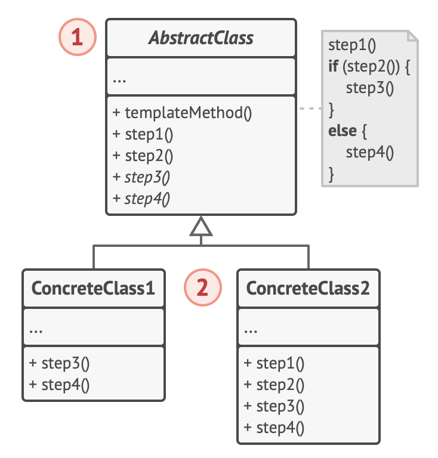

# Template design pattern

- it is a design pattern that defines the skeleton of an algorithm in the superclass but lets subclasses override specific steps of the algorithm without changing its structure

## Problem

- when creating a data mining app that analyzes corporate documents
  - user feed the app documents in various formats (pdf, doc, csv)
  - and tries to extract meaningful data from these docs in a uniform format
- 1st version of the app could only work only with DOC files
  - next version able to support CSV files
  - later it can extract PDF files
- at some point, you realized that all 3 classes have a lot of similar code
  - while the code for dealing with various data formats was entirely different in all classes
    - the code for data processing and analysis is almost identical
    - would be great to get rid of code duplication
      - and leave the algorithm structure intact
- there is another problem related to client code that used these classes
  - it had lots of conditionals that picked a proper course of action depeneding on the class of the processing object
  - if all 3 processing classes had a common interface or a base class
    - one can eliminate the conditionals in client code
    - and use polymorphism when calling methods on a processing object

## Solution

- the pattern suggest that you break down an algorithm into a series of steps
  - turn these steps into methods
  - and put a series of calls to these methods inside a single template method
  - the steps may either be abstract or have some default implementation
  - to use the algorithm, the client is supposed to provide its own subclass
    - implement all abstract steps and override some of the optional ones if needed but not the template method itself
- a base class can be created for all algorithms
  - the class defines a template method consisting of a series of calls to various document processing steps
- at first, we can declare all steps abstract
  - forcing the subclasses to provide their own implementations for these methods
  - for this case, subclasses already have all necessary implementations
    - the only thing needed is to adjust signatures of the methods to match the methods of the superclass
- to get rid of duplicate code
  - the code for opening/closing files and extracting/parsing data is different for various data formats
    - no point touching these methods
  - however, implementation of other steps such as analyzing raw data & composing reports is similar
  - so it can pulled up into the base class where subclasses can share that code
- there are 2 types of steps
  - abstract steps must be implemented by every subclass
  - optional steps already have some default implementation, but still can be overridden if needed
- there is another type of step, called hooks
  - it is an optional step with an empty body
  - a template method would work even if a hook isn't overridden
  - usually hooks are placed before and after crucial steps of algorithms
    - provding subclasses with additional extension points for an algorithm

## Analogy

- the template method approach can be used in mass housing construction
  - the architectural plan for building a standard house may contain several extension points that would let a potential owner adjust some details of the resulting house
- each building step such as laying the foundation, framing, building walls, installing plumbing and wiring for water and electricity, can be slightly changed to make the resulting house a little bit different from others

## Structure

1. The Abstract Class declares methods that act as steps of an algorithm, as well as the actual template method which calls these methods in a specific order.

   - The steps may either be declared abstract or have some default implementation.

2. Concrete Classes can override all of the steps, but not the template method itself.

## How to use

- Use the Template Method pattern when you want to let clients extend only particular steps of an algorithm, but not the whole algorithm or its structure
  - The Template Method lets you turn a monolithic algorithm into a series of individual steps which can be easily extended by subclasses while keeping intact the structure defined in a superclass
- Use the pattern when you have several classes that contain almost identical algorithms with some minor differences
  - As a result, you might need to modify all classes when the algorithm changes
  - When you turn such an algorithm into a template method, you can also pull up the steps with similar implementations into a superclass, eliminating code duplication
  - Code that varies between subclasses can remain in subclasses

## How to implement

1. Analyze the target algorithm to see whether you can break it into steaps
   - consider which steps are common to all subclasses and which ones will always be unique
2. create the abstract base class and declare the template method and a set of abstract methods representing the algorithm's steps
   - outline the algorithm's structure in the template method by executing corresponding steps
   - consider making the template method final to prevent final to prevent subclasses from overriding it
3. it is okay if all steps end by being abstract
   - however, some steps might benefit from having a default implementation
   - subclasses don't have to implement those methods
4. think of adding hooks between the crucial steps of the algorithm
5. for each variation of the algorithm, create a new concrete subclass
   - it must implement all of the abstract steps, but may also override some of the optional ones

## Pros and Cons

### Pros

- can let clients override only certain parts of a large algorithm
  - making them less affected by changes that happen to other parts of the algorithm
- can pull the duplicate code into a superclass

### Cons

- some clients may be limited by the provided skeleton of an algorithm
- you might violate the Liskov Substitution Principle by suppressing a default step implementation via a subclass
- template methods tend to be harder to maintain the more steps they have
