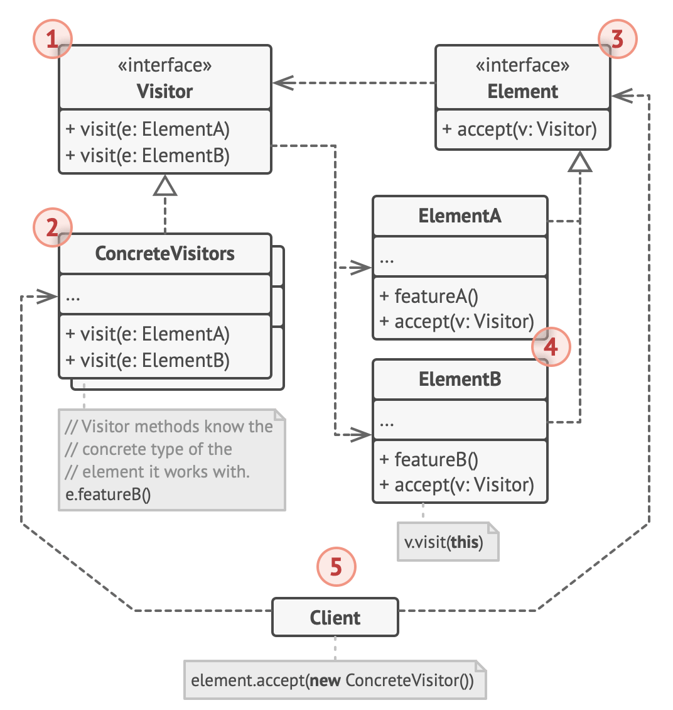

# Visitor design pattern

- it is a behavioral design pattern that lets you separate algorithms from the objects on which they operate

## Problem

- when a team develops an app which works with geographic information structured as 1 colossal graph
  - each node of the graph may represent a complex entity
    - such as a city, and granular things like industries, sightseeing areas, etc
  - the nodes are connected with others if there's a road between real objects that they represent
  - under the hood, each node type is represented by its own class
  - while each specific node is an object
- at some point, a new task is given to implemen exporting the graph into XML format
  - seems straightforward
  - plan to add an export method to each node class
    - and then leverage recursion to go over each node of the graph, executing the export method
  - solution was simple and elegant
    - thanks to polymorphism, code weren't coupled that called the export method to concrete classes of node
- however, the system architect refused to allow altering of existing node classes
  - since code was already in production, its not good to take risk breaking the app due to a potential bug in the changes
  - it also does not make sense to have XML export code within node classes
    - primary job of these classes was to work with geodata
      - XML export behavior would look alien there
  - another reason for refusal is after this feature is implemented
    - someone from the marketing department would ask to provide the ability to export into a different format
      - or request some other weird stuff
    - this would force you to change those classes again

## Solution

- the visitor pattern suggests that the new behavior should be placeds into a separate class call visitor
  - the original object that had to perform the behavior is now passed to 1 of the visitor's methods as an argument
    - providing the method access to all necessary data contained within the object
- the behavior can also be executed over objects of different classes
  - the visitor class may define set of methods, each of which could take arguments of different types
    ```
    class ExportVisitor implements Visitor is
      method doForCity(City c) { ... }
      method doForIndustry(Industry f) { ... }
      method doForSightSeeing(SightSeeing ss) { ... }
      // ...
    ```
  - however, calling of these methods will be an issue since they have different signatures, thus polymorphism can't be used
    ```
    foreach (Node node in graph) {
      if (node instanceof City)
        exportVisitor.doForCity((City) node)
      if (node instanceof Industry)
        exportVisitor.doForIndustry((Industry) node)
      // ...
    }
    ```
  - why not use method overloading?
    - give all methods the same name even if they support different sets of parameters
    - however, even if java & C# supports it, it won't be of help
    - since the exact class of a node object is unknown in advance
      - the overloading mechanism won't be able to determine the correct method to execute
    - it would default to the method that takes an object of the base Node class
- the Visitor pattern addresses this problem by using the `Double Dispatch` method

  - this helps to execute the proper method on an object without cumbersome conditionals
  - instead of letting the client select a proper version of the method to call

    - we delegate the choice to objects we're passing to the visitor as an argument
    - since the objects know their own classes

      - they would be able to pick a proper method on the visitor less awkwardly
      - the accept a visitor and tell it what visiting method should be executed

        ```
        // Client code
        foreach (Node node in graph)
          node.accept(exportVisitor)

        // City
        class City is
          method accept(Visitor v) is
            v.doForCity(this)
          // ...

        // Industry
        class Industry is
          method accept(Visitor v) is
            v.doForIndustry(this)
          // ...
        ```

- although the node classes still has to be changed
  - at least the change is trivial
  - and lets us add further behaviors without altering the code again
- by extracting a common interface for all visitors
  - all existing nodes can work with any visitor introduced into the app
  - when required to introduce a new behavior related to nodes, just need to implement a new visitor class

## Analogy

- imagine a seasoned insurance agent who's eager to get new customers
  - he can visit every building in a neighborhood
    - and try to sell insurance to everyone he meets
  - depending on the type of organization that occupies the building
    - he can offer specialized insurance policies
      - residential building, sells medical insurance
      - bank, sells theft insurance
      - coffee shop, sells fire and flood insurance

## Structure



1. The Visitor interface declares a set of visiting methods that can take concrete elements of an object structure as arguments.

   - These methods may have the same names if the program is written in a language that supports overloading, but the type of their parameters must be different.

2. Each Concrete Visitor implements several versions of the same behaviors, tailored for different concrete element classes.

3. The Element interface declares a method for “accepting” visitors.

   - This method should have one parameter declared with the type of the visitor interface.

4. Each Concrete Element must implement the acceptance method.

   - The purpose of this method is to redirect the call to the proper visitor’s method corresponding to the current element class.
   - Be aware that even if a base element class implements this method, all subclasses must still override this method in their own classes and call the appropriate method on the visitor object.

5. The Client usually represents a collection or some other complex object (for example, a Composite tree).
   - Usually, clients aren’t aware of all the concrete element classes because they work with objects from that collection via some abstract interface.

## When to use

- Use the Visitor when you need to perform an operation on all elements of a complex object structure (for example, an object tree)
  - The Visitor pattern lets you execute an operation over a set of objects with different classes by having a visitor object implement several variants of the same operation, which correspond to all target classes
- Use the Visitor to clean up the business logic of auxiliary behaviors
  - The pattern lets you make the primary classes of your app more focused on their main jobs by extracting all other behaviors into a set of visitor classes
- Use the pattern when a behavior makes sense only in some classes of a class hierarchy, but not in others
  - You can extract this behavior into a separate visitor class and implement only those visiting methods that accept objects of relevant classes, leaving the rest empty

## How to implement

1. Declare the visitor interface with a set of “visiting” methods, one per each concrete element class that exists in the program
2. Declare the element interface
   - If you’re working with an existing element class hierarchy, add the abstract “acceptance” method to the base class of the hierarchy
   - This method should accept a visitor object as an argument
3. Implement the acceptance methods in all concrete element classes
   - These methods must simply redirect the call to a visiting method on the incoming visitor object which matches the class of the current element
4. The element classes should only work with visitors via the visitor interface
   - Visitors, however, must be aware of all concrete element classes, referenced as parameter types of the visiting methods
5. For each behavior that can’t be implemented inside the element hierarchy, create a new concrete visitor class and implement all of the visiting methods
   - You might encounter a situation where the visitor will need access to some private members of the element class
   - In this case, you can either make these fields or methods public, violating the element’s encapsulation, or nest the visitor class in the element class
   - The latter is only possible if you’re lucky to work with a programming language that supports nested classes
6. The client must create visitor objects and pass them into elements via “acceptance” methods

## Pros & Cons

### Pros

- Open/Closed Principle
  - You can introduce a new behavior that can work with objects of different classes without changing these classes
- Single Responsibility Principle
  - You can move multiple versions of the same behavior into the same class
- A visitor object can accumulate some useful information while working with various objects
  - This might be handy when you want to traverse some complex object structure, such as an object tree, and apply the visitor to each object of this structure

### Cons

- You need to update all visitors each time a class gets added to or removed from the element hierarchy
- Visitors might lack the necessary access to the private fields and methods of the elements that they’re supposed to work with
