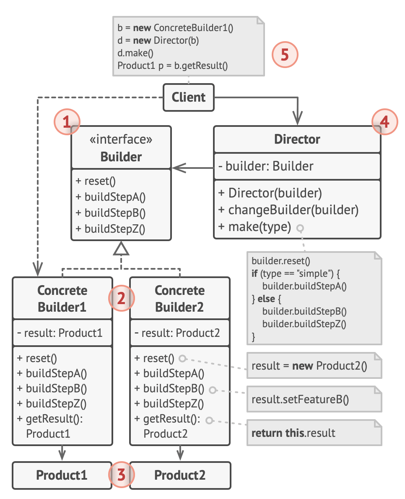

# Builder pattern

- A builder builds anything that requires the culmination of multiple variant steps and processes that result in a finished entity
- A builder understands the requirement in the easiest of expression and translates that into the outcome, using several complex internal processes
- Definition by the Gang of Four
  - A builder separates the construction of a complex object from its representation so that the same construction process can create different representations

## Purpose for using it

- some objects are simple and can be created in a single constructor call
- other objects require a lot of ceremony to create
- having an object with 10 constructor arguments is not productive
  - eg instead of concatenating multiple strings, use a string builder instead
- instead, opt for piecewise construction
  - eg allow people to construct objects piece by piece
- builder provides an API for constructing an object step by step

### summary: A builder is essentially a separate component, so when piecewise object construction is complicated, provide an API for doing it succinctly

## Structure



1. The Builder interface declares product construction steps that are common to all types of builders.

2. Concrete Builders provide different implementations of the construction steps.

   - Concrete builders may produce products that don’t follow the common interface.

3. Products are resulting objects.

   - Products constructed by different builders don’t have to belong to the same class hierarchy or interface.

4. The Director class defines the order in which to call construction steps, so you can create and reuse specific configurations of products.

5. The Client must associate one of the builder objects with the director.
   - Usually, it’s done just once, via parameters of the director’s constructor.
   - Then the director uses that builder object for all further construction.
   - However, there’s an alternative approach for when the client passes the builder object to the production method of the director.
   - In this case, you can use a different builder each time you produce something with the director.

## Why do we need it

- because sometimes you just want a bit of convenience when building up objects
  - especially if those objects are complicated

## example

- the following is an example of not creating a html builder
  - resulting in a tedious method of creating a html

### C#

- Not using a html builder

```c#
public class Program {
  public static void Main() {
    string hello = "hello";
    // StringBuilder is a type of builder to build strings
    System.Text.StringBuilder sb = new System.Text.StringBuilder();
    sb.Append("<p>");
    sb.Append(hello);
    sb.Append("</p>");
    System.Console.WriteLine(sb);

    string[] words = new[] {"Hello", "World"};
    sb.Clear();
    sb.Append("<ul>");
    foreach (string word in words)
      sb.AppendFormat($"<li>{word}</li>");
    sb.Append("</ul>");
    System.Console.WriteLine(sb);
    /*
    <p>hello</p>
    <ul><li>Hello</li><li>World</li></ul>
    */
  }
}
```

- Creating a html builder

```c#
using System.Collections.Generic;

public class HtmlElement {
  public string Name, Text;
  public List<HtmlElement> Elements = new List<HtmlElement>();
  private const int indentSize = 2;

  public HtmlElement() {
  }

  public HtmlElement(string name, string text) {
    Name = name ?? throw new System.ArgumentNullException(paramName: nameof(name));
    Text = text ?? throw new System.ArgumentNullException(paramName: nameof(text));
  }

  private string ToStringImpl(int indent) {
    System.Text.StringBuilder sb = new System.Text.StringBuilder();
    string i = new string(' ', indentSize * indent);
    sb.AppendLine($"{i}<{Name}>");

    if (!string.IsNullOrWhiteSpace(Text)) {
      sb.Append(new string(' ', indentSize * (indent + 1)));
      sb.AppendLine(Text);
    }

    foreach (var e in Elements) {
      sb.Append(e.ToStringImpl(indent + 1));
    }
    sb.AppendLine($"{i}</{Name}>");
    return sb.ToString();
  }

  public override string ToString() {
    return ToStringImpl(0);
  }
}

public class HtmlBuilder {
  private readonly string rootName;
  HtmlElement root = new HtmlElement();

  public HtmlBuilder(string rootName) {
    this.rootName = rootName;
    root.Name = rootName;
  }

  public void AddChild(string childName, string childText) {
    HtmlElement e = new HtmlElement(childName, childText);
    root.Elements.Add(e);
  }

  public override string ToString() {
    return root.ToString();
  }

  public void Clear() {
    root = new HtmlElement{Name = rootName};
  }
}

public class Program {
  public static void Main() {
    HtmlBuilder builder = new HtmlBuilder("ul");
    builder.AddChild("li", "hello");
    builder.AddChild("li", "world");
    System.Console.WriteLine(builder.ToString());
    /*
    <ul>
      <li>
        hello
      </li>
      <li>
        world
      </li>
    </ul>
    */
  }
}
```

- Fluent builder
  - enable chaining of methods

```c#
using System.Collections.Generic;

public class HtmlElement {
  public string Name, Text;
  public List<HtmlElement> Elements = new List<HtmlElement>();
  private const int indentSize = 2;

  public HtmlElement() {
  }

  public HtmlElement(string name, string text) {
    Name = name ?? throw new System.ArgumentNullException(paramName: nameof(name));
    Text = text ?? throw new System.ArgumentNullException(paramName: nameof(text));
  }

  private string ToStringImpl(int indent) {
    System.Text.StringBuilder sb = new System.Text.StringBuilder();
    string i = new string(' ', indentSize * indent);
    sb.AppendLine($"{i}<{Name}>");

    if (!string.IsNullOrWhiteSpace(Text)) {
      sb.Append(new string(' ', indentSize * (indent + 1)));
      sb.AppendLine(Text);
    }

    foreach (var e in Elements) {
      sb.Append(e.ToStringImpl(indent + 1));
    }
    sb.AppendLine($"{i}</{Name}>");
    return sb.ToString();
  }

  public override string ToString() {
    return ToStringImpl(0);
  }
}

public class HtmlBuilder {
  private readonly string rootName;
  HtmlElement root = new HtmlElement();

  public HtmlBuilder(string rootName) {
    this.rootName = rootName;
    root.Name = rootName;
  }

  // change void to HtmlBuilder to return this object
  public HtmlBuilder AddChild(string childName, string childText) {
    HtmlElement e = new HtmlElement(childName, childText);
    root.Elements.Add(e);
    return this;
  }

  public override string ToString() {
    return root.ToString();
  }

  public void Clear() {
    root = new HtmlElement{Name = rootName};
  }
}

public class Program {
  public static void Main() {
    HtmlBuilder builder = new HtmlBuilder("ul");
    builder.AddChild("li", "hello").AddChild("li", "world");
    System.Console.WriteLine(builder.ToString());
  }
}
```

## Fluent Builder inheritance with recursive generics

- builders inherit from other builders
  - will be problematic if used fluent interface approach

```c#
using System;
using System.Collections.Generic;

public class Person
{
  public string Name;
  public string Position;
  public override string ToString()
  {
    return $"{nameof(Name)}: {Name}, {nameof(Position)}: {Position}";
  }
}

public class PersonInfoBuilder
{
  protected Person person = new Person();
  public PersonInfoBuilder Called(string name)
  {
    person.Name = name;
    return this;
  }
}

public class PersonJobBuilder : PersonInfoBuilder
{
  public PersonJobBuilder WorksAsA(string position)
  {
    person.Position = position;
    return this;
  }
}

internal class Program
{
  public static void Main(string[] args)
  {
    var builder = new PersonJobBuilder();
    builder.Called("Terence").WorkAsA  // can't call WorkAsA method
    // The reason why it's not working is because when you call the Called method, you return a PersonInfoBuilder
    // PersonInfoBuilder doesn't know anything about WorkAsA method because it's not part of its inheritance hierarchy
    // PersonInfoBuilder just gives you an interface to the PersonInfoBuilder
    // Therefore the problem with inheritance of fluid interfaces is that you are not allowed to use the containing type as the return type
    // This makes no sense because if you were to do this, eventually as soon as someone calls the Called method, you are degrading your builder from a PersonJobBuilder to a PersonInfoBuilder
  }
}
```

- 1 way to get to get fluent interfaces to inherit is to use recursive generics approach
  - eg. class Foo : Bar\<Foo\>

```c#
using System;
using System.Collections.Generic;

public class Person
{
  public string Name;
  public string Position;

  // use to expose own builder
  // can try to prevent accessibility from outside, but is difficult to control effectively
  // therefore, can make the builder internally and give it an internal constructor
  // but cannot make it private as it is already being exposed through the api
  public class Builder : PersonJobBuilder<Builder>
  {
  }

  // whenever a new person is constructed, a new builder will be given
  public static Builder New => new Builder();

  public override string ToString()
  {
    return $"{nameof(Name)}: {Name}, {nameof(Position)}: {Position}";
  }
}

public abstract class PersonBuilder
{
  protected Person person = new Person();

  public Person Build()
  {
    return person;
  }
}

// class Foo : Bar<Foo>
public class PersonInfoBuilder<SELF>
  : PersonBuilder
  where SELF : PersonInfoBuilder<SELF>  // this is used to restrict SELF, and not int, string, etc.
{
  public SELF Called(string name)
  {
    person.Name = name;
    return (SELF) this;  // need to cast (SELF) to work
  }
}

// this class cannot be initialized directly as there will be type issue at SELF (eg. new PersonJobBuilder<???>)
public class PersonJobBuilder<SELF>
  : PersonInfoBuilder<PersonJobBuilder<SELF>>
  where SELF : PersonJobBuilder<SELF>  // this is used to restrict SELF, and not int, string, etc.
{
  public SELF WorksAsA(string position)
  {
    person.Position = position;
    return (SELF) this;  // need to cast (SELF) to work
  }
}

internal class Program
{
  public static void Main(string[] args)
  {
    var me = Person.New.Called("Terence").WorksAsA("software engineer").Build();
    Console.WriteLine(me);  // Name: Terence, Position: software engineer
  }
}
```

## Functional Builder

- functional programming style

```c#
using System;
using System.Collections.Generic;

public class Person
{
  public string Name, Position;
}

public class PersonBuilder
{
  private string Name, Position;

  public readonly List<Action<Person>> Actions =
    new List<Action<Person>>();

  public PersonBuilder Called(string name)
  {
    Actions.Add(p => { p.Name = name; });
    return this;
  }

  public Person Build()
  {
    var p = new Person();
    Actions.ForEach(a => a(p));
    Name = p.Name;
    Position = p.Position;
    return p;
  }

  public override string ToString()
  {
    return $"{nameof(Name)}: {Name}, {nameof(Position)}: {Position}";
  }
}

public static class PersonBuilderExtensions
{
  public static PersonBuilder WorkAsA(this PersonBuilder builder, string position)
  {
    builder.Actions.Add(p => { p.Position = position; });
    return builder;
  }
}

class Program
{
  public static void Main(string[] args)
  {
    var pb = new PersonBuilder();
    pb.Called("Terence").WorkAsA("software engineer").Build();
    Console.WriteLine(pb);  // Name: Terence, Position: software engineer
  }
}
```

## Faceted Builder
