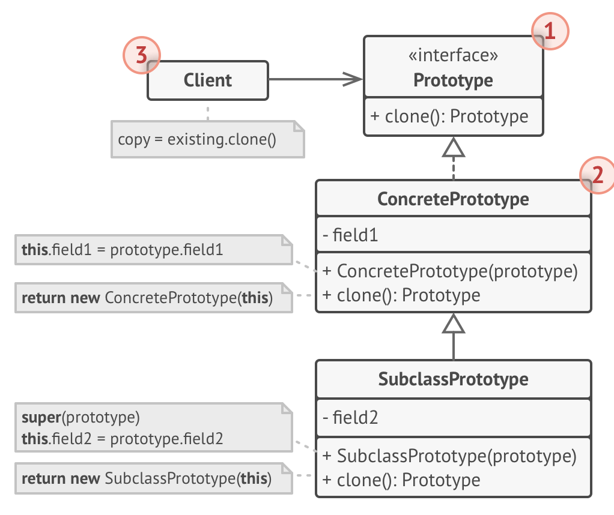

# Prototype

- Allows to specify the kinds of objects to use a prototypical instance
  - and create new objects by copying this prototype
- The prototype pattern needs to return a copy of an instance of the class with a method usually called as clone
  - clone method does not literally just have to return a copy
  - it can also be used to copy and modify attributes

## Why use

- Might wanna use when creation of an object is costly
  - e.g.: a class which requires some configuration data, maybe for a file or database or streamed over some network
    - this calss would be required for initialization
    - if you do not want to pay the cost of having to setup each time, especially if the data does not change often
      - in this case, using of the Prototype pattern to create a simple copy of the objects would be preferred

## Structure

1. The Prototype interface declares the cloning methods.

   - In most cases, it’s a single clone method.

2. The Concrete Prototype class implements the cloning method.

   - In addition to copying the original object’s data to the clone, this method may also handle some edge cases of the cloning process related to cloning linked objects, untangling recursive dependencies, etc.

3. The Client can produce a copy of any object that follows the prototype interface.

## Usage example

- A Builder pattern is used to build complex objects, an example a car
  - this is good if only 1 car is being built, but bad if want to build multiple similar cars
    - because it will be troublesome to set up the director every time
  - by using a prototype class with a clone method, creating copies of cars will be easier
