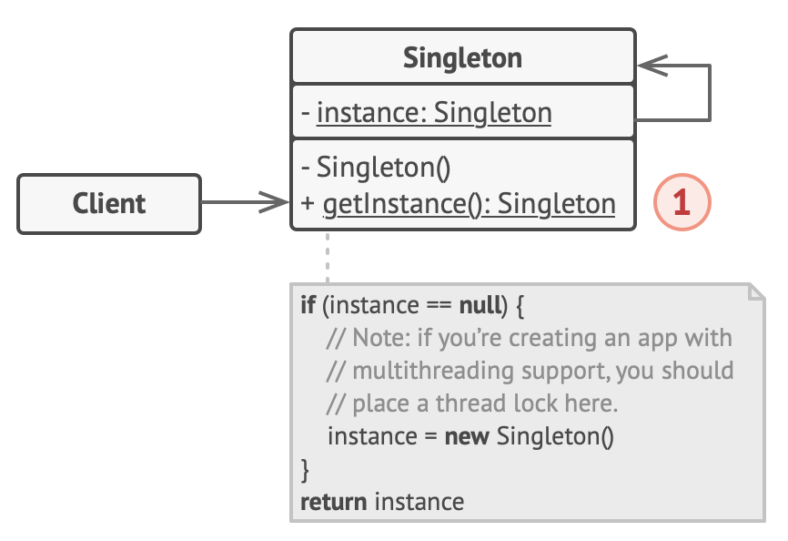

# Singletons

- Objects that can only have a single instance, with a single point of access
- It is a global variable in an object-oriented way
- Why use it?
  - Useful for maintaining a central state, where all clients need to access and operate on a common resource
  - It can be used to cache information
    - so as to be shared by various elements of the software system
    - by keeping the information in a single object
      - it is not longer required to retrieve the infromation from its original source every time
      - in this case, singleton acts as a cache of the information

## Structure



1. The Singleton class declares the static method getInstance that returns the same instance of its own class.
   - The Singleton’s constructor should be hidden from the client code.
   - Calling the getInstance method should be the only way of getting the Singleton object.

## Javascript

### The Node.js module system provides a basic framework for implementing a rudimentary singleton

```javascript
let num1 = 0;
module.exports = {
  add: num => num1 + num, // module 1
  subtract: num => num1 - num, // module 2
};
```

#### Creating a singleton with ES5

- When module is imported, only a single instance is created and referred to
  - This is because the module system caches the module the moment it is accessed by using a require statement
  - Therefore, regardless of the number of times imported, the same instance is referred and is will be accessed via the same cached and common instance
  - However, although this behavior behaves like a singleton, it is technically just an instance of the module that is cached upon first access

#### Creating a singleton with ES6 class

- Normal way of exporting and importing Singletons defined with ES6 class with not behave like a singleton
  - as they do not share the same point of access
- Need to create an instance and export the instance to make it behave like a singleton

## Python

- Python modules are singletons
  - but it is not a good idea to use them for the Singleton pattern
    - because it is error-prone
      - e.g.: if you forget the global statements, variables local to a function will be created instead
    - they pollute the module namespace
    - no oop benefits like associated methods or reuse through inheritance

### Singleton pattern

- Ensures that a class has only 1 instance
- provide a global point of access to it
  - e.g. a logging class
- Pros
  - Singletons are allocated once and only once
  - Policies can be added to the method that provides access to the singleton pointer
- Cons
  - Derivatives of Singletons are not automatically Singletons
  - Singletons must always be accessed through a pointer or reference
    - obtaining this has overhead

#### uses **new** method

- is the first step of instance creation
- is called before **init**
  - is responsible for returning a new instance of the class

```python
class Singleton:
    __instance = None

    def __new__(cls, val=None):
        if Singleton.__instance is None:
            Singleton.__instance = object.__new__(cls)
        Singleton.__instance.val = val
        return Singleton.__instance
```

### Borg

- Allows a class to have as many instances as one likes
- ensures that they all share the same state
- Pros
  - Derivatives of monostate classes can also be monostate
  - Access to monostate objects does not have to be through pointers or references
- Cons
  - No instantiation policy can exist for monostate classes
  - Monostate instances may be allocated and deallocated many times

#### uses **init** method

- does not return anything
- only responsible for initializing the instance after it has been created

```python
class Borg:
    __shared_state = {}  # Attribute dictionary

    def __init__(self):
        self.__dict__ = self._shared_state  # Make it an attribute dictionary
```
