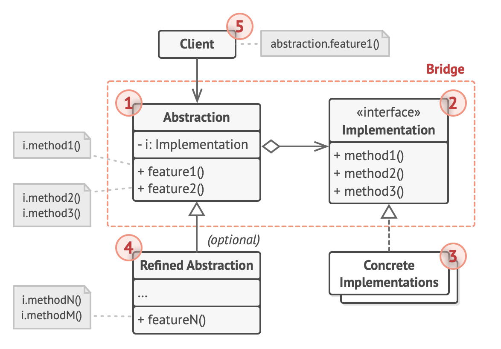

# Bridge pattern

- It divides business logic or huge class into separate class hierarchies that can be developed independently
  - one of these hierarchies (often called `Abstraction`) will get a reference to an object of the 2nd hierarchy (`Implementation`)
  - the abstraction will be able to delegate some of its calls to the implementations object
    - since all implementations will have a common interface and would be interchangeable inside the abstraction

## Why use the Bridge pattern

- it is useful for
  - dealing with cross-platform apps
  - supporting multiple types of database servers
  - working with serveral API providers of a certain kind
    - e.g.: cloud platforms, social networks

## Structure

1. The Abstraction provides high-level control logic.

   - It relies on the implementation object to do the actual low-level work.

2. The Implementation declares the interface that’s common for all concrete implementations.

   - An abstraction can only communicate with an implementation object via methods that are declared here.
   - The abstraction may list the same methods as the implementation, but usually the abstraction declares some complex behaviors that rely on a wide variety of primitive operations declared by the implementation.

3. Concrete Implementations contain platform-specific code.

4. Refined Abstractions provide variants of control logic. Like their parent, they work with different implementations via the general implementation interface.

5. Usually, the Client is only interested in working with the abstraction.
   - However, it’s the client’s job to link the abstraction object with one of the implementation objects.
