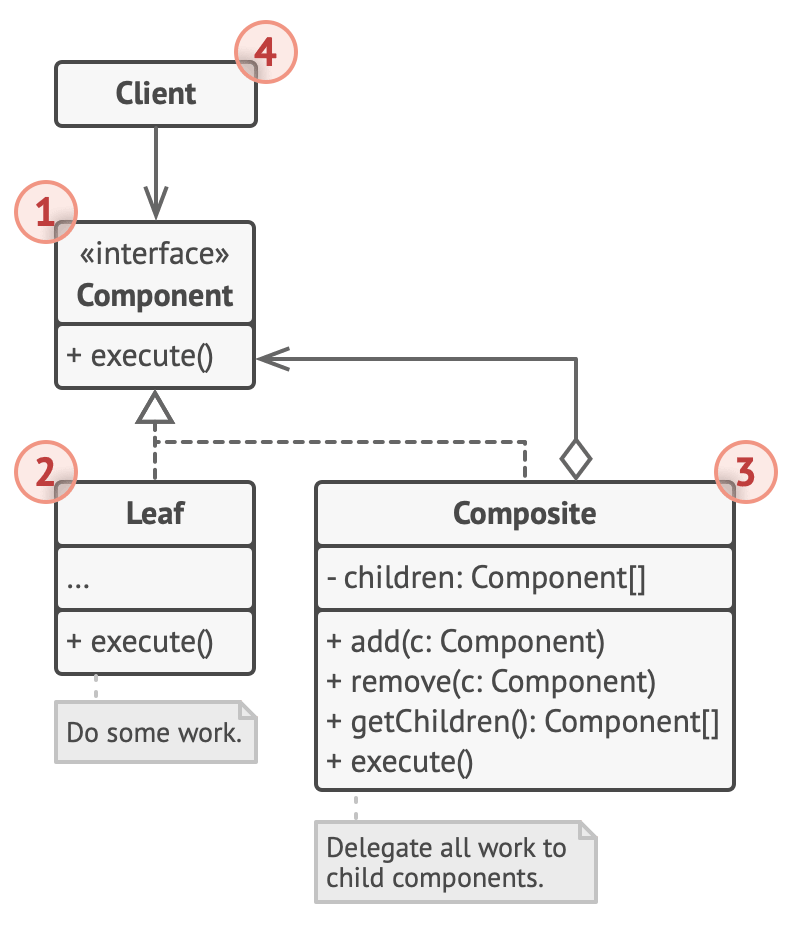

# Composite design pattern

- originally defined as
  - Compose objects into tree structures to represent part-whole hierarchies
    - composite let clients treat individual objects and compositions of objects uniformly

## Structure

1. The Component interface describes operations that are common to both simple and complex elements of the tree.

2. The Leaf is a basic element of a tree that doesn’t have sub-elements.

   - Usually, leaf components end up doing most of the real work, since they don’t have anyone to delegate the work to.

3. The Container (aka composite) is an element that has sub-elements: leaves or other containers.

   - A container doesn’t know the concrete classes of its children.
   - It works with all sub-elements only via the component interface.
   - Upon receiving a request, a container delegates the work to its sub-elements, processes intermediate results and then returns the final result to the client.

4. The Client works with all elements through the component interface.
   - As a result, the client can work in the same way with both simple or complex elements of the tree.

## Example

- The first element in this pattern is an abstract class that sits at the root of the hierarchical tree that this pattern aims to define.

  - This abstract class, known as a component, should contain primitive properties as well as operations that would be shared with its derivatives.

    - from the abstract component class, we get two kinds of derivative classes

      1. a primitive element, known as a leaf, cannot have any children of their own
         - The leaf represents a single element - for instance, a student or an employee or a product.
      2. a composite, which are collections of primitives
         - can host a collection of primitives (leaves) or composites as their children.
           - a composite of primitives could be a catalog of mobile phones
             - or a science class with students
             - or the Quality Assurance department with employees.
         - a composite of composites could be a catalog of mobile phones, laptops, and other products
           - where each category is a sub-catalog
             - a school with multiple subjects, each with multiple students.

    - both leaves and composites must implement a shared and uniform interface, as laid down by the parent class.
      - This ensures uniformity across the structure.
      - Additional methods may be added to the composites as needed, but they must adhere to the base interface.
        - This ensures that the client sees uniformity across composites and primitives, and uses the same interface.

## Summary

- Composite pattern allows you to define relationships and hierarchical trees of objects that stem from a base component class
- the structure allows you to define 2 kinds of nodes
  1. A leaf node or a single entity like a product or a person
     - requests to leaf node are handled directly
  2. A composite that contains collections of entities
     - composites can also be collection of composites
     - requests sent to composites are first forwarded to member leaves, where they are individually handled
  - both leaves and composites implement a uniform interface for the client, and are great for describing a relationship between objects
