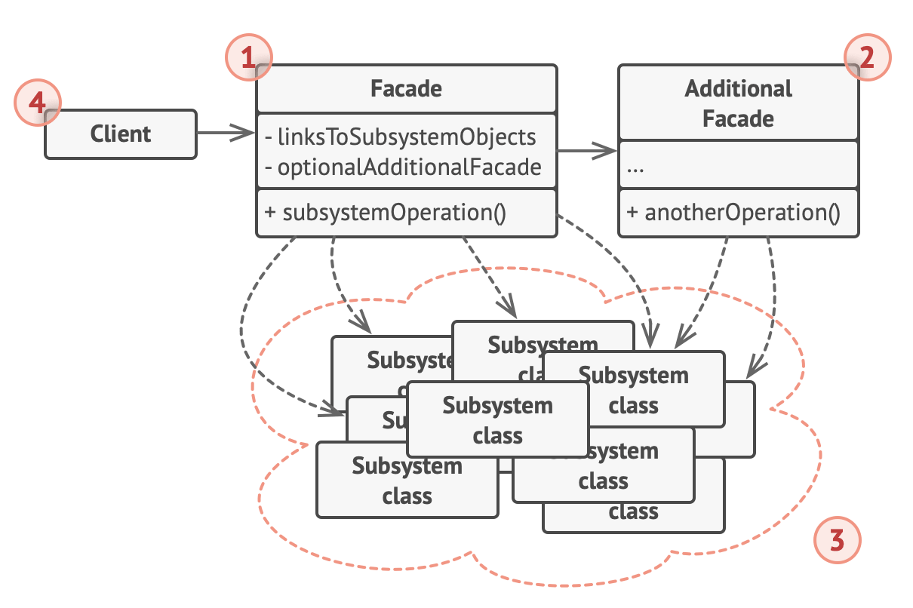

# Facade design pattern

- original definition
  - provide a unified interface to a set of interfaces in a subsystem
  - it defines a higher-level interface that makes the subsystem easier to use
- basically, the client only has to talk to the facade, which then delegates all of the responsibilities of knowing how to use the various potentially complicated sybsystems to it
  - the facade does all the heavy lifting
  - and the client just has to know the interface of the facade

## Structure

1. The Facade provides convenient access to a particular part of the subsystem’s functionality.

   - It knows where to direct the client’s request and how to operate all the moving parts.

2. An Additional Facade class can be created to prevent polluting a single facade with unrelated features that might make it yet another complex structure.

   - Additional facades can be used by both clients and other facades.

3. The Complex Subsystem consists of dozens of various objects.

   - To make them all do something meaningful, you have to dive deep into the subsystem’s implementation details, such as initializing objects in the correct order and supplying them with data in the proper format.
   - Subsystem classes aren’t aware of the facade’s existence.
   - They operate within the system and work with each other directly.

4. The Client uses the facade instead of calling the subsystem objects directly.

## Why use

- make a library easier to use, understand, and test
  - since the facade has convenient methods for common tasks
- reduce dependencies of outside code on the inner workings of a library
  - allowing more flexibility in developing the system
- wrap a poorly designed collection of APIs with a single well-designed API
