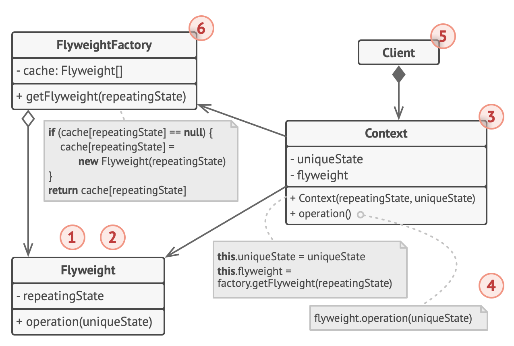

# Flyweight design pattern

- It allows programs to support vast quantities of objects by keeping their memory consumption low
- it is achieved by sharing parts of object state between multiple objects
  - thus allowing it to save RAM by caching the same data used by different objects

## Structure

1. The Flyweight pattern is merely an optimization.

   - Before applying it, make sure your program does have the RAM consumption problem related to having a massive number of similar objects in memory at the same time.
   - Make sure that this problem can’t be solved in any other meaningful way.

2. The Flyweight class contains the portion of the original object’s state that can be shared between multiple objects.

   - The same flyweight object can be used in many different contexts.
   - The state stored inside a flyweight is called intrinsic.
   - The state passed to the flyweight’s methods is called extrinsic.

3. The Context class contains the extrinsic state, unique across all original objects.

   - When a context is paired with one of the flyweight objects, it represents the full state of the original object.

4. Usually, the behavior of the original object remains in the flyweight class.

   - In this case, whoever calls a flyweight’s method must also pass appropriate bits of the extrinsic state into the method’s parameters.
   - On the other hand, the behavior can be moved to the context class, which would use the linked flyweight merely as a data object.

5. The Client calculates or stores the extrinsic state of flyweights.

   - From the client’s perspective, a flyweight is a template object which can be configured at runtime by passing some contextual data into parameters of its methods.

6. The Flyweight Factory manages a pool of existing flyweights.
   - With the factory, clients don’t create flyweights directly.
   - Instead, they call the factory, passing it bits of the intrinsic state of the desired flyweight.
   - The factory looks over previously created flyweights and either returns an existing one that matches search criteria or creates a new one if nothing is found.

## When to use

- it has a single purpose, which is to minimize memory intake
  - thus it is not required if program doesn't struggle with a shortage of RAM
