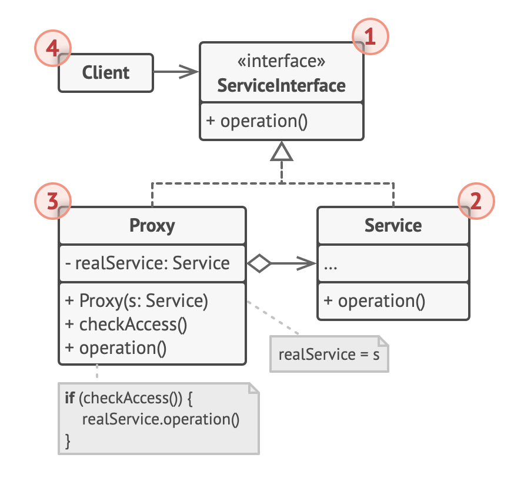

# Proxy design pattern

- allow us to control access to an object
- original definition
  - to provide a surrogate or placeholder for another object to control access to it
    - the surrogate / placeholder is used to access the original object
      - in doing so, the placeholder is able to augment and change the contents of the original object
        - this is often needed to introduce a virtualization layer between the object and the consumer
          - when the consumer requests access to the object, it does so through the proxy
          - the proxy then governs and modifies the data as needed by acting as a wrapper
- important thing is that the interface offered to the consumer remains inline and consistent with the original object
  - can apply a proxy-like behavior by 2 ways
    1. directly augmenting an object during access
    2. through composable wrappers
       - this is better and safer because it does not modify the original object

## typically, this pattern is used when

- need to optimize or preprocess data when the consumer accesses it
- caching remotely access data
- logging
- encryption
- simulating private and inaccessible properties
- data validation

## Why use a proxy

- use an extra level of indirection to support distributed, controlled, or conditional access
- add a wrapper and delegation to protect the real component from undue complexity

## Structure

1. The Service Interface declares the interface of the Service.

   - The proxy must follow this interface to be able to disguise itself as a service object.

2. The Service is a class that provides some useful business logic.

3. The Proxy class has a reference field that points to a service object.

   - After the proxy finishes its processing (e.g., lazy initialization, logging, access control, caching, etc.), it passes the request to the service object.
   - Usually, proxies manage the full lifecycle of their service objects.

4. The Client should work with both services and proxies via the same interface.
   - This way you can pass a proxy into any code that expects a service object.

## Summary

- the proxy pattern allows us to create placeholder wrappers for objects
- a proxy object allows external access control to the object
- implements the same interface as the original object
- the proxy api (ES6, ES2015) enables the creation of proxy wrappers for objects
- proxy implements traps for various kinds of access augmentation
- great for implementing middleware mechanism for caching, logging, encryption, and other kinds of augmented functionality as a virtualized proxy
