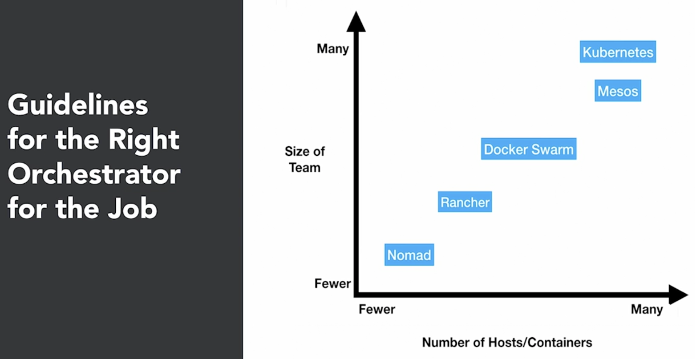

# Kubernetes (K8s, Hubernetes)
- it is an open-source platform started by google, designed to automate the deployment, scaling, and operation of containers
- the goal of the platform is to foster an ecosystem of components and tools that relieve the burden of running applications in public and private clouds
- in google
  - all infrastructure relies on containers and generates more than 2 billion container deployments a week
  - all powered by an internal platform called `Borg`
    - Borg was the predecessor to Kubernetes
- by using Kubernetes in your infrastructure
  - it gives you a platform to schedule and run containers on clusters of your machines
  - it runs on bare metal, virtual machines, private datacenter and public cloud
  - this means no more `golden handcuffs` and opens up opportunities to have hybrid cloud scenarios for those migrating towards the cloud
- since kubernetes is a container platform, you can use `Docker` containers or other container platforms (e.g.: rkt) to develop and build applications
  - then use Kubernetes to run these applications on your infrastructure
- other major player in container orchestration other than Kubernetes
  - e.g.: Docker Swarm, Rancher, Mesos
  - Cloud Specific technologies
    - e.g.: Amazon EC2 Container service, Google Anthos

## Features
### Multi-host container scheduling
- handled by Kube-scheduler
- it assigns containers also known as `pods` to nodes at runtime
- it checks resources, quality of service, polices, and user specifications before scheduling
### Scalability and Availability
- the kubernetes master can be deployed in a highly available configuration
- multi-region deployments are also available
- e.g.: Kubernetes v1.17
  - architecture supports 5000 node clusters
  - run up to max 150000 total pods
    - max 100 pods per node
  - pods can be horizontally scaled via an API
#### Flexibility and Modularization
- has a plug and play architecture
  - it allows you to extend it when needed
- has add-ons: network drivers, service discovery, container runtime, visualization, and command
  - if there are tasks that you need to perform for a specific environment
    - can create an add-on to suit the need
#### Registration and Discovery
- they are the 2 features that allow Kubernetes clusters to scale
##### Registration
- new worker nodes can seamlessly register themselves with the Kubernetes master node
##### Service Discovery
- allows for automatic detection of new services and endpoints via DNS or environment variables
#### Persistent Storage
- a requested and important feature when working with containers
- `pods` can use persistent volumes to store data
  - data is retained across pod restarts and crashes
#### Application Upgrades and Downgrades
- upgrades and downgrades are supported out of the box
### Maintenance
- features are backward compatible for a few versions
- all APIs are versioned
- able to turn on/off host during maintenance
  - can unschedule the host so that no deployments can take place on it during upgrading or maintenance
  - then turn host back on and schedule deployments or jobs
### Logging and Monitoring
- application monitoring or health checks are built-in
  - e.g.: TCP, HTTP, container execution health checks are available out of the box
- have health checks to give status of the nodes
  - failures are monitored by node controller
- Kubernetes status can also be monitored via add-ons
  - e.g.: Metrics Server, cAdvisors and Prometheus, Heapster
- can use built-in logging frameworks or use your own
### Secrets Management
- sensitive data is first class citizen
- secrets are mounted as data volumes or environment variables
- it is specific to a single namespace
  - thus they aren't shared across all applications
