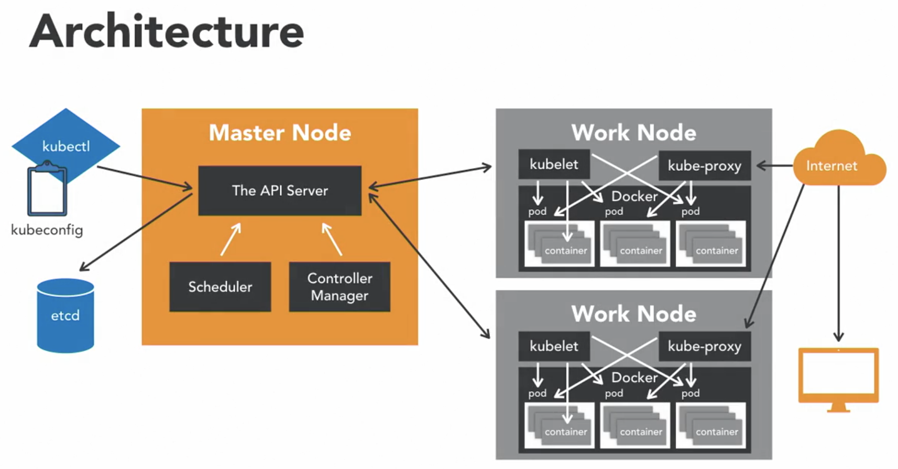

# Kubernetes (K8s, Hubernetes)

- it is an open-source platform started by google, designed to automate the deployment, scaling, and operation of containers
- the goal of the platform is to foster an ecosystem of components and tools that relieve the burden of running applications in public and private clouds
- in google
  - all infrastructure relies on containers and generates more than 2 billion container deployments a week
  - all powered by an internal platform called `Borg`
    - Borg was the predecessor to Kubernetes
- by using Kubernetes in your infrastructure
  - it gives you a platform to schedule and run containers on clusters of your machines
  - it runs on bare metal, virtual machines, private datacenter and public cloud
  - this means no more `golden handcuffs` and opens up opportunities to have hybrid cloud scenarios for those migrating towards the cloud
- since kubernetes is a container platform, you can use `Docker` containers or other container platforms (e.g.: rkt) to develop and build applications
  - then use Kubernetes to run these applications on your infrastructure
- other major player in container orchestration other than Kubernetes
  - e.g.: Docker Swarm, Rancher, Mesos
  - Cloud Specific technologies
    - e.g.: Amazon EC2 Container service, Google Anthos


## Features

### Multi-host container scheduling

- handled by Kube-scheduler
- it assigns containers also known as `pods` to nodes at runtime
- it checks resources, quality of service, polices, and user specifications before scheduling

### Scalability and Availability

- the kubernetes master can be deployed in a highly available configuration
- multi-region deployments are also available
- e.g.: Kubernetes v1.17
  - architecture supports 5000 node clusters
  - run up to max 150000 total pods
    - max 100 pods per node
  - pods can be horizontally scaled via an API

#### Flexibility and Modularization

- has a plug and play architecture
  - it allows you to extend it when needed
- has add-ons: network drivers, service discovery, container runtime, visualization, and command
  - if there are tasks that you need to perform for a specific environment
    - can create an add-on to suit the need

#### Registration and Discovery

- they are the 2 features that allow Kubernetes clusters to scale

##### Registration

- new worker nodes can seamlessly register themselves with the Kubernetes master node

##### Service Discovery

- allows for automatic detection of new services and endpoints via DNS or environment variables

#### Persistent Storage

- a requested and important feature when working with containers
- `pods` can use persistent volumes to store data
  - data is retained across pod restarts and crashes

#### Application Upgrades and Downgrades

- upgrades and downgrades are supported out of the box

### Maintenance

- features are backward compatible for a few versions
- all APIs are versioned
- able to turn on/off host during maintenance
  - can unschedule the host so that no deployments can take place on it during upgrading or maintenance
  - then turn host back on and schedule deployments or jobs

### Logging and Monitoring

- application monitoring or health checks are built-in
  - e.g.: TCP, HTTP, container execution health checks are available out of the box
- have health checks to give status of the nodes
  - failures are monitored by node controller
- Kubernetes status can also be monitored via add-ons
  - e.g.: Metrics Server, cAdvisors and Prometheus, Heapster
- can use built-in logging frameworks or use your own

### Secrets Management

- sensitive data is first class citizen
- secrets are mounted as data volumes or environment variables
- it is specific to a single namespace
  - thus they aren't shared across all applications

## Kubernetes: basics

### Kubernetes cluster architecture



#### master node

- responsible for overall management of the Kubernetes cluster
- has 3 components that takes care of communication, scheduling, and controllers
  1. API Server
     - allows you to interact with the Kubernetes PAI
     - its the front end of the Kubernetes control plane
  2. Scheduler
     - it watches created `Pods` who do not have a Node design yet
     - designs the `Pod` to run on a specific Node
  3. Controller Manager
     - it runs controllers
       - they are background threads that run tasks in a cluster
     - has a bunch of different roles compiled into a single binary
       - roles include
         - Node Controller: responsible for the worker states
         - Replication Controller: responsible for maintaining the correct number of Pods for the replicater controllers
         - End-Point Controller: joins services and Pods together
         - Service account and Token Controller: handle access management

#### etcd

- a simple distributed key value store
- Kubernetes uses it as a database, and stores all cluster data here
  - store informatione examples
    - job scheduling info, pod details, stage information, etc.

#### kubectl

- interact with `master node` with `kubectl`
- it is the command line interface for kubernetes
- has a `kubeconfig` config file
  - has server information
  - has authentication information to access the API server

#### worker nodes

- are nodes where the applications operate
- `kubelet` process
  - it communicates with the master node
  - it is an agent that communicates with the API server to see if `Pods` have been designed to the Nodes
  - it executes `Pod` containers via the `container engine`
  - it mounts and runt `Pod` volume and secrets
  - it is aware of `Pod` of Node states and responds back to the `Master`
- kubernetes is a container orchestrator
  - expectation is that you have a container native platform running on the `worker nodes`
    - this is where `Docker` is used to work together with `Kubelet` to run containers on the Node
- `kube-proxy`
  - it is the network proxy and load balancer for the service on a single worker node
  - it handles the network routing for TCP and UDP Packlets, and performs connection forwarding
- `Docker` daemon
  - allows running of `containers`
    - containers of an application are tightly coupled together in a `Pod`
      - `Pod` is a the smallest unit that can be scheduled as a deployment in Kubernetes
      - this group of containers share storage, Linux name space, IP addresses
      - it is also co-located and share resources that are always scheduled together
      - once `Pods` have been deployed and running, the `kubelet` process communicates with the `pods` to check on state and health
        - `kube-proxy` will route any packets to the Pods from other resources that might want communication
- worker nodes can be exposed to the internvet via `load balancer`
- traffic coming into the Nodes are handled by `Kube-proxy`
  - this is how end-users talk to kubernetes application

### Nodes and Pods

#### Node

- it serves as a worker machine is a kubernetes cluster
- it can be a physical computer or a virtual machine
- requirements
  - each node must have a `kubelet` running
  - container tooling like Docker
  - a kube-proxy process running
  - a process like `Supervisord` so that it can restart components
- recommendation
  - if using Kubernetes in a production like setting, recommended to have at least a 3 Node cluster

#### Tool: Minikube

- a lightweight kubernetes implementation that creates a VM on local machine and deploys a simple cluser containing only 1 node

#### Pods

- it is a simplest unit that you can interact with
- can create, deploy, and delete pods
- it represents 1 running process in the cluster
- inside a Pod
  - docker application container
  - storage resources
  - a unique network IP
  - options that govern how the container should run
  - in some scenarios
    - can have multiple docker containers running in a Pod
      - but a Pod represents 1 single unit of deployment, which is a single instance of an application in Kubernetes that is tightly coupled and shared resources
- designed to be ephemeral, disposable entities
- don't need to create Pods just by themselves in a production application
  - only do that when need to test whether the underlying containers actually work
- Pods don't self-heal
  - it a Pod dies, it will not be reschedules
  - if a Pod is exited from a Node because of lack of resources, it will not be restarted on different healthier Nodes
- always use higher-level constructs
  - it manages and adds stability to Pods, called controllers
  - thus user a controller like a deployment and don't use a Pod directly
- Pod States
  - `Pending`
    - Pod has been accepted by the Kubernete system, but a container has not been created yet
  - `Running`
    - where a Pod has been scheduled on a Node, and all of its containers are created, and at least 1 container is in a running state
  - `Succeeded`
    - all containers in the Pod have exited with an exit status of 0, indicating successful execution and will not be restarted
  - `Failed`
    - all containers in the Pod have exited and at least 1 container has failed and returned a non 0 exit status
  - `CrashLoopBackOff`
    - where a container fails to start, and Kubernetes tries repeatedly to restart the Pod

### Controllers

- pods are the basic building blocks in kubernets
  - but we should not use them by themselves and should use `controllers` instead
- benefits of controllers
  - `application reliability`: where multiple instances of an application running prevent problems if 1 or more instance fails
  - `scaling`: when the pods experience a high volume requests, kubernetes allows scaling up of the pods, allowing for a better user experience
  - `load balancing`: where having multiple versions of a pod running allow traffic to flow to different pods and doesn't overload 1 single pod or a node
- types of controllers
  - ReplicaSets
    - ensures that the specified number of replicas for a pod are running at all times
    - if the number of pods is less than what the Replicaset expects, for example when a pod crashed, it will start up a new pod
    - however, it can't be declared by itself as it requires deployment to do so
  - Deployments
    - provides a declarative updates for pods and ReplicaSets
      - it means that you can describe the desired state of a deployment in a `yaml` file
        - the deployment controller will align the actual state to match
    - it can be defined to create new or replace existing ReplicaSets
    - most applications are packages deployments, thus creating deployments are frequent
    - it manages ReplicaSet, which manages a pod
    - benefit is that it can automatically support a role-back mechanism
    - a new ReplicaSet is created each time a new deployment config is deployed, but it also keeps the old ReplicaSet
      - thus allows easy roll back to old state if something didn't work correctly
    - ReplicaSets and Deployments controller were under the deprecated Replication Controller
    - use cases
      - `pod management` running a ReplicaSet allows us to deploy a number of pods and check their satus as a single unit
      - scaling a ReplicaSet scales out the pods, and allows for the deployment to handle more traffic
      - `pause and resume`
        - used with larger changesets
        - pause deployment, make changes, resume deployment
        - while a deployment is paused, it means that only updates are paused, but traffic will still get passed to the existing ReplicaSet
      - `status` to check the health of pods and identify issues
  - DaemonSets
    - ensure all nodes run a copy of a specific pod
    - as nodes are added or removed from the cluster, it will add or remove the required pods
    - deleting a DaemonSet will also clean up all the pods that it created
  - Jobs
    - it is a supervisor process for pods carrying out batch processes to completion
    - as the pod completes successfully, the job tracks information about the completion state of the pod
    - use to run individual processes that need to run once and complete successfully
    - typically, jobs are run as a cron job to run a specific process at a specific time and repeat at another time
  - Services
    - it provides network connectivity to 1 or more pods in the cluster
    - when a service is created, it designed a unique IP address that never changes through the lifetime of the service
    - Pods are then configured to talk to the service and can rely on the service IP on any requests that might be sent to the pod
    - it is an important concept because they allow 1 set of pods to communicate with another set of pods in an easy way
    - it is best practice to use a service when trying to get 2 deployments to talk to each other
    - types of services
      - internal services, where an IP (cluster IP) is only reachable from within the cluster
      - external services, where services running web servers, or publicly accessible pods, are exposed through an external endpoint
        - these endpoints are available on each node through a specific port (NodePort)
      - load balancer, for use cases when you want to expose your application to the public internet
        - only used when using kubernetes in a cloud environment backed by a cloud provider

### Labels, Selectors, and Namespaces

#### Labels

- they are key value pairs that are attached to object like pods, services, and deployments
- for users of kubernetes to identify attributes for objects
- typically used to organize clusters in some meaningful way
- can be added at deployment time or later on and changed at any time
- examples
  - `release: stable`, `release: canary`
  - `environemnt: dev`, `environemnt: qa`, `environemnt: production`
  - `tier: frontend`, `tier: backend`, `tier: cache`
- labels used with selectors gives a powerl feature
  - label selectors allow identification of a set of objects

#### Selectors

1. Equality-based Selectors
   - `=` 2 labels or values of labels should be equal
   - `!=` the values of the labels should not be equal
2. Set-based Selectors
   - `IN` a value should be inside a set of defined values
   - `NOTIN` a value should not be in a set of defined values
   - `EXISTS` determines whether a label exists or not

#### Namespaces

- great for large enterprises
- allows teams to access resources with accountability
- great way to divide cluster resources between users
- provides scope for names-must be unique in the namespace
- `Default` namespace created when kubernete is launched
- objects placed in `default` namespace at start
- newer applications install their resources in a different namespace

### Kubelet and Kube-proxy

#### Kubelet

- it is the kubernetes node agent that runs on each node
- roles
  - communicates with API server to see if pods have been assigned to nodes
  - executes pod containers via a container engine
  - mounts and runs pod volumes and secrets
  - executes health checks to identify pod/node status
- it works via `Podspec` which is a YAML file that describes a pod
  - it takes a set of Podspec that are provided by the kube-api server and ensures that the containers described in those Podspecs are running and healthy
- it only manages containers that were created by the API server
  - does not manages any container running on the node
- we can manage kubelet without an API server by using a HTTP endpoint or a file

#### Kube-proxy: the network proxy

- a process that runs on all worker nodes
- it reflects services as defined on node, and can do simple network stream or round-robin forwarding across a set of backends
- service cluster IPs and ports are currently found through Docker --link compatible environment variables specifying ports opened by the service proxy
- has 3 modes
  1. User space mode (most common)
  2. Iptables mode
  3. Ipvs mode (alpha feature)
  - why modes are important
    - services defined against the API server: kube-proxy watches the API server for the addition and removal of services
    - for each new service, kube-proxy opens a randomly chosen port on the local node
    - connections made to the chosen port are proxied to 1 of the corresponding backend pods

## Authentication and Authorization

### 2 kinds of users

1. Normal users
   - humans interacting with the system
2. Service accounts
   - accounts managed by the K8s API

### Information that defines a User

- username: a string to indentify the end user
- UID: an indentifier that is more consistent or unique than username
- group: a string that associates users with a set of commonly grouped users
  - used later by the authorization module
- extra fields: a map of strings that hold additional information that might be used by the authorization system

### Definitions

- Authentication: does a user have access to the system
- Authorization: can the user perform an action in the system

### Popular Authentication Modules

#### Client Certificate Authentication

- client certificate authentication enabled by passing the `--client-ca-file=FILENAME` option to the API server
- referenced file must contain 1 or more certificate authorities to validate client certificates
- the common name of a client certificate is used as the username for the request

#### Static token files (static password file)

- Token File Example
- use `--token-auth-file=FILE_WITH_TOKENS` option on the command line
- token file is a CSV file with 4 columns: token, username, user UID, followed by optional group names
  - e.g.: token,user,uid,"group1, group2,group3"

#### OpenID Connect

- if you already have Open ID or Active Directory in your org, take a look at OpenID Connect tokens

#### Webhook tokens

- the kube-apiserver calls out to a service defined by you to tell it whether a token is valid or not
- used commonly in scenarios where you want to integrate Kubernetes with a remote authentication service

### Popular Authorization Modules

#### ABAC: Attribute-based access control

- e.g. 1:
  ```json
  {
    "apiVersion": "abac.authorization.kubernetes.io/v1beta1",
    "kind": "Policy",
    "spec": {
      "user": "karthik",
      "namespace": "*",
      "resource": "*",
      "apiGroup": "*"
    }
  }
  ```
- e.g. 2:
  ```json
  {
    "apiVersion": "abac.authorization.kubernetes.io/v1beta1",
    "kind": "Policy",
    "spec": {
      "user": "carisa",
      "namespace": "*",
      "resource": "*",
      "apiGroup": "*",
      "readonly": true
    }
  }
  ```

#### RBAC: Role-based access control

- does a user have a role that can perform a specific action?
- lots of application want to use RBAC
  - keep it turned on even if you don't use it directly
- e.g.:
  ```yaml
  kind: Role
  apiVersion: rbac.authorization.k8s.io/v1
  metadata:
    namespace: default
    name: pod-reader
  rules:
    - apiGroups: [""] # "" indicates the core API group
      resources: ["pods"]
      verbs: ["get", "watch", "list"]
  ```
- RoleBinding or ClusterRoleBinding
  ```
  get   <-                                                ->  User
            Pod-reader Role  <-  Pod-reader Role Binding  ->  Group
  list  <-                                                ->  Service Account
  ```
  - e.g.:
    ```
    kind: RoleBinding
    apiVersion: brace.authorization.k8s.io/v1
    Metadata:
      name: read-pods
      Namespace: default
    subjects:
      kind: User
      name: karthik
      apiGroup: rbac.authroization.k8s.io
    roleRef:
      kind: Role
      name: pod-reader
      apiGroup: rbac.authorization.k8s.io
    ```

#### Webhook Authorization Mode

- the kube-apiserver calls out to a service defined by you to tell it whether a specific action can be performed
  - it sends the token and the action the token is trying to perform
- this method works great when trying to integrate with a 3rd party authorization system, or if you want a complex set of rules

## Installation

- Install `kubectl`
  > brew install kubectl
  - verify installation
    > kubectl version --client
- Install `minikube`
  > brew install minikube
  - verify installation
    > minikube version

## Yaml file

### application health checks

#### readinessProbe

- detects when a container can accept traffic
- good readinessProd example
  ```yaml
  apiVersion: apps/v1
  kind: Deployment
  metadata:
    name: helloworld-deployment-with-probe
  spec:
    selector:
      matchLabels:
        app: helloworld
    replicas: 1 # tells deployment to run 1 pods matching the template
    template: # create pods using pod definition in this template
      metadata:
        labels:
          app: helloworld
      spec:
        containers:
          - name: helloworld
            image: karthequian/helloworld:latest
            ports:
              - containerPort: 80
            readinessProbe:
              # length of time to wait for a pod to initialize
              # after pod startup, before applying health checking
              initialDelaySeconds: 5
              # Amount of time to wait before timing out
              timeoutSeconds: 1
              # Probe for http
              httpGet:
                # Path to probe
                path: /
                # Port to probe
                port: 80
  ```
- bad readinessProd example
  ```yaml
  apiVersion: apps/v1
  kind: Deployment
  metadata:
    name: helloworld-deployment-with-bad-readiness-probe
  spec:
    selector:
      matchLabels:
        app: helloworld
    replicas: 1 # tells deployment to run 1 pods matching the template
    template: # create pods using pod definition in this template
      metadata:
        labels:
          app: helloworld
      spec:
        containers:
          - name: helloworld
            image: karthequian/helloworld:latest
            ports:
              - containerPort: 80
            readinessProbe:
              # length of time to wait for a pod to initialize
              # after pod startup, before applying health checking
              initialDelaySeconds: 5
              # Amount of time to wait before timing out
              timeoutSeconds: 1
              # Probe for http
              httpGet:
                # Path to probe
                path: /
                # Port to probe
                port: 90
  ```

#### livenessProbe

- checks whether the container is alive and running
- good livenessProbe example
  ```yaml
  apiVersion: apps/v1
  kind: Deployment
  metadata:
    name: helloworld-deployment-with-probe
  spec:
    selector:
      matchLabels:
        app: helloworld
    replicas: 1 # tells deployment to run 1 pods matching the template
    template: # create pods using pod definition in this template
      metadata:
        labels:
          app: helloworld
      spec:
        containers:
          - name: helloworld
            image: karthequian/helloworld:latest
            ports:
              - containerPort: 80
            livenessProbe:
              # length of time to wait for a pod to initialize
              # after pod startup, before applying health checking
              initialDelaySeconds: 5
              # Amount of time to wait before timing out
              timeoutSeconds: 1
              # Probe for http
              httpGet:
                # Path to probe
                path: /
                # Port to probe
                port: 80
  ```
- bad livenessProbe example
  ```yaml
  apiVersion: apps/v1
  kind: Deployment
  metadata:
    name: helloworld-deployment-with-bad-liveness-probe
  spec:
    selector:
      matchLabels:
        app: helloworld
    replicas: 1 # tells deployment to run 1 pods matching the template
    template: # create pods using pod definition in this template
      metadata:
        labels:
          app: helloworld
      spec:
        containers:
          - name: helloworld
            image: karthequian/helloworld:latest
            ports:
              - containerPort: 80
            livenessProbe:
              # length of time to wait for a pod to initialize
              # after pod startup, before applying health checking
              initialDelaySeconds: 5
              # How often (in seconds) to perform the probe.
              periodSeconds: 5
              # Amount of time to wait before timing out
              timeoutSeconds: 1
              # Kubernetes will try failureThreshold times before giving up and restarting the Pod
              failureThreshold: 2
              # Probe for http
              httpGet:
                # Path to probe
                path: /
                # Port to probe
                port: 90
  ```

## Commands

### verify if cluster is up and running

> kubectl get nodes

### see what is in the cluster

> kubectl get all

### create deployment, service, pod

- use `--record` flag to record the rollout history
  - currently deprecated and will be removed in the future
    > kubectl create -f filename.yaml
- pod yaml file example
  ```yaml
  apiVersion: v1
  kind: Pod
  metadata:
    name: helloworld
    labels:
      env: production
      author: karthequian
      application_type: ui
      release-version: "1.0"
  spec:
    containers:
      - name: helloworld
        image: karthequian/helloworld:latest
  ```
- deployment yaml file example
  ```yaml
  # Helloworld application- just the deployment
  apiVersion: apps/v1
  kind: Deployment
  metadata:
    name: helloworld-deployment
  spec:
    selector:
      matchLabels:
        app: helloworld
    replicas: 1 # tells deployment to run 1 pods matching the template
    template: # create pods using pod definition in this template
      metadata:
        labels:
          app: helloworld
      spec:
        containers:
          - name: helloworld
            image: karthequian/helloworld:latest
            ports:
              - containerPort: 80
  ```
- service yaml file example
  ```yaml
  # Helloworld service for nodeports
  apiVersion: v1
  kind: Service
  metadata:
    name: helloworld-service
  spec:
    type: NodePort
    ports:
      - port: 80
        protocol: TCP
        targetPort: 80
    selector:
      app: helloworld
  ```
- multiple files together (e.g.: deployment and service)
  - use `---` to separate different files
  ```yaml
  apiVersion: apps/v1
  kind: Deployment
  metadata:
    name: helloworld-all-deployment
  spec:
    selector:
      matchLabels:
        app: helloworld
    replicas: 1 # tells deployment to run 1 pods matching the template
    template: # create pods using pod definition in this template
      metadata:
        labels:
          app: helloworld
      spec:
        containers:
          - name: helloworld
            image: karthequian/helloworld:latest
            ports:
              - containerPort: 80
  ---
  apiVersion: v1
  kind: Service
  metadata:
    name: helloworld-all-service
  spec:
    type: NodePort
    ports:
      - port: 80
        protocol: TCP
        targetPort: 80
    selector:
      app: helloworld
  ```

### update deployment

- update an image
  > kubectl set image deployment/deploymentname containername=newimagename

### deletion

- delete a deployment
  > kubectl delete deploy deploymentname
- delete a service
  > kubectl delete svc servicename
- delete a pod
  > kubectl delete pod podname
  - delete pods via label
    > kubectl delete pods -l labelkey=labelvalue

### expose deployment as a service

> kubectl expose deployment appname --type=NodePort

### view deployments

> kubectl get deployments

- get deployment details with `describe`
  > kubectl describe deployment deploymentname

### introspect a deployment

> kubectl get deployment/helloworld -o yaml

### view services

> kubectl get services

- get service details with `describe`
  > kubectl describe service servicename

### introspect a service

> kubectl get service/helloworld -o yaml

### view pods

> kubectl get pods

- show labels using `--show-labels` flag
  > kubectl get pods --show-labels
- get filtered list of pods via labels with `--selector` or `-l` flag
  > kubectl get pods --selector labelkey=labelvalue
  - using multi labels
    > kubectl get pods --selector labelkey1=labelvalue1,labelkey2=labelvalue2
  - using `in` operator
    - e.g.: search for release version between 1.0 to 2.0
      > kubectl get pods -l "release-version in (1.0,2.0)"
  - using `notin` operator
    - e.g.: search for release version not in 1.0 to 2.0
      > kubectl get pods -l "release-version notin (1.0,2.0)"
- get pod details with `describe`
  - method 1
    > kubectl describe po/podname
  - method 2
    > kubectl describe pod podname
- get pod logs
  > kubectl logs podname
- enter the pod
  > kubectl exec podname -it /bin/bash
  - enter the pod for a specific container
    > kubectl exec podname -it -c containername /bin/bash

### view replicaSets

> kubectl get rs

- get replicatSets details with `describe`
  > kubectl describe rs replicasetname
- scale replicas
  > kubectl scale -n namespacename deployment deploymentname --replicas=numberofreplicas

### Modifying labels after deployment

- pods
  - add or modify label
    > kubectl label po/podname app=newlabelname --overwrite
  - delete label using `-`
    > kubectl label pod/podname labelname-

### view rollout history

> kubectl rollout history deployment/deploymentname

### revert changes

> kubectl rollout undo deployment/deploymentname

- revert to a specific revision number with `--to-revision` flag
  > kubectl rollout undo deployment/deploymentname --to-revision=revisionnumber

### configmap

#### create configmap

- this will pass the `configmapkeyname=debug` to the actual container as an environment variable
  > kubectl create configmap configmapname --from-literal=configmapkeyname=debug
- must have a yaml file similar to the following
  ```yaml
  apiVersion: apps/v1
  kind: Deployment
  metadata:
    name: logreader-dynamic
    labels:
      app: logreader-dynamic
  spec:
    replicas: 1
    selector:
      matchLabels:
        app: logreader-dynamic
    template:
      metadata:
        labels:
          app: logreader-dynamic
      spec:
        containers:
          - name: logreader
            image: karthequian/reader:latest
            env:
              - name: configmapkeyname
                valueFrom:
                  configMapKeyRef:
                    name: configmapname #Read from a configmap called log-level
                    key: configmapkeyname #Read the key called log_level
  ```

#### view configmap

> kubectl get configmaps

#### introspect a configmap

> kubectl get configmap/configmapname -o yaml

### handling application secrets

#### create a secret

> kubectl create secret generic secretname --from-literal=secretkeyname=secretkeyvalue

#### view secret list

> kubectl get secrets

- view a specific secret
  > kubectl get secret secretname
- introspect secret
  - the secret key value is encoded in the base 64 format
    > kubectl get secret secretname -o yaml
- get secret key value in applications example
  - after deployment, secret key value can be retrieved via logs
  ```yaml
  apiVersion: apps/v1
  kind: Deployment
  metadata:
    name: secretreader
    labels:
      name: secretreader
  spec:
    replicas: 1
    selector:
      matchLabels:
        name: secretreader
    template:
      metadata:
        labels:
          name: secretreader
      spec:
        containers:
          - name: secretreader
            image: karthequian/secretreader:latest
            env:
              - name: secretkeyname
                valueFrom:
                  secretKeyRef:
                    name: secretname
                    key: secretkeyname
  ```

### running jobs

#### simple jobs

- view jobs
  > kubectl get jobs
- need to have the following example
  - create job
  ```yaml
  apiVersion: batch/v1
  kind: Job
  metadata:
    name: finalcountdown
  spec:
    template:
      metadata:
        name: finalcountdown
      spec:
        containers:
          - name: counter
            image: busybox
            command:
              - bin/sh
              - -c
              - "for i in 9 8 7 6 5 4 3 2 1 ; do echo $i ; done"
        restartPolicy: Never #could also be Always or OnFailure
  ```

#### cron jobs

- view cron jobs
  > kubectl get cronjob
- need to have the following example
  - create job
  ```yaml
  apiVersion: batch/v1beta1
  kind: CronJob
  metadata:
    name: hellocron
  spec:
    schedule: "*/1 * * * *" #Runs every minute (cron syntax) or @hourly.
    jobTemplate:
      spec:
        template:
          spec:
            containers:
              - name: hellocron
                image: busybox
                args:
                  - /bin/sh
                  - -c
                  - date; echo Hello from your Kubernetes cluster
            restartPolicy: OnFailure #could also be Always or Never
    suspend: false #Set to true if you want to suspend in the future
  ```
  - this is create a new job each time it runs
    - view the new job with
      > kubectl get jobs
- edit cronjob
  > kubectl edit cronjobs/cronjobname
- pause/stop a cronjob
  - edit cronjob
  - modify `suspend: false` to `suspend: true`

### daemonset

- need create the following example
  ```yaml
  apiVersion: apps/v1
  kind: DaemonSet
  metadata:
    name: example-daemonset
    namespace: default
    labels:
      k8s-app: example-daemonset
  spec:
    selector:
      matchLabels:
        name: example-daemonset
    template:
      metadata:
        labels:
          name: example-daemonset
      spec:
        #nodeSelector: minikube # Specify if you want to run on specific nodes
        containers:
          - name: example-daemonset
            image: busybox
            args:
              - /bin/sh
              - -c
              - date; sleep 1000
            resources:
              limits:
                memory: 200Mi
              requests:
                cpu: 100m
                memory: 200Mi
        terminationGracePeriodSeconds: 30
  ```
- set infra as development
  - if DaemonSet is not running, it means that there isn't any development nodes running
    - the Node Selector watches for the `infra=development` label and only runs on nodes with that label
  ```yaml
  apiVersion: apps/v1
  kind: DaemonSet
  metadata:
    name: example-daemonset2
    namespace: default
    labels:
      k8s-app: example-daemonset2
  spec:
    selector:
      matchLabels:
        name: example-daemonset2
    template:
      metadata:
        labels:
          name: example-daemonset2
      spec:
        containers:
          - name: example-daemonset2
            image: busybox
            args:
              - /bin/sh
              - -c
              - date; sleep 1000
            resources:
              limits:
                memory: 200Mi
              requests:
                cpu: 100m
                memory: 200Mi
        terminationGracePeriodSeconds: 30
        nodeSelector:
          infra: "development"
  ```
- set infra as production
  - if DaemonSet is not running, it means that there isn't any production nodes running
    - the Node Selector watches for the `infra=production` label and only runs on nodes with that label
  ```yaml
  apiVersion: apps/v1
  kind: DaemonSet
  metadata:
    name: prod-daemonset
    namespace: default
    labels:
      k8s-app: prod-daemonset
  spec:
    selector:
      matchLabels:
        name: prod-daemonset
    template:
      metadata:
        labels:
          name: prod-daemonset
      spec:
        containers:
          - name: prod-daemonset
            image: busybox
            args:
              - /bin/sh
              - -c
              - date; sleep 1000
            resources:
              limits:
                memory: 200Mi
              requests:
                cpu: 100m
                memory: 200Mi
        terminationGracePeriodSeconds: 30
        nodeSelector:
          infra: "production"
  ```

#### view daemonsets

> kubectl get daemonsets

### stateful set

- example
  ```yaml
  apiVersion: v1
  kind: Service
  metadata:
    name: zk-hs
    labels:
      app: zk
  spec:
    ports:
      - port: 2888
        name: server
      - port: 3888
        name: leader-election
    clusterIP: None
    selector:
      app: zk
  ---
  apiVersion: v1
  kind: Service
  metadata:
    name: zk-cs
    labels:
      app: zk
  spec:
    ports:
      - port: 2181
        name: client
    selector:
      app: zk
  ---
  apiVersion: policy/v1beta1
  kind: PodDisruptionBudget
  metadata:
    name: zk-pdb
  spec:
    selector:
      matchLabels:
        app: zk
    maxUnavailable: 1
  ---
  apiVersion: apps/v1
  kind: StatefulSet
  metadata:
    name: zk
  spec:
    selector:
      matchLabels:
        app: zk
    serviceName: zk-hs
    replicas: 3
    updateStrategy:
      type: RollingUpdate
    podManagementPolicy: OrderedReady
    template:
      metadata:
        labels:
          app: zk
      spec:
        affinity:
          podAntiAffinity:
            requiredDuringSchedulingIgnoredDuringExecution:
              - labelSelector:
                  matchExpressions:
                    - key: "app"
                      operator: In
                      values:
                        - zk
                topologyKey: "kubernetes.io/hostname"
        containers:
          - name: kubernetes-zookeeper
            imagePullPolicy: Always
            image: "k8s.gcr.io/kubernetes-zookeeper:1.0-3.4.10"
            resources:
              requests:
                memory: "1Gi"
                cpu: "0.5"
            ports:
              - containerPort: 2181
                name: client
              - containerPort: 2888
                name: server
              - containerPort: 3888
                name: leader-election
            command:
              - sh
              - -c
              - "start-zookeeper \
                --servers=3 \
                --data_dir=/var/lib/zookeeper/data \
                --data_log_dir=/var/lib/zookeeper/data/log \
                --conf_dir=/opt/zookeeper/conf \
                --client_port=2181 \
                --election_port=3888 \
                --server_port=2888 \
                --tick_time=2000 \
                --init_limit=10 \
                --sync_limit=5 \
                --heap=512M \
                --max_client_cnxns=60 \
                --snap_retain_count=3 \
                --purge_interval=12 \
                --max_session_timeout=40000 \
                --min_session_timeout=4000 \
                --log_level=INFO"
            readinessProbe:
              exec:
                command:
                  - sh
                  - -c
                  - "zookeeper-ready 2181"
              initialDelaySeconds: 10
              timeoutSeconds: 5
            livenessProbe:
              exec:
                command:
                  - sh
                  - -c
                  - "zookeeper-ready 2181"
              initialDelaySeconds: 10
              timeoutSeconds: 5
            volumeMounts:
              - name: datadir
                mountPath: /var/lib/zookeeper
        securityContext:
          runAsUser: 1000
          fsGroup: 1000
    volumeClaimTemplates:
      - metadata:
          name: datadir
        spec:
          accessModes: ["ReadWriteOnce"]
          resources:
            requests:
              storage: 10Gi
  ```

#### view stateful sets

> kubectl get statefulsets

### namespaces

- add `-n` flag followed by the namespacename when deploying a resource to a specific namespace
  - adding the flag will make the resource exist in the namespace

#### view namespaces

> kubectl get namespaces

#### create namespace

> kubectl create namespace namespacename

#### delete namespace

> kubectl delete namespace namespacename
