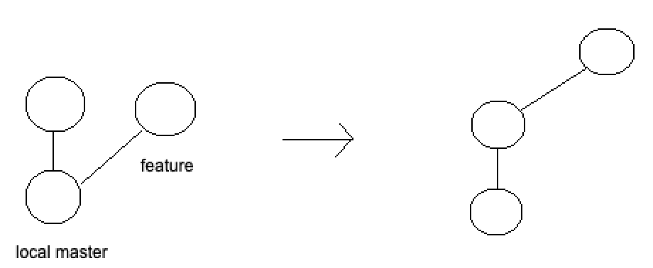
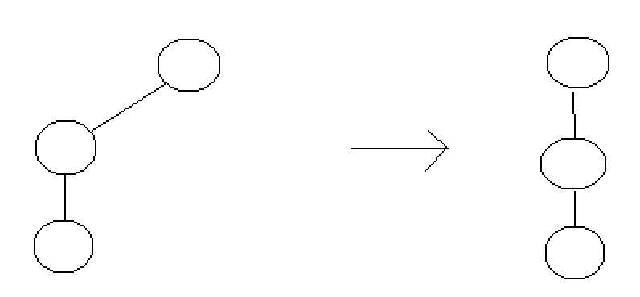

# Git tutorial
* It is a type of Distributed Version Control Systems
  * clients fully mirror the repository and history
  * if any server dies, the client repositories can be copied back up to the server to restore it
    * only if the systems were collaborating via that server
  * every clone is a full backup of all the data
* It is better than the Centralized Version Control Systems
  * file is stored and modified in the server
  * clients can view or modify the file if authorized by the administrator
  * problem is if server is down, no one can view or modify the file
* It is better than the Local Version Control System
  * file is stored and modified locally
  * problem is it is error prone (ex: save or copy wrong file)
### Set config values
* ```git config --global user.name "My Name"``` let collaborators know who modified the source code
* ```git config --global user.email "myemail@email.com"``` let collaborators know the email of the person who modified the source code
* ```git difftool --tool=<toolName>``` set external graphical diff viewing program
### View config values
* ```git config --list```
### Get help for git commands
* ```git help <verb>``` or ```git <verb> --help```
### Initialize a repository from existing code
* ```git init``` creates a .git folder to track changes
### View current status of repository
* ```git status```
### Ignore files to prevent it from being tracked by git
* Create a .gitignore file if it does not exist
* Write the filename or folders to ignore in the file
  * ```.DS_Store``` add file
  * ```*.pyc```  add all file that end with .pyc
  * ```!test.pyc``` track test.pyc even though all files that end with .pyc is to be ignored
  * ```/filename``` ONLY ignore this file in the current directory and not in other directories
  * ```folderName/``` ignore all files in with this folderName
### Git stages
* Newly created or recently modified files are in the "working directory"
* Files can only be committed if recent file changes are transferred from the "working directory" to the "staging area"
* When files are committed, the files are transferred from the "staging area" to the ".git directory"
### Add new file or recently modified file to the "Staging area"
* ```git add <filename>```
* ```git add -A``` stages all changes (new files, modified files, deleted files)
* ```git add .``` (version 1.x) stages new files and modified files only, (version 2.x) stages ALL changes
* ```git add --ignore-removal .``` stages new files and modified files only (only in version 2.x)
* ```git add -u``` stages modified files and deleted files only
### Remove file from "Staging area"
* ```git reset <filename>``` unstage file from the staging area (unstaged change will NOT be displayed in the history)
* ```git rm --cached <filename>``` stages the file's removal from the staging area
  * ```git rm <filename>``` WARNING: this will actually delete the file from the system and stage the file's removal
* ```git reset``` remove all files from staging area
### Rename or move file then add to the "Staging area"
* ```git mv <oldFilenameOrWithPath> <newFilenameOrWithPath>```
### Unmodify file
* ```git checkout -- <filename>``` revert modified file to the last commit
### Commit files from the "Staging area" to the ".git directory"
* ```git commit``` an editor will open to allow you to write the commit changes message
* ```git commit -m "message about the changes made"``` write the commit changes message directly in the terminal
* ```git commit --amend``` undo and recommit new changes (ex: add forgotten files, modify commit messages)
### Add and commit
* ```git commit -a``` "-a" adds all new and modified files
### View git history
* ```git log```
* ```git log --pretty=oneline``` or ```git log --oneline``` display one line logs
* ```git log --graph``` display logs with ASCII graph showing the branch and merge history
### Cloning a remote repository
* ```git clone <gitURL> <whereToClone>```
### View remote information about the repository
* ```git remote -v```
### Add remote repositories
* ```git remote add <shortRepoName> <url>``` shortRepoName is usually named as "origin"
### Inspect a remote respository
* ```git remote show <shortRepoName>```
### Rename remote repository
* ```git remote rename <oldShortRepoName> <newShortRepoName>```
### Remove remote repository
* ```git remote remove <shortRepoName>```
### View all branches information in the repository
* ```git branch -a``` or ```git branch```
### View the differences of recently modified files in the "working directory" compared to the last commit
* ```git diff``` does not work on files that are already added to the "Staging area" or ".git directory"
* ```git diff --staged``` or ```git diff --cached``` view differences for files in the "Staging area" compared to the last commit
* ```git difftool -y``` change diff to difftool to use external program, add "-y" to agree to launching the external program
### Create new branch
* ```git branch <newBranchName>```
### Change to a different branch
* ```git checkout <branchName>```
### Create and change to the new branch
* ```git checkout -b <newBranchName>```
### Delete branch
* ```git branch -d <branchName>```
* ```git push origin --delete <branchName>``` delete branch from remote repository
### Merge branch with current master
* ```git merge <branchName>```
### Fetch data from the server but do not merge with your client
* ```git fetch <nameOfRemoteRepository> <branchNameThatWeWantToGet>```
### Fetch data from the server AND merge with your client
* ```git pull <nameOfRemoteRepository> <branchNameThatWeWantToGet>``` usually use ```git pull origin master```
### Update server from the client
* ```git push <nameOfRemoteRepository> <branchNameThatWeWantToSend>``` usually use ```git push origin master```
* ```git push -u origin <branchName>``` -u is required when pushing the branch for the FIRST time
### Repositioning commits to the latest
* ```git rebase master``` when this is called at branch, it will reposition the branch commits to the latest master commits

* ```git rebase <branchName>``` when this is called at master, it will merge the branch commits as new commits

