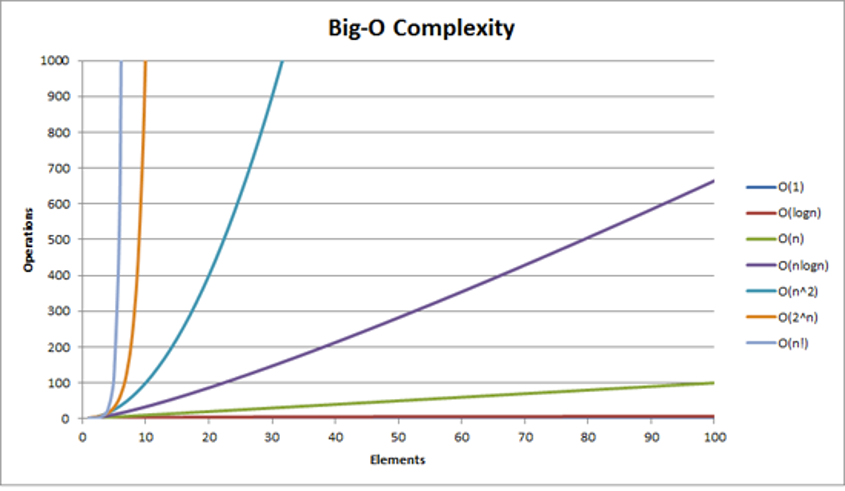

# Big O Notation

- the speed and memory usage of an algorithm aren't necessarily fixed
  - they might change depending on the input
- it is a powerful tool that allow us to generalize the space-time complexity of an algorithm as a function of its input size
- variables used in Big O notation denote the sizes of inputs to algorithms
  - e.g.: O(n) might be the time complexity of an algorithm that traverses through an array of length n
  - similarly, O(n + m) might be the time complexity of an algorithm that traverses through an array of length n and through a string of length m
- not that in the context of coding interviews, Big O notation is usually understood to describe the worst-case complexity of an algorithm
  - even though the worst case complexity might differ from the average-case complexity
  - e.g.: some sorting algorithms have different time complexities depending on the layout of elements in their input array
    - in rare cases, their time complexity will be much worse than in more common cases
    - similarly, an algorithm that takes in a string and performs special operations on uppercase characters might have a different time complexity when run on a input string of only uppercase characters vs on an input string with just a few uppercase characters

## common complexities and their Big O notations ordered from fastest to slowest

### Constant: O(1)

### Logarithmic: O(log n)

### Linear: O(n)

- do not join them together if the input value are from a different source
  - O(n + m)

### Log-linear: O(n log n)

### Quadratic: O(n2)

- drop the smaller unit if the input value are from the same source
  - O(n2 + n) = O(n2)
- do not drop the smaller unit if the input value are from a different source
- O(n2 + 2m) = O(n2 + m)

### Cubic: O(n3)

### Exponential: O(2n)

### Factorial: O(n!)

> 4! = 4 _ 3 _ 2 \* 1 = 24
