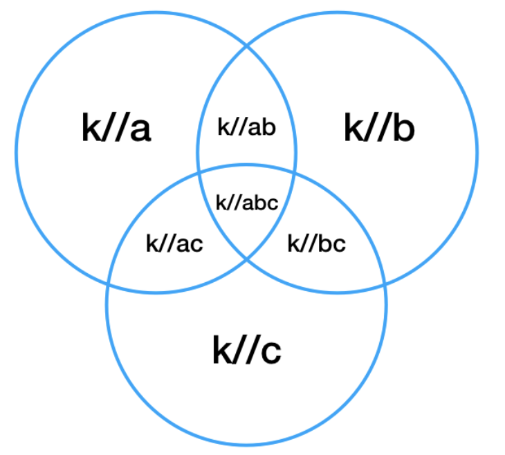

# Binary Search: Advanced
## Ugly Number III
```
Write a program to find the n-th ugly number.

Ugly numbers are positive numbers that are divisible by either a, b, or c.

Since the number can be too large, return the actual answer modulo 10^9 + 7

Example 1:
  Input:n = 10, a = 2, b = 3, c = 5
  Output: 14
  Explanation: 2, 3, 4, 5, 6, 8, 9, 10, 12, 14 is the sequence of the first 10 ugly numbers.

Example 2:
  Input:n = 2, a = 3, b = 4, c = 5
  Output: 4
  Explanation: 3, 4 is the sequence of the first 2 ugly numbers.

Constraints
  1 <= n, a, b, c <= 10^9
  1 <= a * b * c <= 10^18
```
```javascript
function nthUglyNumber(n, a, b, c) {
  const ab = leastCommonMultiple(a, b);
  const bc = leastCommonMultiple(b, c);
  const ac = leastCommonMultiple(a, c);
  const abc = leastCommonMultiple(a, bc);
  let low = Math.min(a, b, c);
  let high = low * n;
  while (low < high) {
    const mid = ~~((high + low) / 2);
    if (hasNthUglyNumbers(a, b, c, ab, bc, ac, abc, n, mid)) low = mid + 1;
    else high = mid;
  }
  return low;
}

const greatestCommonDivisor = (a, b) => (b == 0 ? a : greatestCommonDivisor(b, a % b));

const leastCommonMultiple = (a, b) => (a * b) / greatestCommonDivisor(a, b);

const hasNthUglyNumbers = (a, b, c, ab, bc, ac, abc, n, mid) =>
  ~~(mid / a) +
    ~~(mid / b) +
    ~~(mid / c) -
    ~~(mid / ab) -
    ~~(mid / bc) -
    ~~(mid / ac) +
    ~~(mid / abc) <
  n;
```
### Explanation
- For this question, we can go through linearly and determine the value of the next ugly number
- The time complexity is `O(n)`
  - That is not enough, though, as n can reach `10^9` Can we do better?
- by using binary search
  - The time complexity is `O(log(n))`
#### Count in constant time
- Consider a given integer k,
  - we can calculate the number of ugly numbers less than or equal to it by checking how many numbers are divisible by either a, b, or c
  - We can find the number of numbers divisible by x by k / x
    - e.g. there are two numbers less than or equal to 10 that are divisible by 5 - 5 and 10
    - To find the number of numbers divisible by three different numbers, we can use the following Venn Diagram
      - `Total area = k//a + k//b + k//c - k//ab - k//bc - k//ac + k//abc`



#### Monotonic condition
- Also note that the number of ugly numbers below k can never decrease as k increase
  - so we can perform a binary search to find the least k such that there are at least n ugly numbers less than or equal to it
