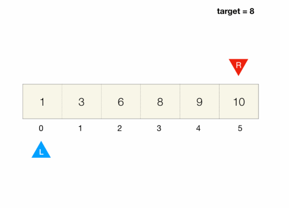
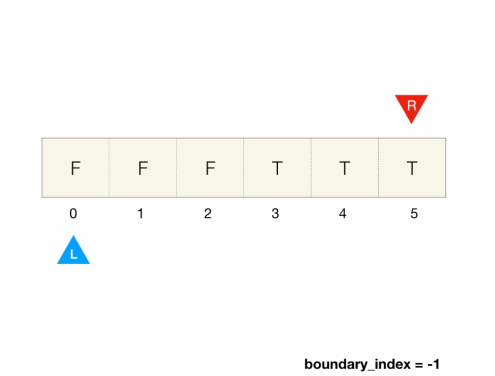

# Binary Search pattern

- is an efficient array search algorithm
- It works by narrowing down the search range by half each time

## Vanilla Binary Search pattern

### Example

```
Given a sorted array of integers and an integer called target,
find the element that equals to the target and return its index.
If the element is not found, return -1.
```

- The key observation here is that the array is sorted
  - if we pick a random element in the array and compare it to the target
    - If we happen to pick the element that equals to the target, then We don't need to do any more work, just return its index
    - If the element < target, then we know the target cannot be found in the section to the left of the current element since everything to the left is even smaller
      - can discard the current element and everything on the left from the search range
    - If the element > target, then we know the target cannot be found in the section to the right of the current element since everything to the right is even larger
      - can discard the current element and everything on the right from the search range
  - We repeat this process until we find the target
    - Instead of picking a random element, we always pick the middle element in the current search range
      - This way we can discard half of the options and shrink the search range by half each time
      - This gives us `O(log(N))` runtime



## Implementation

- search range is represented by the `left` and `right` indices that start from both ends of the array and move towards each other as we search
- When we move the index, we discard elements and shrink the search range

### Calculating mid

- when calculating mid, if the number of elements is even, there are two elements in the middle
  - We normally follow the convention of picking the first one
    - which is equivalent to doing integer division `(left + right) / 2`

### Deducing binary search

1. When to terminate the loop
   - Make sure while loop has equality comparison
   - Otherwise, for the edge case of a one-element array, we'd skip the loop and miss the potential match
2. Whether / how to update left and right boundary in the if conditions
   - Consider which side to discard
   - If `arr[mid]` < target
     - then we should discard everything on the left by making `left = mid + 1`
   - If `arr[mid]` > target
     - then we should discard everything on the right by making `right = mid - 1`
3. Should I discard the current element?
   - For vanilla binary search, we can discard it since it can't be the final answer if it is not equal to the target
   - There might be situations where you would want to think twice before discarding the current element

### When to use binary search

- use binary search whenever you can make a binary decision to shrink the search range

### Javascript

```javascript
function binarySearch(arr, target) {
  let left = 0;
  let right = arr.length - 1;
  while (left <= right) {
    // <= because left and right could point to the same element, < would miss it
    mid = Math.floor((right + left) / 2);
    if (arr[mid] === target) {
      // found target, return its index
      return mid;
    } else if (arr[mid] < target) {
      left = mid + 1; // middle less than target, discard left half by making left search boundary `mid + 1`
    } else {
      right = mid - 1; // middle greater than target, discard right half by making right search boundary `mid - 1`
    }
  }
  return -1; // if we get here we didn't hit above return so we didn't find target
}

const arr = [1, 3, 6, 8, 9, 10];
console.log(binarySearch(arr, 1)); // 0
```

## Finding Boundary with Binary Search pattern

- This problem is a major key in solving future binary search-related problems
- many problems boil down to finding the boundary in a boolean array

### Example

```
An array of boolean values is divided into two sections;
the left section consists of all false and the right section consists of all true
Find the boundary of the right section, i.e. the index of the first true element
If there is no true element, return -1

Input: arr = [false, false, true, true, true]

Output: 2

Explanation: first true's index is 2
```

- The binary decision we have to make when we look at an element is
  1. if the element is false, we discard everything to the left and the current element itself
  2. if the element is true, the current element could be the first true although there may be other true to the left
     - We discard everything to the right, but what about the current element?
- We can either `keep the current element in the range` or `record it somewhere and then discard it`
  - this example uses the latter approach
    - We keep a variable boundary_index that represents the leftmost true's index currently recorded
      - If the current element is true, then we update boundary_index with its index
        - discard everything to the right including the current element itself since its index has been recorded by the variable
    - Time Complexity: `O(log(n))`
  - alternative approach
    - keep the current element in the search range instead of discarding it
      - i.e. if arr[mid]: right = mid instead of right = mid - 1
    - However, doing this without modifying the while condition will result in an infinite loop
      - This is because when left == right, right = mid will not modify right and thus, not shrink search range and we will be stuck in the while loop forever
      - To make this work we have to remove the equality in the while condition
      - In addition, a while loop without equality will miss the single-element edge case so we have to add an additional check after the loop to handle this case
    - Overall, we have to make three modifications to the vanilla binary search to make it work
    - Side note: how to not get stuck in an infinite loop
      - make progress in each step
      - have an exit strategy



### Implementation

- good thing with this approach is that we don't have to modify the while loop logic in the vanilla binary search from the last module, besides introducing a variable

### Javascript

- record it somewhere and then discard it solution

```javascript
function findBoundary(arr) {
  let left = 0;
  let right = arr.length - 1;
  let boundary_index = -1;

  while (left <= right) {
    let mid = Math.floor((left + right) / 2);
    if (arr[mid]) {
      boundary_index = mid;
      right = mid - 1;
    } else {
      left = mid + 1;
    }
  }
  return boundary_index;
}

const arr = [false, false, false, true, true, true];
console.log(findBoundary(arr)); // 3
```

- keep the current element in the search range instead of discarding it solution

```javascript
function findBoundary(arr) {
  let left = 0;
  let right = arr.length - 1;
  let boundary_index = -1;

  while (left < right) {
    let mid = Math.floor((left + right) / 2);
    if (arr[mid]) {
      boundary_index = mid;
      right = mid;
    } else {
      left = mid + 1;
    }
    if (left === right) {
      mid = Math.floor((left + right) / 2);
      if (arr[mid]) {
        boundary_index = mid;
      } else {
        boundary_index = -1;
      }
    }
  }
  return boundary_index;
}

const arr = [false, false, false, true, true, true];
console.log(findBoundary(arr)); // 3
```
