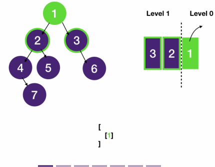

# Breadth First Search: BFS On Tree
## Binary Tree Level Order Traversal
```
Given a binary tree, return its level order traversal.
Input is the root node of the tree.
The output should be a list of lists of integers, with the ith list containing the values of nodes on level i, from left to right.

Example:
  lvl 0 -------- 1
                / \              [
  lvl 1 ------ 2   3               [1],
              / \   \        ->    [2, 3],
  level 2 -- 4   5   6             [4, 5, 6],
              \                    [7],
  level 3 ---- 7                 ]
```
```javascript
class Node {
  constructor(val, left = null, right = null) {
    this.val = val;
    this.left = left;
    this.right = right;
  }
}

function levelOrderTraversal(root) {
  if(!root) return [];
  let result = [];
  let queue = [root];  // at least one element in the queue to kick start bfs
  while (queue.length > 0) {  // as long as there is element in the queue
    const n = queue.length;  // number of nodes in current level, see explanation above
    const newLevel = [];
    for (let i=0; i<n; i++) {  // dequeue each node in the current level
      const node = queue.shift();
      newLevel.push(node.val);
      // enqueue non-null children
      for (const child of [node.left, node.right]) {
        if (child) queue.push(child);
      }
    }
    result.push(newLevel);
  }
  return result;
}
```
### Explanation



- We can use DFS for this problem by keeping track of the depth for each node.
  - A better way though is to use BFS since BFS traverse the tree by level by default.
- Applying the template, we use a queue to keep track of nodes to visit next.
#### How to get a node's level
- When we dequeue a node from the queue, we need to know the level it sits in the tree to add it to the corresponding level in the result.
  - But nodes in the queue do not have any information about level.
  - How do we get a node's level?
    - One observation is that the queue contains at most two levels of nodes.
      - To see why let's assume our tree is three-level deep.
      - Let's call the nodes of the shallowest level "level 0" nodes and their children "level 1" nodes, whose children are "level 2" nodes.
      - When we do a BFS, we first push "level 0" nodes into the queue, and as we process them, we push their children "level 1" nodes into the queue.
      - To get "level 2" nodes onto the queue,
        - we have to start dequeuing and processing "level 1" nodes
        - but we can't dequeue any "level 1" nodes until we have finished dequeuing and processing "level 0" nodes
          - since a queue is a First-in-First-Out structure.
      - Therefore it's impossible to have 3 levels in the queue at the same time, and we can have at most two levels in the queue.
    - Also, observe that we always push the leftmost node of a level into the queue first.
      - When we dequeue the leftmost node (and before we add its children), the queue contains only one level of nodes.
      - We can save the number of nodes in the queue in a variable n, and dequeue the next n nodes.
- Time Complexity: `O(n)`
  - We traverse every edge and node once but since the number of edges is n - 1, then this simply becomes O(n).
