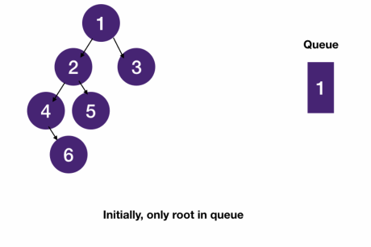

# Breadth First Search pattern
- breath first search visits all nodes in a level before starting to visit the next level
- While DFS uses recursion/stack to keep track of progress,
  - BFS uses a queue (First In First Out).
    - When we dequeue a node, we enqueue its children.



## DFS vs BFS
|DFS is better at|BFS is better for|
|-|-|
|narrow but deep trees|shallow but wide trees|
|finding nodes far away from the root|finding nodes close/closest to the root|
## Template
- We can implement BFS using a queue.
  - Important things to remember:
    - We need at least one element to kick start the process
    - Right after we dequeue an element, we'd want to enqueue its children if there is any
```javascript
class Node {
  constructor(value) {
    this.value = value;
    this.children = [];
  }

  addChildren(node) {
    this.children.push(node);
  }
}
```
```javascript
function bfsByQueue(root, target) {
  if (!root) return null;
  const queue = [root];
  while (queue.length > 0) {
    const node = queue.shift();
    for (const child of node.children) {
      if (child.value === target) return child;
      queue.push(child);
    }
  }
  return null;
}

const one = new Node(1);
const two = new Node(2);
const three = new Node(3);
const four = new Node(4);
const five = new Node(5);
const six = new Node(6);

one.addChildren(two);
one.addChildren(six);

two.addChildren(three);
two.addChildren(five);

three.addChildren(four);

console.log(bfsByQueue(one, 2));
```
