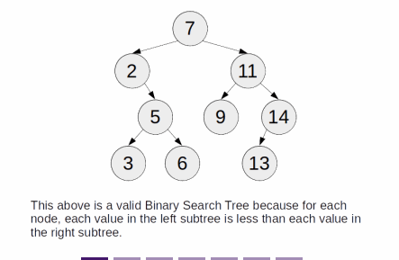
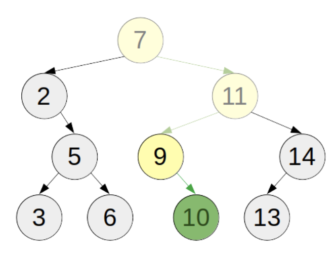
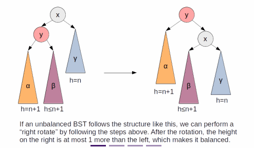

# Binary Search Trees (BST)
- a binary tree with the following characteristics:
  - An empty tree is a BST
  - If the tree is non-empty, the value of the root node is larger than each node in the left subtree and smaller than each node in the right subtree
  - If the tree is non-empty, both its left and right subtrees are BST
- The values of each node on a BST can be of any type, as long as they are comparable with each other
  - i.e. you can have an integer BST, a string BST, and so on
## Searching
- primary purpose of a BST is search
  - you can search for the existence of an element in a short amount of time, like you would in a binary search
  - To search for the existence of an item, we look at the value of the top node and see if it's greater, smaller, or equal to the item we are looking for
    - If it is equal, We found the item
    - If it's smaller, we look for that item in the left subtree, if the item exists in the BST, it must be in the left subtree
    - If it's larger, we look for that item in the right subtree, using the same reasoning
    - If a tree is empty, the item is not in the BST
- The time complexity of each search is `O(h)`
  - where h is the height of the tree
  - In the best case scenario, the height of the tree is proportional to the log of the size of the tree



## Insertion
- One advantage to using a BST compared to a sorted list (to keep track of which items exist in a collection) is that
  - unlike a sorted list, inserting an item to the BST does not require each item in the list to move down an index like inserting to a sorted list do
  - Instead, when inserting an item, first perform the searching for that item in that BST
    - However, if we find an empty tree, instead we replace that empty tree with a new node containing the inserted value in the BST
- The time complexity is the same as searching for a value: `O(h)`
  - where h is the height of the tree
  - Ideally, h is proportional to the log of the size of the tree



## Deletion (Optional)
- Deleting an element from a BST doesn't show up often in interview questions
- deleting an element from the tree is the same as finding an element in the tree
  - After you find the node, if the node's right subtree is empty, bring its left subtree to its current position and remove the node
  - Otherwise, delete the leftmost node of the right subtree and put it in its current position
- The time complexity is proportional to the height of the tree, `O(h)`
  - where h is the height of the tree
  - h is proportional to the log of the size of the tree

## Implementations
### Javascript
```javascript
class Node {
  constructor(val) {
    this.val = val;
    this.left = null;
    this.right = null;
  }
}

function find(root, target) {
  if (!root) return false;
  if (root.val === target) return true;
  else if (root.val < target) return find(root.right, target);
  else return find(root.left, target);
}

function insert(root, value) {
  if (!root) return new Node(value)
  if (root.val < value) {
    root.right = insert(root.right, value);
  } else if (root.val > value) {
    root.left = insert(root.left, value);
  }
  return root;
}

const seven = new Node(7);
console.log(find(seven, 7));

insert(seven, 2);
console.log(find(seven, 2));

insert(seven, 11);
console.log(find(seven, 11));

insert(seven, 5);
console.log(find(seven, 5));

insert(seven, 9);
console.log(find(seven, 9));

insert(seven, 14);
console.log(find(seven, 14));

insert(seven, 3);
console.log(find(seven, 3));

insert(seven, 6);
console.log(find(seven, 6));

insert(seven, 10);
console.log(find(seven, 10));

insert(seven, 13);
console.log(find(seven, 13));

```
## Improvements (Optional)
- Ideally speaking, the time complexity of each operation is `O(log(n))`
- However, that is not always going to happen with the naive implementation
  - i.e. if we insert each item from an already sorted list into the binary tree, it is going to form a linked list, and the time complexity of each operation becomes `O(n)`
- a balanced binary tree is a binary tree whose subtrees are also balanced and have a height difference of at max 1
  - The height of a balanced binary tree is proportional to the log of its size
  - If there is a way to ensure that a BST is always balanced, then its time complexity is always going to be `O(log(n))`
- One of the self-balancing tree type is the `AVL tree`
  - It uses a feature called `tree rotation` at certain points of insertion
  - If, after the insertion of an element, a node becomes unbalanced, one of the subtree must have two more height than the others
  - Depending on which side is unbalanced, the balancing act is different



## Applications
- BST is often used to look up the existence of certain objects
  - i.e. Java's HashSet and HashMap uses BST as its underlying data structure
    - Compared to binary search, the insertion has way lower time complexity, so it's good for dynamic insertion of items
    - If you don't need to dynamically insert new items, then you can simply sort the collection first and use binary search to look up
- However, most modern languages offers hash tables, which is another way of looking up the existence of an object in a collection
  - Most implementations are dynamically sized, which can cause the lookup and insertion of items to approach `O(1)`
    - so usually hash tables are preferred over BST
- advantages to using a BST over a hash table
  - Hash tables are unsorted, while BSTs are
    - If you want to constantly maintain a sorted order while inserting, using a BST is more efficient than a hash table or a sorted list
  - It's easy to look up the first element in the BST that is greater/smaller than a lookup value than a hash table
  - It's easy to find the k-th largest/smallest element
  - Dynamic hash tables usually have a lot of unused memory in order to make the insertion/deletion time approach `O(1)`
    - whereas BST uses all the memory they requested

