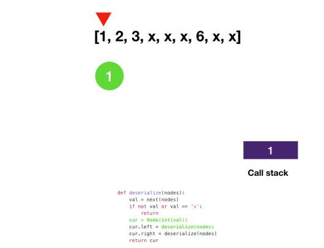

# Depth First Search: DFS on Tree
## Serializing and Deserializing Binary Tree
```
Given a binary tree,
write a serialize function that converts the tree into a string
and a deserialize function that converts a string to a binary tree.
You may serialize the tree into any string representation you want as long as it can be deseralized.

Example 1: serialize
  input:
    6
   / \
  4   8
 / \
3   5

  output: "6 4 3 x x 5 x x 8 x x"
  
Example 2: deserialize
  input: "6 4 3 x x 5 x x 8 x x"
  
  output:
    6
   / \
  4   8
 / \
3   5
```
```javascript
class Node {
  constructor(val, left = null, right = null) {
    this.val = val;
    this.left = left;
    this.right = right;
  }
}
```
- solution 1: using iterators
```javascript
function serialize(root) {
  let res = [];
  serializeDfs(root, res);
  return res.join(" ");
}

function serializeDfs(root, res) {
  if (!root) {
    res.push("x");
    return;
  }
  res.push(root.val);
  serializeDfs(root.left, res);
  serializeDfs(root.right, res);
}

function deserialize(s) {
  // create an iterator that returns a token each time we call `next`
  return deserializeDfs(s.split(" ")[Symbol.iterator]());
}

function deserializeDfs(nodes) {
  let val = nodes.next().value;
  if (val === 'x') return;
  const cur = new Node(parseInt(val, 10));
  cur.left = deserializeDfs(nodes);
  cur.right = deserializeDfs(nodes);
  return cur;
}
```
- solution 2: using arrays
```javascript
function serializeDfs(root, result) {
  if (!root) return result.push("x");
  result.push(root.val);
  serializeDfs(root.left, result);
  serializeDfs(root.right, result);
}

function serialize(root) {
  const result = [];
  serializeDfs(root, result);
  return result.join(" ");
}

function deserializeDfs(arr) {
  if (!arr.length) return null;
  const currentVal = arr.shift();
  const current = currentVal === "x" ? null : new Node(parseInt(currentVal, 10));
  if (current) {
    current.left = deserializeDfs(arr);
    current.right = deserializeDfs(arr);
  }
  return current;
}

function deserialize(s) {
  return deserializeDfs(s.split(" "));
}
```
### Explanation
- To serialize, we can simply do a DFS and append the node value to the string
  - We need to encode null nodes too since otherwise we wouldn't be able to tell if we have reached leaf nodes when we deserialize
  - We use x here as a placeholder for the null node
- To deserialize, we split the string into tokens and consume them
  - For each token we create a new node using token value. When we see an x we know we reached the leaf and return
### Serialize


### Deserialize


