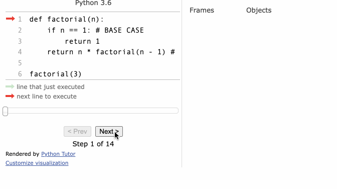
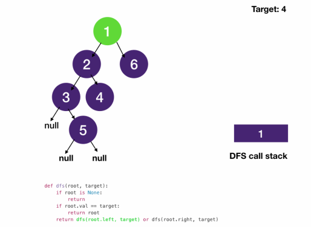

# Depth First Search
## Recursion pattern
- one of the most important concepts in computer science
- it is the process of a function calling itself
### key components in writing a correct recursive function
1. Base case/exit
2. Recursive call, i.e. calling the function itself with different argument
### Example



#### Javascript
```javascript
const people = ["Andy", "Carly"];

function callForLunch(personIndex) {
  if (people[personIndex] === "Carly") {  // BASE CASE
    return true;
  }
  return callForLunch(personIndex + 1);  // RECURSIVE CALL
}

console.log(callForLunch(0));
```
- find factorial example
```javascript
function factorial(n) {
  if (n <= 1) {  // base case
    return 1;
  }
  return n * factorial(n - 1);  // recursive call
}

console.log(factorial(5));
```
- the computer calls the function itself by using a stack behind the scene to keep track of where things are
- computer's internal stack is called `call stack`
- the data it pushes onto a call stack are called `stack frame`
  - stack frames on a call stack represent the function you are calling and its arguments
```javascript
function factorialStack(n) {
  const stack = [];
  while (n > 0) {
    stack.push(n);
    n--;
  }

  result = 1;

  while (stack.length) {
    result *= stack.pop();
  }

  return result;
}

console.log(factorialStack(5));
```
## Depth First Search pattern
- DFS is a bold search
- We go as deep as we can to look for a value, and when there is nothing new to discover, we retrace our steps to find something new
- `pre-order traversal` of a tree is DFS
- it introduces 2 other concepts
  - backtracking: the action of retracing steps
    - Backtracking and DFS are similar concept and the same thing since in DFS you always "backtrack" after exploring a deeper node
    - to make a distinction, backtracking is the concept of retracing and DFS is the algorithm that implements it
    - backtracking is often mentioned and associated with combinatorial search problems
  - divide and conquer
    - splitting into subproblems of the same type (search in left and right children) until they are simple enough to be solved directly (null nodes or found target) and combine the results from these subproblems (return non-null node)
      - two recursive calls `dfs(root.left)` and `dfs(root.right)`, and return based on results from the recursive calls



### Javascript
```javascript
class TreeNode {
  constructor(val) {
    this.val = val;
    this.left = null;
    this.right = null;
  }
}

const one = new TreeNode(1)
const two = new TreeNode(2)
const three = new TreeNode(3)
const four = new TreeNode(4)
const five = new TreeNode(5)
const six = new TreeNode(6)

one.left = two
one.right = six
two.left = three
two.right = four
three.right = five
```
- Recursion
```javascript
function dfs(root, target) {
  if (!root) return null;  // always remain at this position

  if (root.val == target) return root;
  return dfs(root.left, target) || dfs(root.right, target);
}

const node = dfs(one, 4)
console.log(node.val)
```
- Iteration
```javascript
function dfs(root, target) {
  if (!root) return null;

  const stack = [];
  let current = root;
  stack.push(current);

  while (stack.length) {
    current = stack.pop();  // always remain at this position
    
    if (current.val === target) return current;  // change this position for different traversal mode
    
    if (current.right) stack.push(current.right);  // right child must be pushed first so that left child is processed first
    if (current.left) stack.push(current.left);
  }
}

const node = dfs(one, 4)
console.log(node.val)
```
### When to use DFS
#### Tree
- DFS is essentially pre-order tree traversal
  - Traverse and find/create/modify/delete node
  - Traverse with return value (finding max subtree, detect balanced tree)
#### Combinatorial problems
- DFS / backtracking and combinatorial problems are a match made in heaven
- combinatorial search problems boil down to searching in trees
  - How many ways are there to arrange something
  - Find all possible combinations of ...
  - Find all solutions to a puzzle
#### Graph
- Trees are special graphs that have no cycle
- We can still use DFS in graphs with cycles
- We just have to record the nodes we have visited and avoiding re-visiting them and going into an infinite loop
  - Find a path from point A to B
  - Find connected components
  - Detect cycles
