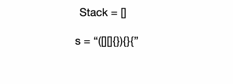

# Sorting: Warm Up
## Valid Parentheses
```
For this question we ask you to determine whether or not a string has valid parentheses.
A string has valid parentheses if each bracket is closed and opened in the same order and has the same type.
Parentheses has 3 types (), {} and []

Input
  s: String containing the parentheses
Output
  Whether or not the string is valid

Example 1:
  Input:
    s = ()
  
  Output: true

  Explanation:
    This is a valid parentheses sequence.

Example 2:
  Input:
    s = (}

  Output: false

  Explanation:
    This is not valid as } cannot match (.

Constraints
  1 <= s.length <= 100000
```
- Solution 1:
```javascript
function validParentheses(s) {
  const stack = [];
  const pairs = {
    ')': '(',
    '}': '{',
    ']': '[',
  };
  for (const char of s) {
    if (pairs[char]) {
      if (stack.length && stack[stack.length - 1] === pairs[char]) stack.pop();
      else return false;
    } else stack.push(char);
  }
  return stack.length ? false : true;
}
```
- Solution 2
```javascript
function validParentheses(s) {
  const stack = [];
  const pairs = {
    "(": ")",
    "[": "]",
    "{": "}",
  };
  for (const char of s) {
    if (pairs[char]) stack.push(char);
    else {
      if (!stack.length || pairs[stack.pop()] !== char) return false;
    };
  }
  return !stack.length;
}
```
### Explanation
- This is a classic stack question.
  - Because a stack is LIFO, we can look at the top the stack to check the "latest" parenthesis.
- We go through each parenthesis in order,
  - if the parenthesis is an opening parenthesis, then we push it onto the stack
  - if the parenthesis is a closing parenthesis, we look up the top of the stack to see if they match.
    - If they don't, then we have found a non-matching pair and return false.
- Otherwise, we keep going until we reach the end of the string.
- After we have gone through all the parentheses, we need to do one more check on the stack.
  - The stack should be empty at this point otherwise it means there are unmatched opening parentheses.


