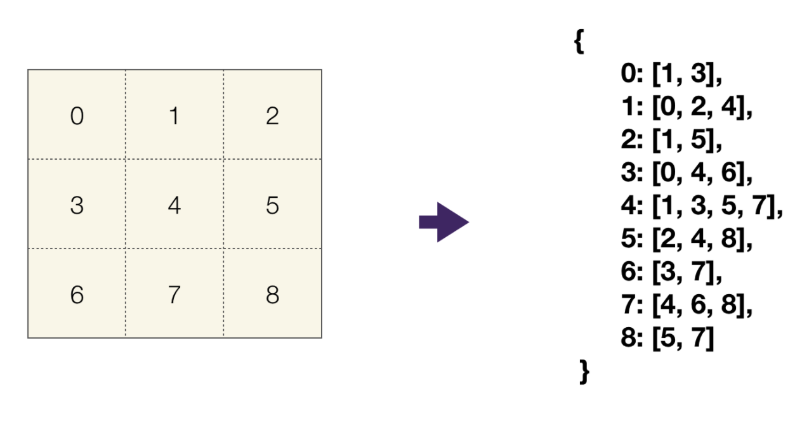
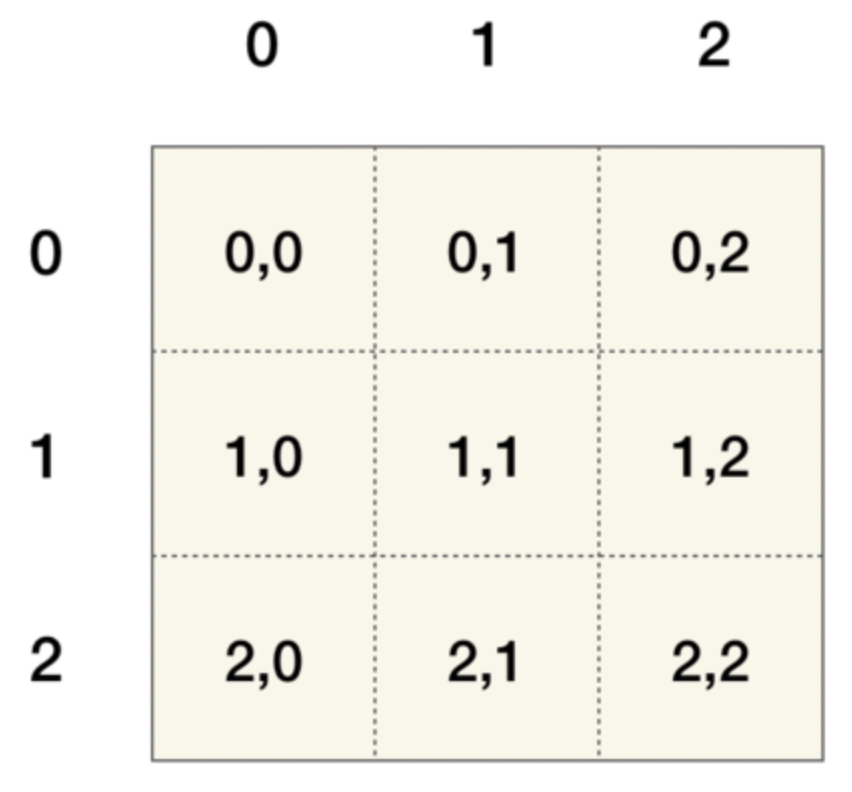
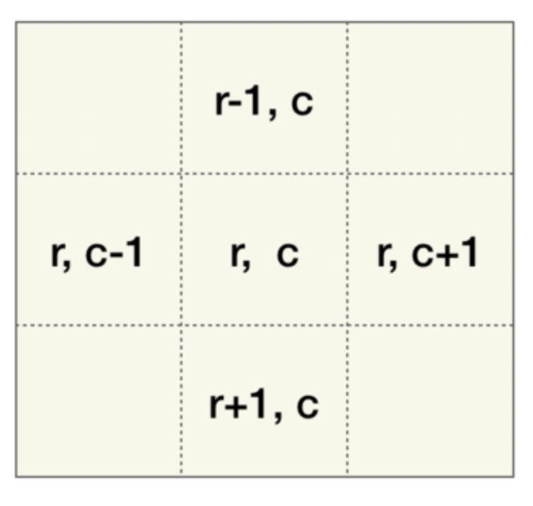
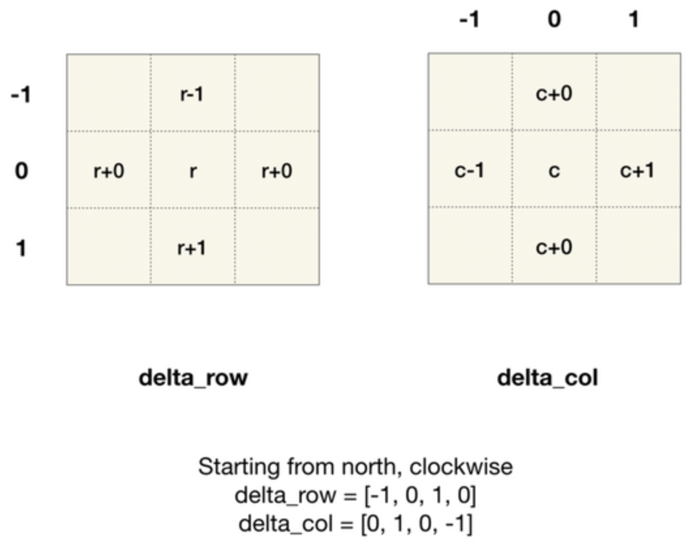

# Graph: Matrix As Graph
- Very often graph problems are represented as a matrices. For example:
  - `Number of Islands`
  - `Knight Shortest Path`
- A matrix translates to a graph (adjacency list):



- When we code the problem, we have to build the graph as we go.
  - Nodes/vertices are represented by coordinates of matrix entries.



## Getting neighboring node's coordinates
- The core of BFS/DFS is to add neighbors of the current vertex to queue/stack.
  - The get_neighbors function returns all 4 (or 8 if you are allowed to go diagonal) coordinates of neighboring nodes.



- One way to get each neighbor's coordinates is to keep each neighbor's horizontal and vertical offsets (i.e. delta) in a list
  - and adding them to the each vertex's coordinates.



```javascript
const numRows = grid.length;
const numCols = grid[0].length;
function getNeighbors(coord) {
  const [row, col] = coord;
  const deltaRow = [-1, 0, 1, 0];
  const deltaCol = [0, 1, 0, -1];
  const result = [];
  for (let i=0; i<deltaRow.length; i++) {
    const neighborRow = row + deltaRow[i];
    const neighborCol = col + deltaCol[i];
    if (0 <= neighborRow && neighborRow < numRows && 0 <= neighborCol && neighborCol < numCols) {
      result.push([neighborRow, neighborCol]);
    }
  }
  return result;
}
```
## BFS template
- Sometimes we can overwrite the value in the matrix to keep track of visited nodes without using a visited set.
  - We'll see this in `Number of Islands`
```javascript
const numRows = grid.length;
const numCols = grid[0].length;
function getNeighbors(coord) {
  const [row, col] = coord;
  const deltaRow = [-1, 0, 1, 0];
  const deltaCol = [0, 1, 0, -1];
  const result = [];
  for (let i=0; i<deltaRow.length; i++) {
    const neighborRow = row + deltaRow[i];
    const neighborCol = col + deltaCol[i];
    if (0 <= neighborRow && neighborRow < numRows && 0 <= neighborCol && neighborCol < numCols) {
      result.push([neighborRow, neighborCol]);
    }
  }
  return result;
}

function bfs(startingNode) {
  const queue = [startingNode];
  const visited = new Set([startingNode]);
  while (queue.length > 0) {
    const node = queue.shift();
    for (const neighbor of getNeighbors(node)) {
      if (visited.has(neighbor)) continue;
      // Do stuff with the node if required
      // ...
      queue.push(neighbor);
      visited.add(neighbor);
    }
  }
}
```
