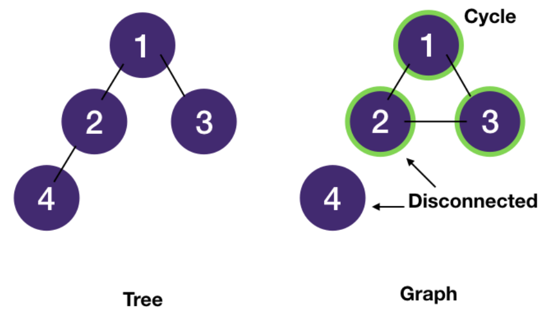
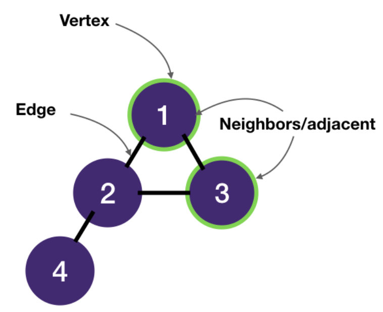
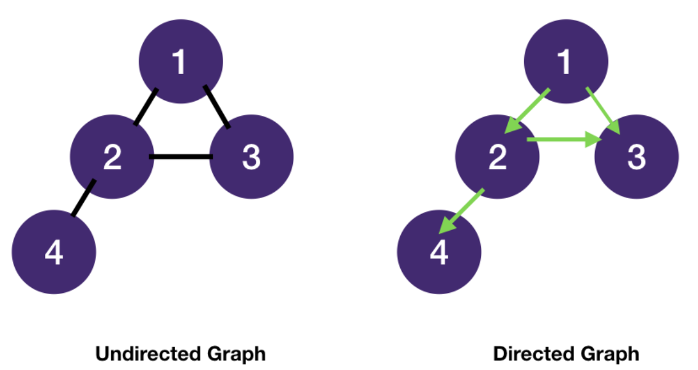
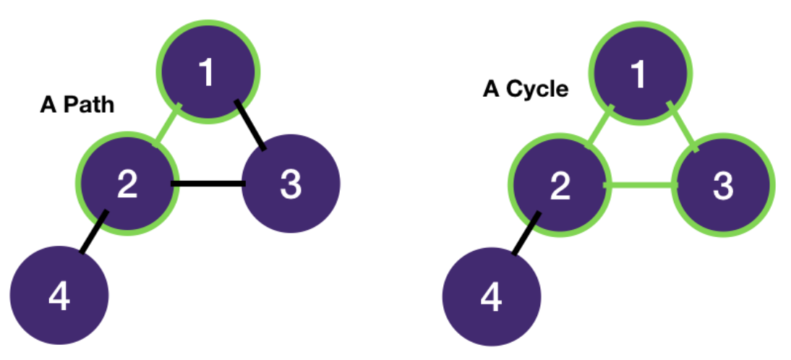
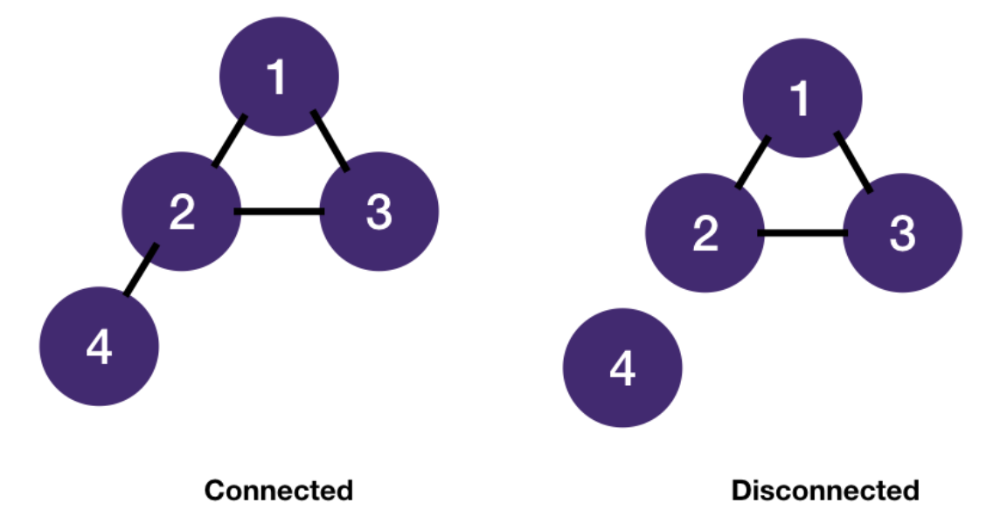
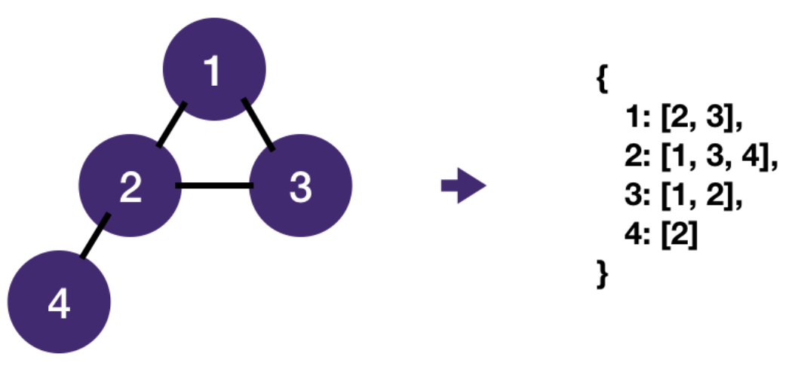
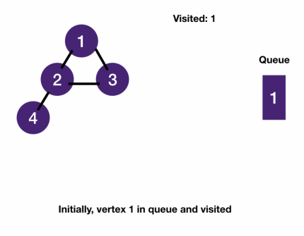
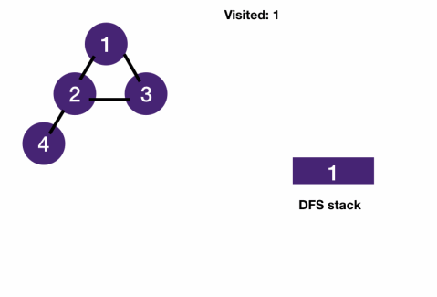

# Graph pattern
## Fundamentals
### Tree with 0+ cycle
- A tree is a special graph - a connected acyclic (cycle-less) graph.
- A graph may contain cycle(s) and nodes could be disconnected.
- A tree also contains n nodes and n - 1 edges in addition to being acyclic and there exists only 1 path between 2 nodes in a tree.



### Graph Terminologies
- A graph consists of vertices ("nodes" in trees) and edges.
- Vertices are connected by edges.
- Two vertices connected by an edge are called neighbors and are adjacent ("children" in trees).



- Edges can be undirected or directed. For most interview problems we are dealing with undirected graphs.
- A tree is also an undirected graph.



- A path is a sequence of vertices.
- A cycle is a path that starts and ends at the same vertex.



- An undirected graph is connected if every vertex is joined by a path to another vertex.
- Otherwise, it's disconnected.



- A graph is most commonly stored as a map of adjacency lists: for each vertex, store a list of its neighbors.



- Note that even though a graph is represented as an adjacency list , we don't actually have to create it upfront.
- What we really need is a function to get a vertex's neighbors. 
## Breadth First Search on Graphs
### Tree vs Graph Traversal
- A Tree is a connected, acyclic undirected graph.
  - Statistically, most interview graph problems are about connected and undirected graphs.
  - So for simplicity, we're gonna define a tree as a graph without cycle.
  - The search algorithms we have learned in tree modules are applicable to graphs as well.
- The difference between a tree and a graph is the possibility of having a cycle, we just have to handle this situation.
  - We use an extra variable `visited` to keep track of vertices we have already visited to prevent re-visiting and getting into infinite loops.
  - visited can be any data structure that can answer existence queries quickly.
    - For example, a hash set or an array where each element maps to a vertex in the graph can both do this in constant time.
- Note minor terminology change from tree to graph - we call "children" "neighbors" since there's no parent-child relationship in a graph.
### BFS on graphs
- Notice how the visited set prevents infinite loops. If we didn't have it, we would have enqueued 2's neighbors 1 and 3 into the queue again which would enqueue 2 again.



### BFS on graph template
- BFS template consists of two core functions
  1. bfs: uses a queue to keep track of nodes to be visited
  2. get_neighbors: returns a node's neighbors.
      - In an adjacency list representation, this would be returning the list of neighbors for the node.
      - If the problem is about a matrix, this would be the surrounding valid cells as we will see in `number of islands` and `knight shortest path`
      - If the graph is implicit, we have to generate the neighbors as we traverse.
      - We will see this in `word ladder`
- BFS on tree
```javascript
function bfsByQueue(root) {
  const queue = [root];
  while (queue.length > 0) {
    const node = queue.shift();
    for (const child of node.children) {
      queue.push(child);
    }
  }
}
```
- BFS on graph
```javascript
function getNeighbors(graph, node) {
  return graph[node];
}

function bfs(root) {
  const queue = [root];
  const visisted = new Set();
  while (queue.length > 0) {
    const node = queue.shift();
    for (const neighbor of getNeighbors(node)) {
      if (visisted.has(neighbor)) continue;
      queue.push(neighbor);
      visisted.add(neighbor);
    }
  }
}
```
### Tracking levels/Finding distance
- BFS is by-level traversal.
- Sometimes we need to track how many levels we have traversed (much like level order traversal problem in BFS on Tree module).
- Similar to binary tree level order traversal, we can get the number of nodes of a level from the queue size.
```javascript
function bfsLevel(root) {
  const queue = [root];
  const visisted = new Set();
  let level = 0;
  while (queue.length > 0) {
    const n = queue.length;  // get # of nodes in the current level
    for (let i=0; i<n; i++) {
      const node = queue.shift();
      for (const neighbor of getNeighbors(node)) {
        if (visisted.has(neighbor)) continue;
        queue.push(neighbor);
        visisted.add(neighbor);
      }
    }
    // increment level after we have processed all nodes of the level
    level++;
  }
}
```
### When to use BFS?
- `Shortest path from A to B (unweight)`
- Graph of unknown or even infinite size, e.g. `knight shortest path`
- `Dijkstra Intro | Shortest Path in a Weighted Graph`
## Depth First Search on Graphs
- Similar to BFS, we just have to add visited to keep track of visited nodes and use get_neighbors to get the next nodes to visit.



- DFS on tree
```javascript
function dfs(root) {
  if (!root) return;
  for (const child of node.children) {
    dfs(child);
  }
}
```
- DFS on graph
```javascript
function dfs(root, visited) {
  for (const neighbor of getNeighbors(root)) {
    if (visited.has(neighbor)) continue;
    visited.add(neighbor);
    dfs(neighbor, visited);
  }
}
```
### Complexity
- We only visit each vertex once in both BFS and DFS with visited.
  - Since technically a graph is made of vertices and edges,
    - the time complexity of BFS/DFS on graphs is normally expressed as `O(|V| + |E|)`
      - where |V| stands for number of vertices and |E| stands for number of edges
      - V is set of vertices and in math |V| means the size of a set
## BFS or DFS
### When should you use one over the other?
- If you just have to visit each node once without memory constraints (e.g. `number of islands` problem), 
  - then it doesn't really matter which one you use.
  - It comes down to your personal preference for recursion/stack vs queue.

|BFS is better at|DFS is better at|
|-|-|
|finding the shortest distance between two vertices|uses less memory than BFS for wide graphs, since BFS has to keep all the nodes in the queue, and for wide graphs this can be quite large.|
|graph of unknown size, e.g. `word ladder`, or even infinite size, e.g. `knight shortest path`|finding nodes far away from the root, e.g. looking for an exit in a maze.|
