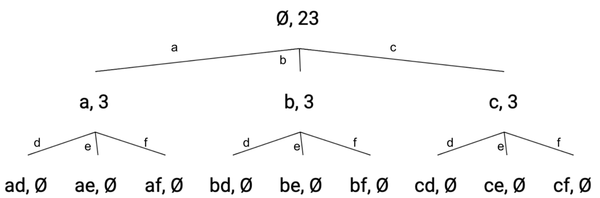

# Backtracking: Combinatorial Search

## Letter Combinations of Phone Number

```
Given a phone number that contains 2-9, find all possible letter combinations the phone number could translate to

 1    2   3
     abc def
 4    5   6
ghi  jkl mno
 7    8   9
pqrs tuv wxyz

Example:
  Input: "56"

  Output: ["jm","jn","jo","km","kn","ko","lm","ln","lo"]
```

```javascript
const phoneMap = {
  2: "abc",
  3: "def",
  4: "ghi",
  5: "jkl",
  6: "mno",
  7: "pqrs",
  8: "tuv",
  9: "wxyz",
};

function letterCombinationsOfPhoneNumber(digits) {
  if (!digits) return [];
  const result = [];
  dfs(digits, [], result);
  return result;
}

function dfs(digits, path, result) {
  if (digits.length === path.length) {
    result.push(path.join(""));
    return;
  }
  const digit = digits[path.length];
  const letters = phoneMap[digit];
  for (let i = 0; i < letters.length; i++) {
    path.push(letters[i]);
    dfs(digits, path, result);
    path.pop();
  }
}
```

### Explanation

- This is essentially asking for all permutations with the constraint of a number to letter mapping

1. Identify state(s)
   - To construct a letter combination we need
     - The letters we have selected so far
   - To make a choice when we visit the current node's children
     - we don't need to maintain any additional state
       - since the next possible letters are defined by the number to letter mapping
2. Draw the tree



3. DFS on the tree
   - Time Complexity: `O(4^n)`
     - n is the length of the input string
     - Worst case we have 4 choices for every number
       - average case we have 3 choices so it should be closer to `O(3^n)`
