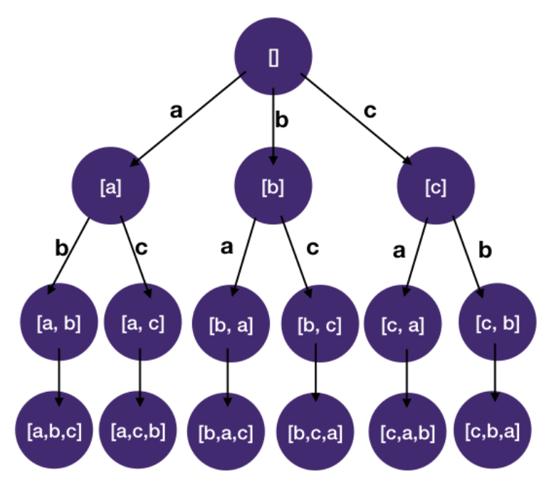

# Backtracking: Combinatorial Search

## Permutations

```
Given a string of unique letters, find all of its distinct permutations.

Input
letters: a string of unique letters
Output
all of its distinct permutations

Example 1:
Input:
  letters = `abc`

Output:
  abc
  acb
  bac
  bca
  cab
  cba
```

```javascript
function permutations(letters) {
  const result = [];
  const n = letters.length;
  dfs(letters, [], new Array(n).fill(false), result);
  return result;
}

function dfs(letters, path, usedLettersArr, result) {
  if (path.length === usedLettersArr.length) {
    result.push(path.join(""));
    return;
  }
  for (let i = 0; i < letters.length; i++) {
    // skip if letter is already in used
    if (usedLettersArr[i]) continue;
    path.push(letters[i]);
    usedLettersArr[i] = true;
    dfs(letters, path, usedLettersArr, result);
    path.pop();
    usedLettersArr[i] = false;
  }
}
```

### Explanation

1. Identify States
   - What state do we need to know whether we have reached a solution and using it to construct a solution if the problem asks for it
     - We need a state to keep track of the list of letters we have chosen for the current permutation
   - What state do we need to decide which child nodes should be visited next and which ones should be pruned
     - We have to know what are the letters left that we can still use (since each letter can only be used once).
2. Draw the State-space Tree



3. DFS on the State-space tree
   - Using the backtracking template as basis, we add the two states we identified in step 1:
     - A list to represent permutation constructed so far, path
     - A list to record which letters are already used, used, used[i] == true means ith letter in the origin list has been used

- Time Complexity: `O(n!)`
  - This is because we have n letters to choose from then n - 1 and so on therefore n _ (n - 1) _ (n - 2) _ ... _ 1
