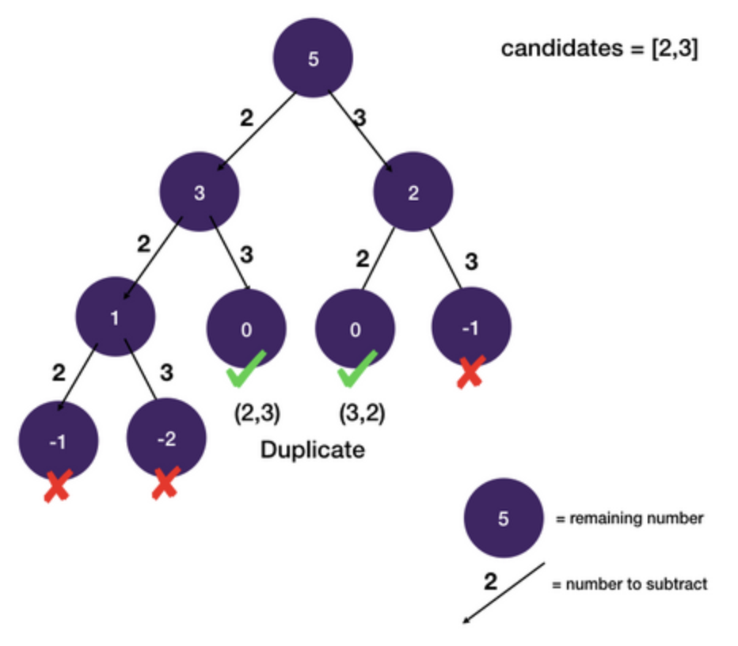

# Backtracking: Dedup

## Combination Sum

```
Given an array of distinct integers candidates and a target integer target,
return a list of all unique combinations of candidates where the chosen numbers sum to target.
You may return the combinations in any order.

The same number may be chosen from candidates an unlimited number of times.
Two combinations are unique if the frequency of at least one of the chosen numbers is different.

It is guaranteed that the number of unique combinations that sum up to target is less than 150 combinations for the given input.

Example 1:
  Input: candidates = [2,3,6,7], target = 7
  Output: [[2,2,3],[7]]
  Explanation:
    2 and 3 are candidates, and 2 + 2 + 3 = 7. Note that 2 can be used multiple times.
    7 is a candidate, and 7 = 7.
    These are the only two combinations.

Example 2:
  Input: candidates = [2,3,5], target = 8
  Output: [[2,2,2,2],[2,3,3],[3,5]]

Example 3:
  Input: candidates = [2], target = 1
  Output: []

Example 4:
  Input: candidates = [1], target = 1
  Output: [[1]]

Example 5:
  Input: candidates = [1], target = 2
  Output: [[1, 1]]

Constrains:
  1 <= candidates.length <= 30
  1 <= candidates[i] <= 200
  All elements of candidates are distinct.
  1 <= target <= 500
```

```javascript
function combinationSum(candidates, target) {
  const result = [];
  dfs(candidates, 0, target, [], result);
  return result;
}

function dfs(nums, startIndex, remaining, path, result) {
  if (remaining === 0) {
    result.push(path);
    return;
  }

  for (let i = startIndex; i < nums.length; i++) {
    const num = nums[i];
    if (remaining - num < 0) continue;
    dfs(nums, i, remaining - num, path.concat([num]), result);
  }
}
```

### Explanation

- We can try subtracting each candidate number until the remaining number is either less or equal to zero
- Time Complexity: `O(2^n)`
  - Every number can be used or not used therefore leading to exponential time complexity

#### State-space Tree

- The only problem is that we have duplicate combinations in our results.



#### Dedup

- The way we dedup is to only use candidate numbers whose index in the array is >= last used number's index
- In this example, when we are at the teal node, we don't want to look back and use any precedent candidate such as 2
- This is because by DFS order
  - we already explored subtracting 2 and during that traversal we have considered using 3 (blue nodes)


- We use an additional state start_index to keep track of the position of the last used number
  - "start" "index" because it is the index you want to start building new branches from
  - Final tree with duplicate branch pruned.


- This idea of establishing order and pruning backward branches a is very useful de-duplication technique
  - You can also use it in two-pointer problems that has duplicate candidates.
