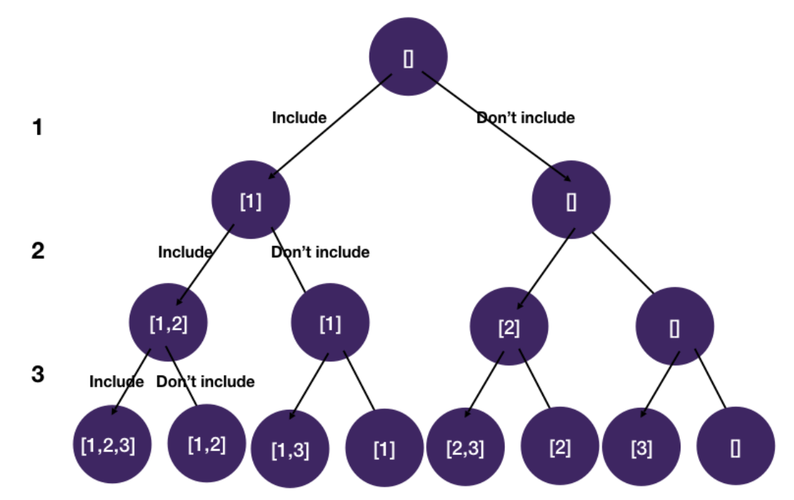

# Backtracking: Dedup

## Subsets

```
Given a set of distinct integers, nums, return all possible subsets (the power set).

Note: The solution set must not contain duplicate subsets.

Example 1:
  Input: nums = [1,2,3]
  Output:
    [
      [3],
      [1],
      [2],
      [1,2,3],
      [1,3],
      [2,3],
      [1,2],
      []
    ]
```

- Solution 1: permutations

```javascript
function subsets(nums) {
  const result = [];
  dfs(0, [], nums, result);
  return result;
}

function dfs(i, current, nums, result) {
  const n = nums.length;
  if (i === n) {
    result.push(current);
    return;
  }
  dfs(i + 1, current.concat([nums[i]]), nums, result);
  dfs(i + 1, current, nums, result);
}
```

- Solution 2: combination sum

```javascript
function subsets(nums) {
  const result = [[]];
  dfs(0, [], nums, result);
  return result;
}

function dfs(i, current, nums, result) {
  const n = nums.length;
  if (i === n) return;
  const newCurrent = current.concat([nums[i]]);
  result.push(newCurrent);
  dfs(i + 1, newCurrent, nums, result);
  dfs(i + 1, current, nums, result);
}
```

- Solution 3: iterative

```javascript
function subsets(nums) {
  let result = [[]];
  backtrack(0, [], nums, result);
  return result;
}

function backtrack(first, current, nums, result) {
  // we iterate over the indexes i from 'first' to the length
  //of the entire sequence 'nums'
  for (let i = first; i < nums.length; i++) {
    current.push(nums[i]);

    // use distructure operator to clone 'current' value and save to 'result'
    result.push([...current]);

    // generate all other subsets for the current subset.
    // increasing the position by one to avoid duplicates in 'result'
    backtrack(i + 1, current, nums, result);

    // BACKTRACK.
    current.pop();
  }
}
```

### Explanation

- Time Complexity: `O(2^n)`
- We have to permute through the possibilities

#### State-space tree

- Similar to permutations, we make a binary choice of whether to include the number in the subset at each level
- We can use a state i to keep track of the index of the current char we are at



#### Alternative solution

- Note that this problem is very special because every time we make a choice we already have a subset
  - so some of the leaf node values are in internal nodes as well
  - Therefore, we can potentially terminate the search earlier


- An alternative and faster solution to is take advantage of the fact that internal nodes are also final states and draw the tree differently


- Similar to combination sum, we dedup by only pruning backward branches
- Note that the main difference between the alternate solution and the original is the position of the res.append(cur)
  - We don't wait until we get to a leaf node to add to the result list
  - We instead add to the result list at each step
