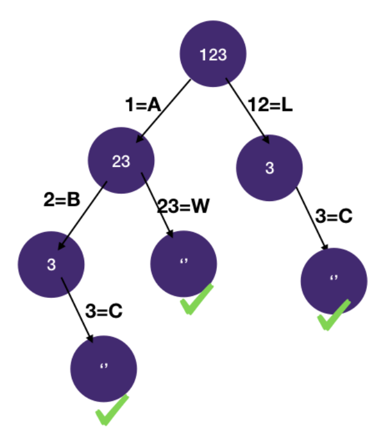
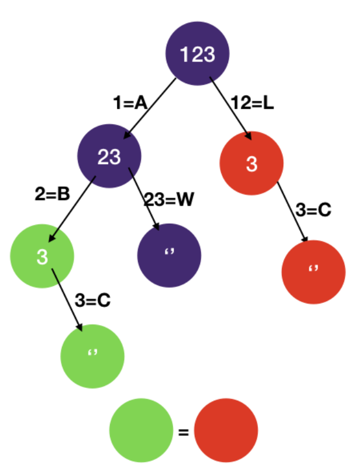

# Backtracking: Memoization

## Decode Ways

```
We have a message to decode. Letters are encoded to digits by its position in the alphabet
  A -> 1
  B -> 2
  C -> 3
  ...
  Y -> 25
  Z -> 26

Given a non-empty string of digits, how many ways are there to decode it?
  Input: "18"
  Output: 2
  Explanation: "18" can be decoded as "AH" or "R"

  Input: "123"
  Output: 3
  Explanation: "123" can be decoded as "ABC", "LC", "AW"
```

- Solution 1

```javascript
const LETTERS = Array.from(Array(26).keys(), (n) => (n + 1).toString(10));

function decode_ways(digits) {
  return dfs(digits, 0);
}

function dfs(digits, i) {
  if (i === digits.length) return 1;

  let ways = 0;
  const remaining = digits.slice(i);
  for (const letter of LETTERS) {
    if (remaining.startsWith(letter)) {
      // add number of ways returned from child node
      ways += dfs(digits, i + letter.length);
    }
  }
  return ways;
}
```

- Solution 2: using memoization

```javascript
const LETTERS = Array.from(Array(26).keys(), (n) => (n + 1).toString(10));

function dfs(digits, i, memo) {
  if (i in memo) return memo[i];
  if (i === digits.length) return 1;

  let ways = 0;
  const remaining = digits.slice(i);
  for (const letter of LETTERS) {
    if (remaining.startsWith(letter)) {
      ways += dfs(digits, i + letter.length, memo);
    }
  }
  memo[i] = ways;
  return ways;
}

function decodeWays(digits) {
  let memo = {};
  return dfs(digits, 0, memo);
}
```

### Explanation

- Combinatorial search problem, apply the three-step system

1. Identify states
   - What state do we need to know whether we have decoded a string?
     - We can keep track of the number of digits we have already matched in index i
     - When i == length of digits, we have finished
   - What state do we need to decide which child nodes of the state-space tree should be visited next?
     - Since there's no constraint on which letters can be used for decoding, we don't need any state here
2. Draw the space-state tree



3. DFS
   - Using the backtracking template as a basis, we add the state we identified in step 1:
     - i for the number of digits we have already matched.
   - DFS returns the number of ways we can decode digits[i:]

- Time Complexity: `O(2^n)`
  - n is the length of the string
  - Essentially at every digit we either make a new number or add it to the old one
  - We can make this into linear time through dp but currently we have a exponential time solution


