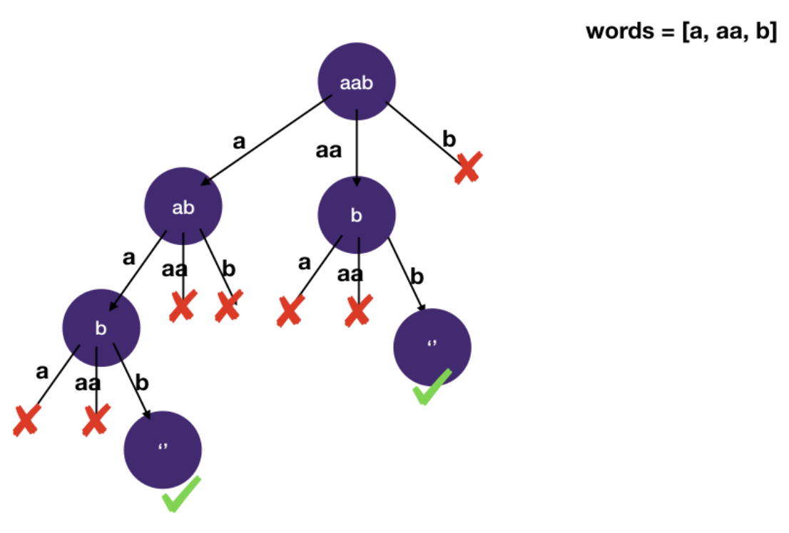
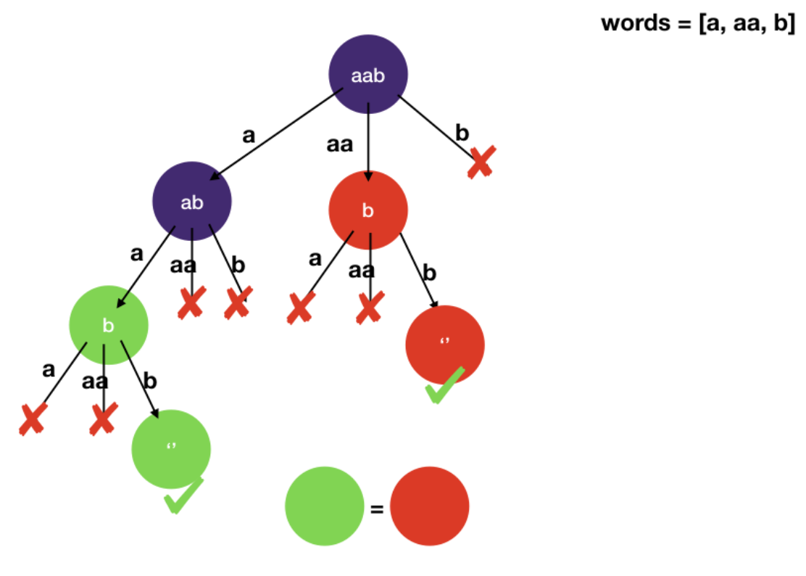

# Backtracking: Memoization

## Word Break

```
Given a string and a list of words, determine if the string can be constructed from concatenating words from the list of words.
A word can be used multiple times.

Example 1:
  Input:
    s = "algomonster"
    words = ["algo", "monster"]
  Output: true

Example 2:
  Input:
    s = "aab"
    words = ["a", "c"]
  Output: false
```

- Solution 1

```javascript
function wordBreak(s, words) {
  return dfs(s, words, []);
}

function dfs(s, words, path) {
  let result = false;
  let wordsStr = path.join("");
  if (wordsStr === s) return true;
  if (wordsStr.length >= s.length) return false;

  for (const word of words) {
    path.push(word);
    result = dfs(s, words, path);
    if (result) break;
    path.pop();
  }
  return result;
}
```

- Solution 2

```javascript
function wordBreak(s, words) {
  return dfs(s, words, 0);
}

function dfs(s, words, i) {
  // we have constructed the entire target s
  if (i === s.length) return true;

  for (const word of words) {
    if (s.slice(i).startsWith(word)) {
      // is this a valid path
      if (dfs(s, words, i + word.length)) return true; // any path leads to true is fine
    }
  }
  return false;
}
```

- Solution 3:

```javascript
function wordBreak(s, words, start = 0, memo = []) {
  if (start === s.length) return true;
  if (memo[start] !== undefined) return memo[start];

  for (let i = 0, len = s.length; i + start <= len; i++) {
    if (
      words.indexOf(s.substr(start, i)) > -1 &&
      wordBreak(s, words, i + start, memo)
    ) {
      return (memo[start] = true);
    }
  }
  return (memo[start] = false);
}
```

- Solution 4: using memoization

```javascript
function wordBreak(s, words) {
  return dfs(s, words, 0, {});
}

function dfs(s, words, i, memo) {
  if (i === s.length) return true;
  if (i in memo) return memo[i];

  let result = false;
  for (const word of words) {
    if (s.slice(i).startsWith(word)) {
      if (dfs(s, words, i + word.length, memo)) {
        result = true;
        break;
      }
    }
  }
  memo[i] = result;
  return result;
}
```

### Explanation

- This is yet another combinatorial search problem. Let's apply the three-step backtracking system

1. Identify the states
   - To determine whether we have completely constructed target s, we have to find
     - What are the characters left to be matched using words in the list
   - To make a choice when we visit the current node's children
     - we don't need any additional states since we can use any word in the list unlimited times
2. Draw the space-state tree

   

   - Note that in the above figure, there are two paths that lead to an empty string
     - i.e. completely matching target
   - When we DFS we would reach the left one first without visiting the other one since we just need one successful path to return true

3. DFS on the space-state tree
   - Using the backtracking template as a basis, we add the state we identified in step 1:
     - We use index i to record the current position in the target we have matched so far
       - s[:i] is matched and s[i:] is to be matched

#### Memoization

- Everything looks great. When we finish typing that last bracket/semicolon
  - we can almost hear angels singing and all tests passing
- Except there is one pesky test case
  ```
  "aaaaaaaaaaaaaaaaaaaaaaaaaaaaaaaaaaaaaaaaaaaaaaaaaaaaaaaaaaaaaaaaaaaaaaaaaaaaaaaaaaaaaaaaaaaaaaaaaaaaaaaaaaaaaaaaaaaaaaaaaaaaaaaaaaaaaaaaaaaaaaaaaaaaaab"
  ["a","aa","aaa","aaaa","aaaaa","aaaaaa","aaaaaaa","aaaaaaaa","aaaaaaaaa","aaaaaaaaaa"]
  ```
- Why does this one time out?

  - We have 10 branches to check each level of the tree and there are 140 as in the target
    - in the worse case we'd be looking at 10^140 branches
  - Remember we talked about "combinatorial explosion" in the backtracking module
  - We have just been struck by it
  - The way to solve this is to use memoization to cache the branches we have already seen
  - We can even see duplicate in the above example

  

- Time Complexity: `O(s * w * max(w[i]))`
- s is the length of the string, w is the length of the words array and max(w[i]) is the maximal possible word length
  - Here our time complexity is polynomial since we memoize and we iterate through the possibilities
  - At every position s we try every word in w which takes time proportionate to the word length
