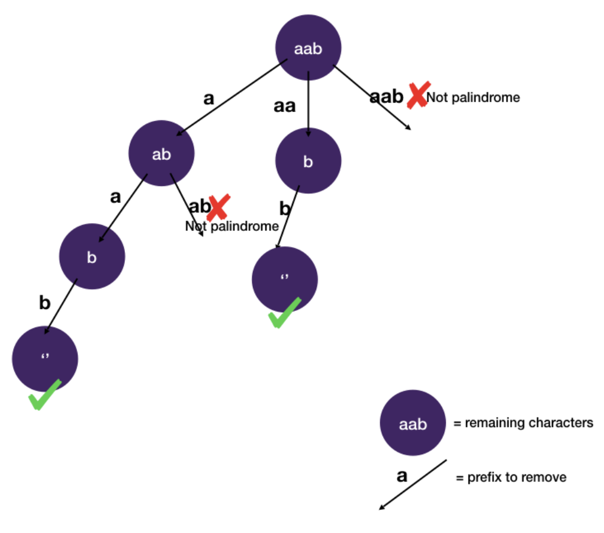

# Backtracking: Pruning

## Palindrome Partitioning

```
Given a string s, partition s such that every substring of the partition is a palindrome

Return all possible palindrome partitioning of s

Example 1:
  Input: aab
  Output:
    [
      ["aa","b"],
      ["a","a","b"]
    ]
```

```javascript
function partition(s) {
  const ans = [];
  dfs(s, ans, s.length, 0, []);
  return ans;
}

function isPalindrome(word) {
  return word === word.split("").reverse().join("");
}

function dfs(s, ans, n, start, curPath) {
  if (start === n) {
    ans.push(curPath);
    return;
  }
  for (let i = start + 1; i < n + 1; i++) {
    const prefix = s.slice(start, i);
    if (isPalindrome(prefix)) dfs(s, ans, n, i, curPath.concat([prefix]));
  }
}
```

### Explanation

- We try to remove prefix at each possible position and only continue if the prefix is a palindrome
  - since every substring has to be a palindrome


#### Space-state Tree



- We prune the tree by not branching out when the prefix is not a palindrome.
- Time Complexity: `O(2^n)`
  - This is because once we determine a palindrome we work backwards to consider the other palindromes and enumerate them accordingly
