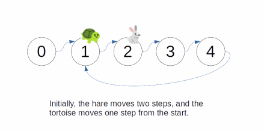

# Two Pointer: Cycle Finding
## Linked List Cycle
```
Given a linked list with potentially a loop,
determine whether the linked list from the first node contains a cycle in it.
For bonus points, do this with constant space.

Parameters
  nodes: The first node of a linked list with potentially a loop.
Result
  Whether there is a loop contained in the linked list.

Example 1
Input:
  0 -> 1 -> 2 -> 3 -> 4
       ^              |
       | - - - - - - - 
 
Output: true

Example 2
Input:
  0 -> 1 -> 2 -> 3 -> 4

Output: false

Constraints
  1 <= len(nodes) <= 10^5
```
```javascript
class Node {
  constructor(val, next = null) {
    this.val = val;
    this.next = next;
  }
}

function hasCycle(head) {
  let fast = head;
  let slow = head;
  while (slow && fast) {
    fast = fast?.next?.next;
    slow = slow?.next;
    if (!fast || !slow) break;
    if (fast === slow) return true;
  }
  return false;
};
```



### Explanation
- If a linked list has no loop, then when we iterate through the list, we will eventually reach the end of the list
  - at which point we can simply return
  - However, the challenge is figuring out how to terminate the program if it finds a loop
    - Otherwise the program would go on forever
- A simple solution would be to use a set to store the information
  - We store all the nodes we have been through and check if we have been there each time we move
  - However, a set is not constant memory, and there might be issues with hashing and whatnot
- Introducing `Floyd's Cycle Finding Algorithm` also known as the `Tortoise and Hare Algorithm`
  - The idea is to have two pointers, the fast pointer (or "hare") moves at double speed of the slow pointer (or "tortoise")
  - Each cycle, the tortoise moves once and the hare moves twice
  - The idea is that since the cycle must have integer size
    - when the tortoise and the hare are both in the cycle
    - their distance difference must also be an integer
  - Then, each cycle, because of their speed difference
    - the distance between them constantly reduces until they meet
    - in which case we know there is a cycle
  - However, if there is no cycle, they will never meet because the speed of the hare is always faster
- Time Complexity: `O(n)`
  - Technically `O(n/2)` but again we factor out the constant and we are left with linear time
  - Worst case we have, `O(2n)` as the small pointer moves around the entire array once
  - Either way we have `O(n)` time complexity
