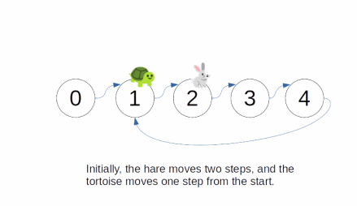

# Two Pointers: Cycle Finding
## Linked List Cycle II
```
This question is the same as Linked List Cycle,
except in addition to checking whether a linked list has a loop,
we also find the size of the loop, if applicable.

Parameters
  nodes: The first node of a linked list with potentially a loop.

Result
  An integer representing the size of the loop, if there is one. If there is no loop, output -1.

Example 1
  Input: 0 -> 1 -> 2 -> 3 -> 4
              ^              |
              |_ _ _ _ _ _ _ 

Output: 4 (there is a loop of size 4, starting from node 1)

Example 2
  Input: 0 -> 1 -> 2 -> 3 -> 4

Output: -1 (there is no loop)

Constraints
  1 <= len(nodes) <= 10^5
```
```javascript
class Node {
  constructor(val, next=Null) {
    this.val = val;
    this.next = next;
  }
}

function nodeNext(node) {
  return node.next || node;
}

function cycleSize(nodes) {
  let tortoise = nodeNext(nodes);
  let hare = nodeNext(nodeNext(nodes));
  while (tortoise !== hare && hare.next) {
    tortoise = nodeNext(tortoise);
    hare = nodeNext(nodeNext(hare));
  }
  if (!hare.next) return -1;
  let count = 1;
  tortoise = nodeNext(tortoise);
  hare = nodeNext(nodeNext(hare));
  while (tortoise !== hare) {
    count++;
    tortoise = nodeNext(tortoise);
    hare = nodeNext(nodeNext(hare));
  }
  return count;
}
```



### Explanation
- The basic idea is the same as in Linked List Cycle, except how do we determine the size of the loop?
  - Let's say that the loop size is r and the tortoise and the hare already met up
  - They must both be inside the loop, otherwise they cannot be at the same location
  - Let's say that after k cycle, they meet up again
    - In that case, k % r == 2k % r, which means that k % r == 0
    - The smallest k where this is possible is when k == r
  - This means that after they meet, we start counting the number of cycles that passed until they meet again
    - Then, that must be the size of the cycle
- Time Complexity: `O(n)`
