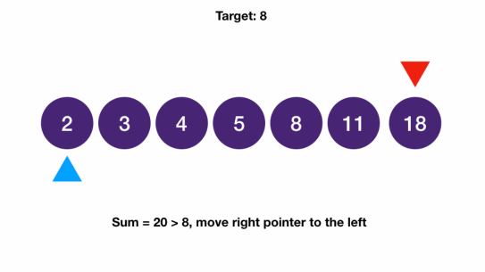

# Two Pointers: Opposite Direction
## Two Sum Sorted
```
Given an array of integers sorted in ascending order,
find two numbers that add up to a given target.
Return the indices of the two numbers in ascending order.
You can assume elements in the array are unique and there is only one solution.
Do this in O(n) time and with constant auxiliary space.

Input: [2 3 5 8 11 15], 5

Output: 0 1
```
```javascript
function twoSumSorted(arr, target) {
  let right = arr.length - 1;
  let left = 0;
  while (left < right) {
    const sum = arr[left] + arr[right];
    if (sum === target) {
      return [left, right];
    } else if (sum > target) {
      right--;
    } else {
      left++;
    }
  }
  return [];
}
```
### Explanation



- since the array is sorted, the smallest two sum we can get is the sum of the first two numbers 2 + 3
  - and the largest two sum we can get is the sum of the last two numbers 11 + 18
  - If we sort all two sum pairs by their sum value
    - the middle point is the smallest number + largest number 2 + 18
    - From this point, we can compare with our target 8
      - If our sum equals target, then we're done
      - If our sum is less than the target, we need to exchange one of the numbers for a bigger number
        - Since 18 is already the bigger number available, we have to exchange 2 for a bigger number. We go to 3
      - If our sum is greater than the target, we need to exchange one of the numbers for a smaller number
        - Since 2 is the smallest number available, we have to exchange 18 for a smaller number. We go to 11
      - repeat the process until two sum is equal to our target
- Time Complexity: `O(n)`

