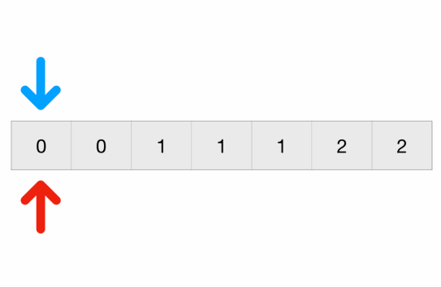
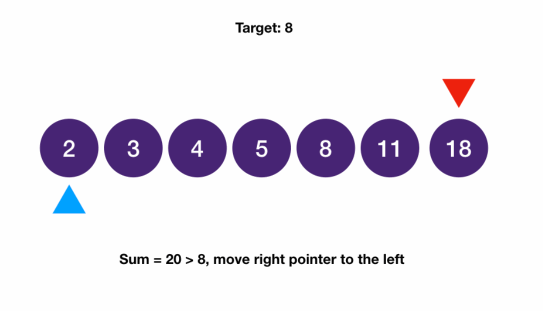
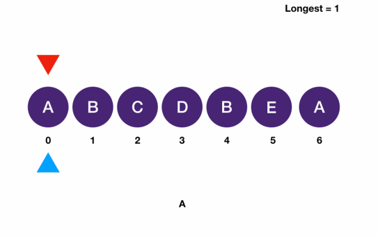

# Two Pointers pattern
- Two pointers is a common interview technique often used to solve certain problems involving an iterable data structure, such as an array
- As the name suggests, this technique uses two (or more) pointers that traverses through the structure
- It does not have to be physically using two pointers
- As long as the other pointer can be easily calculated from existing values
  - such as the index of the other pointer, it counts as a two pointer question
- Depending on the questions you encounter, you need to implement the answer differently
- Generally speaking, a two pointer algorithm has these characteristics:
  1. Two moving pointers, regardless of directions, moving dependently or independently
  2. A function that utilizes the entries pointing at the two pointers that relates to the answer in a way
  3. An easy way of deciding which pointer to move
  4. Optionally a way to process the array when the pointers are moved
## Classifications
### Same Directions
- questions have two pointers that move in the same direction
  - i.e. Remove Duplicates
- uses the `fast and slow pointer technique` also known as `tortoise and hare algorithm`

- function used in this question is comparing the value of the fast pointer to its previous entry and see if they match
- The moving condition of the two pointer is that if the previous check match, only the fast pointer moves
- Otherwise, the slow pointer moves
  - perform the process of setting the value at the slow pointer to the value at the fast pointer
  - and then the fast pointer moves
- The program ends when the fast pointer reaches the end
  - return the index after the slow pointer as the size of the array
### Opposite Directions
- questions have two pointers that move in the opposite direction. 
  - i.e. Two Sum Sorted

- function is comparing the sum of the entries to the desired amount
- If the sum is greater, we move the larger pointer
- if the sum is lesser, we move the smaller pointer
- If the sum is equal, we find our answer and we stop the program
### Sliding Window
- similar to the same directions problems
  - however, the function performs on the entire interval between the two pointers
- we keep track of the overall result of the window
  - each time we insert/remove an item from the window
    - we update the window according to the changes instead of recalculating everything
- i.e. Longest Substring without Repeating Characters 

- we keep track of the number of characters that appear in the window
- We move the later pointer, inserting the item into the set, until there is a duplicate
- Then, we move the earlier pointer, removing items out of the set, until we can insert the item
- We also keep track of the largest size each time for the answer
### Non-array Applications
- two-pointer technique is not limited to arrays
- Two pointer can be done on other structures, like linked list, as long as they are iterable
- i.e. in Happy Number, you are asked to detect a cycle from a linked list structure
  - it can be solved using a two-pointer technique called Floyd's Cycle-Finding Algorithm
## Why use 2 pointers
- Two pointers are helpful because it often offers a more efficient solution than the naive solution
- From the examples above, if we use the naive solution and use two loops to iterate through the array
  - the time complexity is often `O(n^2)`
- If we use two pointers for this type of problem, we are often only passing through the array once with the two pointers
  - time complexity is often `O(n)`
