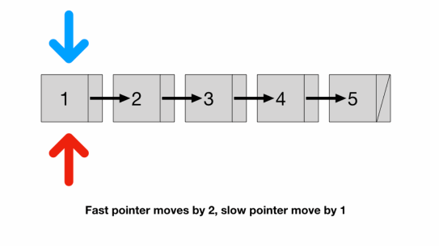
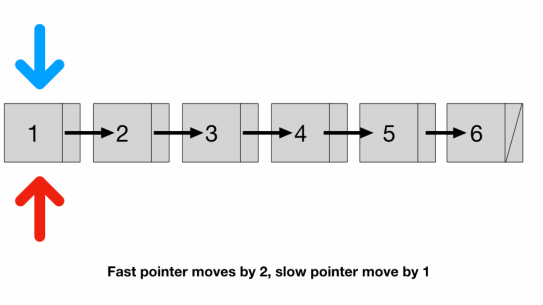

# Two Pointers: Same Direction
## Middle Of Linked List
```
Find the middle node of a linked list.

Input: 0 1 2 3 4

Output: 2

If the number of nodes is even, then return the second middle node.

Input: 0 1 2 3 4 5

Output: 3
```
```javascript
class Node {
  constructor(val, next = null) {
    this.val = val;
    this.next = next;
  }
}

function middleOfLinkedList(nodes) {
  let slow = nodes;
  let fast = nodes;
  while (fast && fast.next) {
    slow = slow.next;
    fast = fast.next.next;
  }
  return slow.val;
}
```
### Explanation
- If it was an array, then we can get its length and middle element trivially
- For a linked list, we have to traverse it to find its length l
- We can find l by traversing the list once and then find the middle element by traversing it again and stop on the l/2th element
- Is there any way to traverse only once? We can use two pointers
  - a fast pointer that moves 2 nodes at a time and
  - a slow pointer that moves 1 node at a time
- Since the speed of the fast pointer is 2x of the slow pointer
  - by the time the fast pointer reaches the end the slow pointer should be at exactly the middle of the list
- Time Complexity: `O(n)`
  - Technically `O(n/2)` but constants are cut out from the time complexity and so we are left with just `O(n)`




- We have to check the existence of fast and fast.next in the while loop condition
- We have to check fast because if list length is odd (illustrated above)
  - the fast pointer would reach the last node
- And if list length is even (illustrated below)
  - the fast pointer would land on null (Node 6's next)


