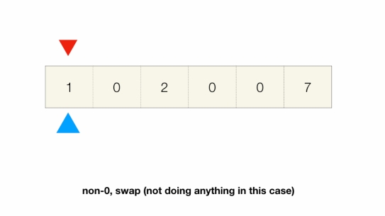

# Two Pointers: Same Direction
## Move Zeros
```
Given an array of integers,
move all the 0s to the back of the array while maintaining the relative order of the non-zero elements.
Do this in-place using constant auxiliary space.

Input:
  [1, 0, 2, 0, 0, 7]

Output:
  [1, 2, 7, 0, 0, 0]
```
```javascript
function moveZeros(nums) {
  let slow = 0;
  for (let fast=0; fast<nums.length; fast++) {
    if (nums[fast] !== 0) {
      [nums[fast], nums[slow]] = [nums[slow], nums[fast]];
      slow++;
    }
  }
  return nums;
}
```
### Explanation



- The problem description asks us to do it in-place without extra data structure
- There are only a couple of things we can do under these constraints - `linear traversal` or `binary search`
- We use `slow and fast pointers`
  - The fast one moves one element at a time
    - if the current element is 0, do nothing
    - if the current element is non-0, swap its element with slow pointer's element and move slow pointer
  - The slow pointer always points to the next 0 if there is one.
- The order of non-0 elements is preserved because the early one always gets swapped to the early 0s
